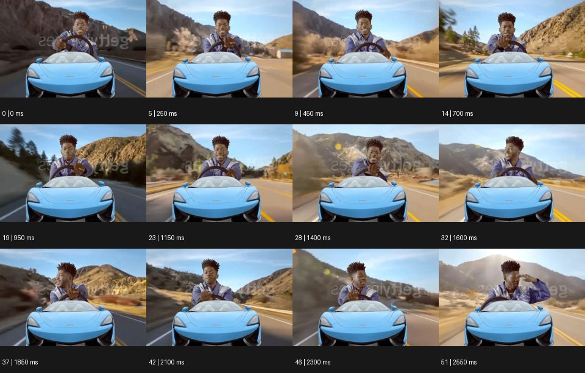

# Stylistic Suck 스타일리스틱 석


출처: Eyecandy · 원본 등록 카드명: **Stylistic Suck 스타일리스틱 석** · slug: stylistic-suck

분류: I · VFX & Style / VFX & 스타일

[원본 기법 페이지](https://eyecannndy.com/technique/stylistic-suck) · [원본 미디어](https://asset.eyecannndy.com/media/clip/2024/02/21/261708473649.webp)

## 확인 근거

원본 52프레임, 메타데이터 길이 2600ms. 고유 12개 시점 프레임을 추출하여 이미지로 직접 관찰했다. 재생 감상·음향 청취·생성 재현 테스트를 했다는 뜻이 아니다.

표본 프레임(0부터): 0, 5, 9, 14, 19, 23, 28, 32, 37, 42, 46, 51



## 실제 시간순 관찰

0–700ms: 작은 파란 자동차 앞모습 위로 상대적으로 큰 인물이 운전하는 구도다. 950–1850ms: 인물이 손과 고개를 움직이는 동안 뒤의 산길 영상이 빠르게 흐른다. 2100–2550ms: 같은 합성 비율을 유지하며 운전대 제스처가 이어지고 배경에 스톡 표시 같은 글자가 남아 있다.

## 주체·카메라·합성·편집 구분

인물은 정면에서 운전 제스처를 한다. 배경 이동이 주행감을 만들고 차체·인물 비율과 레이어 분리가 의도적으로 거칠게 보인다. 실제 카메라가 차량과 함께 달렸다는 근거는 없다.

## 장면에 재사용할 원리

부정확한 합성 비율이나 과장된 레이어를 알아볼 수 있게 드러내 유머와 자의식을 만든다. 읽혀야 할 중심 동작은 명료하게 보존한다.

## 확인 한계

기존 워터마크를 새 작업에 재현하지 않는다. 거친 결과가 언제나 의도된 미학이라는 주장도 하지 않는다. 표본 사이의 모든 프레임과 반복 경계의 연속성을 검사하지 않았다. 음향은 확인하지 않았다.

## 뮤직비디오 각색 · 완성형 프롬프트

아래는 장면 목적에 맞게 새로 설계한 창작 적용안이며 원본 길이를 상속하지 않는다.

```text
6초 유머러스한 뮤직비디오, 성인 래퍼가 골판지로 만든 작은 우주선에 앉아 커다란 장난감 조종간을 움직인다. 카메라는 정면 고정이고 우주선은 실제로 이동하지 않는다. 1초 후 뒤의 별 배경이 옆으로 미끄러지기 시작하며 래퍼가 조종간을 왼쪽으로 꺾으면 배경만 반대 방향으로 급하게 바뀐다. 우주선과 인물의 일부러 어긋난 크기, 종이 가장자리의 그림자를 그대로 보여주되 얼굴은 선명하고 손가락은 정상이다. 4초에 래퍼가 조종간을 놓으면 배경이 늦게 멈추고 그는 카메라를 무표정하게 바라본다. 새 로고·워터마크·자막 없이 마찰음만 둔다.
```

## 브랜드필름 각색 · 완성형 프롬프트

```text
7초 위트 있는 디자인 문구 브랜드필름, 흰 책상 위의 실제 고급 연필 한 자루를 작은 종이 산맥 앞에 세운다. 고정 매크로 카메라가 시작하면 종이 산맥이 노골적인 평면 판처럼 옆으로 움직여 연필이 거대한 탐험 도구처럼 보이게 한다. 2초에 손으로 만든 구름이 실에 매달린 채 들어오고 연필 끝을 지나갈 때 한 번 덜컹거린다. 거친 연출은 배경 소품에만 적용하고 연필의 도장·나뭇결·각인 형태는 정교하게 유지한다. 마지막 2초에는 구름과 산맥이 멈추고 손이 연필을 집어 한 줄을 그린다. 새 문구 없이 종이와 연필의 소리만 둔다.
```

생성 테스트: 미실시. 단일 모델의 정확한 재현을 보장하지 않으며 필요한 촬영·합성·편집 층을 구분해 구현한다.
