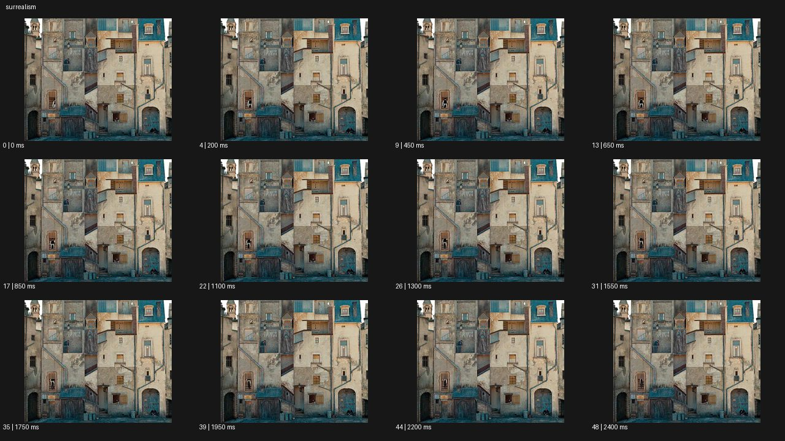

# Magical Realism 매지컬 리얼리즘


- 원본 등록명: **Magical Realism 매지컬 리얼리즘**
- 분류: B · 앵글 & 구도 / Angle & Framing
- 공식 기법 페이지: [Magical Realism 매지컬 리얼리즘](https://eyecannndy.com/technique/surrealism)
- 지정 원본 미디어: [애니메이션 WebP](https://asset.eyecannndy.com/media/clip/2023/12/20/261703059338.webp)
- 확인 방식: 49프레임 중 12시점의 시간순 이미지 배열을 직접 시각 확인. 메타데이터 길이 2.45초. 전체 프레임 재생·청음 확인 또는 생성 재현 테스트로 보고하지 않는다.



## 실제 관찰

낡은 건물의 입면에 창·계단·문이 서로 다른 높이와 방향으로 복잡하게 붙어 있다. 시작부터 비현실적으로 밀집된 건축 구도가 보이고 0.65–1.55초 작은 창 주변 인물의 미세 변화가 있다. 끝까지 건물 전체 배치는 거의 고정되어 있다.

## 작동 원리와 역할

현실적인 벽 재질과 비현실적 공간 배열을 같은 화면에 자연스럽게 공존시킨다. 이 예시에서는 변형 과정보다 이미 성립한 기묘한 세계가 핵심이다.

## 해석의 한계

관찰 표본에 건물 변형·중력 반전·새 통로 출현을 확인하지 못했다. 작은 인물 동작은 해상도로 세부 판독이 어렵다. 샘플 사이의 모든 움직임과 반복 경계의 무봉합 여부는 별도 검증하지 않았다. 아래 프롬프트는 새로운 장면 각색이며 생성 테스트는 하지 않았다.

## 뮤직비디오 적용 · 완성형 프롬프트

아래 설정과 길이는 독립 창작 예시다. 실제 요청의 길이·참조·음향 조건을 우선한다.

```text
8초 뮤직비디오. 오래된 주택가의 현실적인 벽돌 골목에 창문 크기의 바다가 한 칸만 존재한다. 성인 보컬은 그 앞 의자에 앉아 평범하게 신발끈을 묶고 다른 사람들은 골목을 지나간다. 카메라는 정면 와이드에서 천천히 오른쪽으로 이동하며 벽의 얼룩과 창틀, 창 안의 잔잔한 파도를 함께 보여준다. 바닷물은 창 밖으로 넘치지 않고 인물도 놀라는 연기를 하지 않는다. 보컬이 창 쪽으로 고개를 돌리면 바람에 커튼만 부푼다. 마지막에는 보컬과 창을 나란히 담는 구도에 멈춘다. 비현실적 요소 하나를 일상의 재질과 빛에 맞춰 유지한다.
```

## 브랜드필름 적용 · 완성형 프롬프트

제품의 재질과 기능이 읽히는 순간에 효과를 배치하고 안정된 제품 상태로 끝낸다. 실제 브랜드 톤과 구조에 맞춰 각색한다.

```text
8초 고급 홈 프래그런스 필름. 햇빛이 든 현실적인 거실에서 작은 도자기 디퓨저 위로만 가느다란 올리브나무 그림자가 공중에 떠 있다. 성인 사용자가 책을 덮고 디퓨저 옆을 지나가도 그림자는 조용히 흔들릴 뿐 주변 가구는 평범하게 유지된다. 카메라는 넓은 실내에서 천천히 접근해 제품과 벽에 실제로 드리운 그림자를 함께 보여준다. 창에서 들어오는 빛의 방향과 공중 그림자의 농도를 맞춰 낯선 현상이 자연스럽게 존재하게 한다. 마지막에는 제품 전면과 작은 그림자에 2초 머문다. 디퓨저의 도자기 형태와 라벨은 변형하지 않는다.
```

음향은 원본에서 확인하지 않았다. 실제 음원과 무음·NO BGM 등 사용자 조건을 유지한다. 특정 모델의 자동 재현을 보장하는 프리셋이 아니다.
