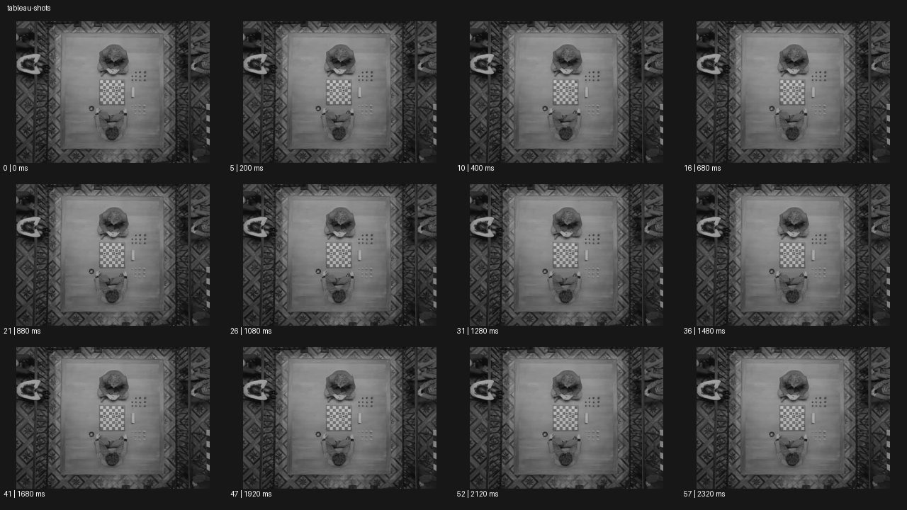

# Tableau 타블로


- 원본 등록명: **Tableau 타블로**
- 분류: B · 앵글 & 구도 / Angle & Framing
- 공식 기법 페이지: [Tableau 타블로](https://eyecannndy.com/technique/tableau-shots)
- 지정 원본 미디어: [애니메이션 WebP](https://asset.eyecannndy.com/media/clip/2024/01/29/261706566256.webp)
- 확인 방식: 58프레임 중 12시점의 시간순 이미지 배열을 직접 시각 확인. 메타데이터 길이 2.36초. 전체 프레임 재생·청음 확인 또는 생성 재현 테스트로 보고하지 않는다.



## 실제 관찰

흑백 오버헤드에서 장식 러그 중앙 탁자와 체스판, 서로 마주 앉은 두 인물이 대칭적으로 배치된다. 0–1.28초 구도와 배치가 거의 유지되고 1.48–2.32초에도 미세한 신체 변화만 보인다. 좌우 가장자리의 다른 사람 일부도 정해진 배열 안에 남는다.

## 작동 원리와 역할

카메라의 정지와 인물·소품의 정교한 배치가 회화적인 장면을 만든다. 완전한 정지 프레임을 반복했다는 의미가 아니라 움직임이 작은 살아 있는 구도다.

## 해석의 한계

미세 움직임이 있으므로 모두 얼어붙었다고 단정하지 않는다. 체스의 실제 진행이나 연출 의도는 확인하지 않았다. 샘플 사이의 모든 움직임과 반복 경계의 무봉합 여부는 별도 검증하지 않았다. 아래 프롬프트는 새로운 장면 각색이며 생성 테스트는 하지 않았다.

## 뮤직비디오 적용 · 완성형 프롬프트

아래 설정과 길이는 독립 창작 예시다. 실제 요청의 길이·참조·음향 조건을 우선한다.

```text
8초 뮤직비디오. 오래된 연회장에 성인 여섯 명을 긴 식탁 둘레에 회화처럼 배치한다. 중앙 보컬은 정면에 앉고 양옆 인물은 서로 다른 방향을 바라본다. 카메라는 허리보다 높은 정면 와이드에 고정하며 접시와 촛대의 균형을 먼저 읽힌다. 보컬이 잔을 내려놓으면 왼쪽 사람의 손, 오른쪽 사람의 고개가 순서대로 아주 작게 움직인다. 모두 동시에 춤추지 않고 구도의 긴장을 유지한다. 마지막에는 보컬만 렌즈를 바라보고 나머지 인물은 기존 자세를 지킨다. 빛은 일정하게 유지하며 화면을 정지 사진으로 얼리지 않는다.
```

## 브랜드필름 적용 · 완성형 프롬프트

제품의 재질과 기능이 읽히는 순간에 효과를 배치하고 안정된 제품 상태로 끝낸다. 실제 브랜드 톤과 구조에 맞춰 각색한다.

```text
8초 고급 테이블웨어 필름. 옅은 회색 식탁 위에 크림색 도자기 접시와 유리잔, 리넨 냅킨을 정교하게 배치하고 성인 네 명이 서로 다른 자세로 앉는다. 카메라는 약간 높은 정면 와이드에 고정해 회화적인 전체 구도를 보여준다. 한 사람이 물병을 들어 가운데 잔에 물을 따르고 다른 사람은 냅킨을 조용히 편다. 소품의 배열은 유지되고 작은 행동만 표면 반사와 질감을 살아 있게 만든다. 마지막 물병이 원래 자리에 놓이면 모든 손이 쉬고 완성된 식탁이 2초 남는다. 제품 비례와 유리잔의 개수를 일관되게 유지한다.
```

음향은 원본에서 확인하지 않았다. 실제 음원과 무음·NO BGM 등 사용자 조건을 유지한다. 특정 모델의 자동 재현을 보장하는 프리셋이 아니다.
