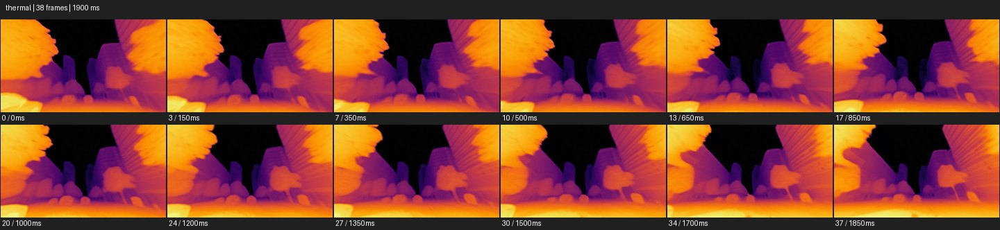

# Thermal


- 출처: Eyecandy · [Thermal](https://eyecannndy.com/technique/thermal)
- 카탈로그 등록 표기: **Thermal 서멀 이미징**
- 카테고리: F · Lens & Optics · 렌즈 & 옵틱
- 원본 미디어: [애니메이션 WebP](https://asset.eyecannndy.com/media/clip/2024/07/07/261720345029.webp)
- 확인 방식: 원본 애니메이션을 디코딩해 시간순 프레임을 추출한 뒤 컨택트 시트를 직접 시각 확인했다. 전체 38프레임 / 1900ms, 기본 12시점. 재생·음향 청취·전 프레임 시각 검수·생성 테스트를 했다고 주장하지 않는다.
- 기본 확인 프레임: 0, 3, 7, 10, 13, 17, 20, 24, 27, 30, 34, 37. 해당 타임스탬프(ms): 0, 150, 350, 500, 650, 850, 1000, 1200, 1350, 1500, 1700, 1850.
- 원본 길이는 관찰 정보다. 아래 새 장면의 길이를 원본에 자동 맞추지 않는다.

## 움직임 증거



## 원본에서 확인한 시작 → 변화 → 끝

낮은 시점의 거리 또는 건축물이 보라·주황·노랑의 연속 색으로 표시된다. 검은 하늘 아래 밝은 나무와 건물의 모서리가 좌우로 움직이며 풍경 깊이가 바뀐다.

- 카메라·시점: 낮은 풍경 시점이 이동한다.
- 주체: 주된 변화는 배경의 시점 변화다.
- 조명·합성·편집: 보라·주황·노랑의 거짓색 영상으로 보인다.

## 작동 원리와 확인 한계

원래 표면색 대신 밝기·온도처럼 보이는 값을 거짓색 팔레트로 바꿔 보이지 않는 차이를 시각화한다. 실제 온도 측정 영상인지는 미확인.

샘플 사이의 빠른 변화는 일부 빠질 수 있다. GIF의 반복 경계가 작품의 의도된 완전 루프라는 보장은 없다. 원본 음악·대사·촬영 장비·제작 소프트웨어는 확인하지 않았다. 아래 프롬프트는 관찰한 원리를 다른 장면에 각색한 창작안이며 원본 장면이나 검증된 생성 결과가 아니다.

## 뮤직비디오 각색 · 완전한 장면 프롬프트

```text
도시의 에너지를 추상화하는 뮤직비디오. 밤 골목을 걷는 성인 보컬을 정면 미디엄으로 따라가고 몸의 중심은 밝은 노랑, 옷 가장자리는 주황과 보라로 이어지는 열화상풍 팔레트를 사용한다. 배경 건물은 차가운 보라로 남기고 보컬이 손을 가슴에 대는 동작을 선명히 읽힌다. 카메라는 함께 후진하다 골목 끝에서 멈춘다. 마지막에는 보컬 실루엣과 손의 위치가 안정된 구도로 남는다. 온도 숫자나 측정 주장 없이 색 변화만으로 감정의 열기를 표현한다.
```

## 브랜드필름 각색 · 완전한 장면 프롬프트

```text
스포츠웨어 착용자의 운동 후 온기를 상상적으로 표현하는 브랜드필름. 성인 러너를 측면 미디엄으로 담고 피부와 원단 위에 보라에서 주황으로 이어지는 절제된 열화상풍 색을 적용한다. 러너가 걸음을 멈추고 소매를 정리하면 팔의 형태와 옷 주름을 따라 색 경계가 자연스럽게 움직인다. 카메라는 짧게 원호 이동해 정면에 도착하고, 마지막에는 일반 색의 제품 구도로 한 번 컷해 실제 원단과 로고를 읽힌다. 이 장면을 실제 열성능 측정처럼 표시하지 않는다.
```

적용 시 사용자가 지정한 길이·참조·컷·음향·제품 보존 조건을 우선한다. 효과의 시작 계기와 도착 구도를 유지하며 필요한 부분을 해당 장면에 맞춰 다시 연출한다.
