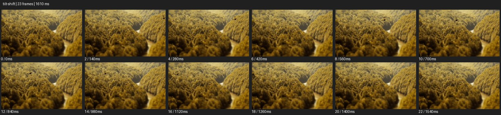

# Tilt Shift


- 출처: Eyecandy · [Tilt Shift](https://eyecannndy.com/technique/tilt-shift)
- 카탈로그 등록 표기: **Tilt Shift 틸트시프트**
- 카테고리: F · Lens & Optics · 렌즈 & 옵틱
- 원본 미디어: [애니메이션 WebP](https://asset.eyecannndy.com/media/clip/2023/12/31/261703993765.webp)
- 확인 방식: 원본 애니메이션을 디코딩해 시간순 프레임을 추출한 뒤 컨택트 시트를 직접 시각 확인했다. 전체 23프레임 / 1610ms, 기본 12시점. 재생·음향 청취·전 프레임 시각 검수·생성 테스트를 했다고 주장하지 않는다.
- 기본 확인 프레임: 0, 2, 4, 6, 8, 10, 12, 14, 16, 18, 20, 22. 해당 타임스탬프(ms): 0, 140, 280, 420, 560, 700, 840, 980, 1120, 1260, 1400, 1540.
- 원본 길이는 관찰 정보다. 아래 새 장면의 길이를 원본에 자동 맞추지 않는다.

## 움직임 증거



## 원본에서 확인한 시작 → 변화 → 끝

노란빛 숲과 가운데 굽은 강을 높은 시점에서 본다. 중앙의 좁은 깊이 구간은 상대적으로 선명하고 앞뒤 숲이 흐려 작은 모형처럼 보인다. 구도가 천천히 변한다.

- 카메라·시점: 높은 시점에서 지형을 천천히 이동해 본다.
- 주체: 풍경의 큰 동작은 샘플에서 두드러지지 않는다.
- 조명·합성·편집: 선택적 흐림이 선명 영역 앞뒤를 감싼다.

## 작동 원리와 확인 한계

선택적 선명도와 높은 시점이 실제 크기 단서를 줄여 미니어처 인상을 만든다. 실제 틸트 렌즈와 후반 블러는 구분되지 않는다.

샘플 사이의 빠른 변화는 일부 빠질 수 있다. GIF의 반복 경계가 작품의 의도된 완전 루프라는 보장은 없다. 원본 음악·대사·촬영 장비·제작 소프트웨어는 확인하지 않았다. 아래 프롬프트는 관찰한 원리를 다른 장면에 각색한 창작안이며 원본 장면이나 검증된 생성 결과가 아니다.

## 뮤직비디오 각색 · 완전한 장면 프롬프트

```text
도시 속 개인의 작음을 보여주는 뮤직비디오. 높은 창문에서 횡단보도를 내려다보며 성인 보컬이 노란 우산을 들고 중앙을 걷게 한다. 횡단보도 한 줄과 보컬이 있는 깊이만 선명하게 유지하고 앞뒤 도로는 부드럽게 흐린다. 카메라는 매우 느리게 옆으로 이동하고 차량과 보행자는 자연스러운 속도로 지나간다. 보컬이 중앙에서 멈춰 위를 바라보면 이동도 멈춘다. 마지막에는 작은 노란 우산과 규칙적인 도시 패턴을 남긴다. 블러 경계를 보컬 얼굴 위로 지나가게 하지 않는다.
```

## 브랜드필름 각색 · 완전한 장면 프롬프트

```text
가구 브랜드의 정원 전시를 건축 모형처럼 보여주는 필름. 높은 사선 시점에서 의자와 테이블이 배치된 실물 중정을 담는다. 중앙 테이블과 옆의 성인 방문객이 있는 좁은 영역만 선명하게 두고 전후경은 점진적으로 흐리게 한다. 카메라는 아주 느리게 접근해 제품 배치의 질서를 드러낸다. 방문객이 의자에 앉는 순간 선명한 구간을 그 자리로 유지하고 이동을 멈춘다. 마지막에는 테이블과 의자 전체 윤곽이 읽히며 제품 크기와 다리 구조는 변하지 않는다.
```

적용 시 사용자가 지정한 길이·참조·컷·음향·제품 보존 조건을 우선한다. 효과의 시작 계기와 도착 구도를 유지하며 필요한 부분을 해당 장면에 맞춰 다시 연출한다.
