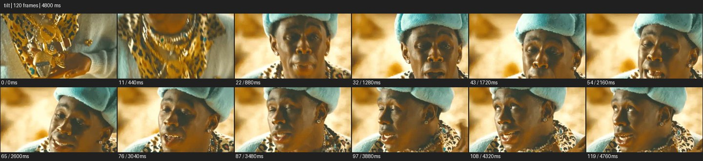

# Tilt


- 출처: Eyecandy · [Tilt](https://eyecannndy.com/technique/tilt)
- 카탈로그 등록 표기: **Tilt 틸트**
- 카테고리: E · More Camera Moves · 카메라 무브 확장
- 원본 미디어: [애니메이션 WebP](https://asset.eyecannndy.com/media/clip/2024/01/13/261705128422.webp)
- 확인 방식: 원본 애니메이션을 디코딩해 시간순 프레임을 추출한 뒤 컨택트 시트를 직접 시각 확인했다. 전체 120프레임 / 4800ms, 기본 12시점. 재생·음향 청취·전 프레임 시각 검수·생성 테스트를 했다고 주장하지 않는다.
- 기본 확인 프레임: 0, 11, 22, 32, 43, 54, 65, 76, 87, 97, 108, 119. 해당 타임스탬프(ms): 0, 440, 880, 1280, 1720, 2160, 2600, 3040, 3480, 3880, 4320, 4760.
- 원본 길이는 관찰 정보다. 아래 새 장면의 길이를 원본에 자동 맞추지 않는다.

## 움직임 증거



## 원본에서 확인한 시작 → 변화 → 끝

금색 장신구와 가슴의 가까운 구도에서 시점이 위로 움직여 파란 모자를 쓴 인물 얼굴이 드러난다. 이후 얼굴 가까운 구도를 유지하며 입과 머리의 퍼포먼스가 이어진다.

- 카메라·시점: 가슴의 장신구에서 얼굴로 위를 향한다.
- 주체: 얼굴 도착 후 입·눈·머리 동작이 이어진다.
- 조명·합성·편집: 초반의 정확한 이동 방식과 숨은 컷은 미확인.

## 작동 원리와 확인 한계

카메라의 상향 회전으로 디테일에서 얼굴로 시선을 전달한다. 초반 이동에 물리 접근이 섞였는지는 샘플로 확정하기 어렵다.

샘플 사이의 빠른 변화는 일부 빠질 수 있다. GIF의 반복 경계가 작품의 의도된 완전 루프라는 보장은 없다. 원본 음악·대사·촬영 장비·제작 소프트웨어는 확인하지 않았다. 아래 프롬프트는 관찰한 원리를 다른 장면에 각색한 창작안이며 원본 장면이나 검증된 생성 결과가 아니다.

## 뮤직비디오 각색 · 완전한 장면 프롬프트

```text
가죽 재킷을 입은 성인 보컬의 결심을 드러내는 뮤직비디오. 처음에는 손에 쥔 구겨진 종이와 재킷 지퍼를 가까이 담는다. 보컬이 종이를 천천히 펴는 동작을 읽힌 뒤 카메라 위치를 유지한 채 부드럽게 위로 틸트해 가슴, 턱, 눈으로 시선을 올린다. 보컬은 고개를 급히 움직이지 않고 렌즈를 바라본다. 얼굴에 도착하면 틸트를 멈추고 얕은 숨과 단단해지는 눈빛을 유지한다. 배경의 작은 실내등은 같은 위치에 두고 마지막 얼굴 구도에서 임의 줌이나 컷을 넣지 않는다.
```

## 브랜드필름 각색 · 완전한 장면 프롬프트

```text
수공예 시계와 착용자의 태도를 연결하는 브랜드필름. 어두운 재킷 소매에서 드러난 손목시계를 가까이 담고 부드러운 창빛으로 문자판을 읽힌다. 성인 모델이 손목을 내린 뒤 같은 카메라 위치에서 천천히 위로 틸트해 재킷의 여밈과 얼굴을 드러낸다. 모델은 창가를 바라보다 마지막에 고개를 조금 돌린다. 틸트가 끝나는 지점에서 눈과 어깨가 안정된 미디엄에 들어오고 시계는 프레임 아래에 자연스럽게 남는다. 얼굴과 시계 디자인을 유지하고 이동 중 손목을 비정상적으로 늘리지 않는다.
```

적용 시 사용자가 지정한 길이·참조·컷·음향·제품 보존 조건을 우선한다. 효과의 시작 계기와 도착 구도를 유지하며 필요한 부분을 해당 장면에 맞춰 다시 연출한다.
