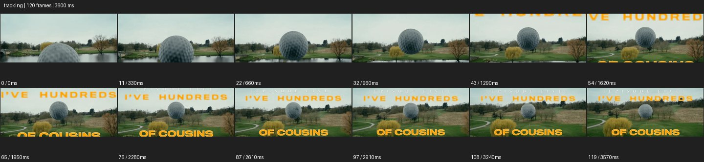

# Tracking


- 출처: Eyecandy · [Tracking](https://eyecannndy.com/technique/tracking)
- 카탈로그 등록 표기: **Tracking 트래킹**
- 카테고리: E · More Camera Moves · 카메라 무브 확장
- 원본 미디어: [애니메이션 WebP](https://asset.eyecannndy.com/media/clip/2024/03/12/261710225646.webp)
- 확인 방식: 원본 애니메이션을 디코딩해 시간순 프레임을 추출한 뒤 컨택트 시트를 직접 시각 확인했다. 전체 120프레임 / 3600ms, 기본 12시점. 재생·음향 청취·전 프레임 시각 검수·생성 테스트를 했다고 주장하지 않는다.
- 기본 확인 프레임: 0, 11, 22, 32, 43, 54, 65, 76, 87, 97, 108, 119. 해당 타임스탬프(ms): 0, 330, 660, 960, 1290, 1620, 1950, 2280, 2610, 2910, 3240, 3570.
- 원본 길이는 관찰 정보다. 아래 새 장면의 길이를 원본에 자동 맞추지 않는다.

## 움직임 증거



## 원본에서 확인한 시작 → 변화 → 끝

거대한 골프공이 수면 앞의 가까운 위치에서 멀리 코스 쪽으로 이동한다. 카메라 구도도 이동하며 공을 중앙 부근에 유지하고, 뒤로 나무와 잔디 지형이 이어진다. 중후반에는 노란 큰 글자가 겹쳐진다.

- 카메라·시점: 공이 중앙 부근에 남도록 경로를 따른다.
- 주체: 공이 코스 위 멀리 이동한다.
- 조명·합성·편집: 과장된 공 규모와 노란 글자 합성 층이 있다.

## 작동 원리와 확인 한계

움직이는 주체를 지속적으로 따라가 위치 관계와 이동 경로를 읽힌다. 공의 과장된 규모는 합성 가능성을 시사하나 제작 방법은 미확인.

샘플 사이의 빠른 변화는 일부 빠질 수 있다. GIF의 반복 경계가 작품의 의도된 완전 루프라는 보장은 없다. 원본 음악·대사·촬영 장비·제작 소프트웨어는 확인하지 않았다. 아래 프롬프트는 관찰한 원리를 다른 장면에 각색한 창작안이며 원본 장면이나 검증된 생성 결과가 아니다.

## 뮤직비디오 각색 · 완전한 장면 프롬프트

```text
새벽 지하 통로를 걸어 나가는 성인 보컬의 뮤직비디오. 카메라는 정면 미디엄에서 보컬과 같은 속도로 뒤로 이동한다. 보컬은 발걸음에 맞춰 손을 펴며 렌즈를 바라보고, 뒤의 형광등과 기둥이 순차적으로 멀어진다. 출구 빛에 닿으면 카메라가 조금 느려져 얼굴이 가까워지고 보컬도 걸음을 멈춘다. 마지막에는 눈높이 얼굴 구도로 안정시켜 결심한 표정을 남긴다. 주체의 보행과 카메라 후진을 따로 유지하며 얼굴 크기가 이동 중 갑자기 뛰지 않게 한다.
```

## 브랜드필름 각색 · 완전한 장면 프롬프트

```text
경량 여행가방을 끌고 밝은 역 통로를 걷는 성인 여행자의 브랜드필름. 카메라는 가방 높이의 측후면에서 같은 속도로 이동하며 바퀴와 손잡이를 담는다. 바닥 타일과 기둥이 뒤로 흐르고, 여행자가 코너를 돌 때 카메라도 넓게 경로를 따라가 가방 측면을 유지한다. 여행자가 창가에서 멈추면 카메라도 감속해 가방과 다리가 함께 들어오는 구도에 착지한다. 바퀴는 지면에 접촉하고 손잡이 길이와 제품 구조를 일정하게 유지한다. 끝에는 쉘 표면의 반사를 읽힌다.
```

적용 시 사용자가 지정한 길이·참조·컷·음향·제품 보존 조건을 우선한다. 효과의 시작 계기와 도착 구도를 유지하며 필요한 부분을 해당 장면에 맞춰 다시 연출한다.
