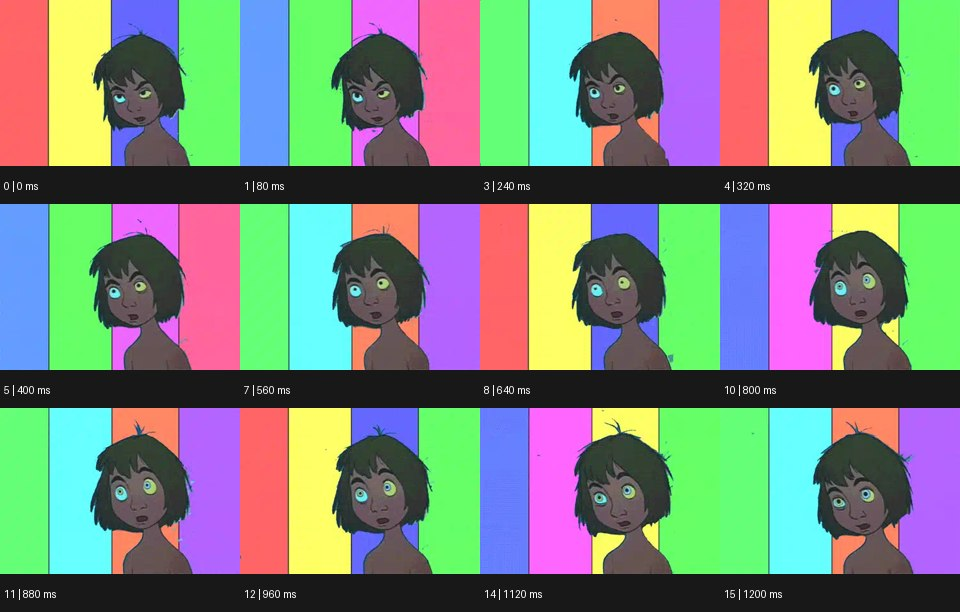

# Animation 셀 애니메이션


출처: Eyecandy · 원본 등록 카드명: **Animation 셀 애니메이션** · slug: traditional

분류: I · VFX & Style / VFX & 스타일

[원본 기법 페이지](https://eyecannndy.com/technique/traditional) · [원본 미디어](https://asset.eyecannndy.com/media/clip/2024/02/08/261707407268.webp)

## 확인 근거

원본 16프레임, 메타데이터 길이 1280ms. 고유 12개 시점 프레임을 추출하여 이미지로 직접 관찰했다. 재생 감상·음향 청취·생성 재현 테스트를 했다는 뜻이 아니다.

표본 프레임(0부터): 0, 1, 3, 4, 5, 7, 8, 10, 11, 12, 14, 15



## 실제 시간순 관찰

0–320ms: 선으로 그린 인물이 여러 색의 세로 띠 앞에서 옆을 본다. 400–800ms: 눈동자의 크기와 위치, 입 모양이 달라지고 배경 색 띠의 배열도 바뀐다. 880–1200ms: 고개 각도와 놀란 표정이 이어지며 평면 선화와 단색 면이 유지된다.

## 주체·카메라·합성·편집 구분

주체의 표정·고개는 드로잉 애니메이션으로 바뀐다. 카메라에 해당하는 프레임 구도는 비슷하다. 배경은 별도 평면 색층처럼 변화한다.

## 장면에 재사용할 원리

윤곽선과 평면 채색을 유지하면서 핵심 포즈·표정을 그림 단위로 설계한다. 실제 셀 필름 사용 여부는 확인되지 않는다.

## 확인 한계

공식 카드의 Animation 범주를 특정 제작 재료인 셀 필름으로 제한하지 않는다. 표본 사이의 모든 프레임과 반복 경계의 연속성을 검사하지 않았다. 음향은 확인하지 않았다.

## 뮤직비디오 각색 · 완성형 프롬프트

아래는 장면 목적에 맞게 새로 설계한 창작 적용안이며 원본 길이를 상속하지 않는다.

```text
6초 손그림 애니메이션 뮤직비디오, 파란 밤의 창가에서 붉은 스웨터를 입은 성인 보컬을 가슴 위로 그린다. 고정 카메라 구도에서 보컬이 창밖을 보다가 천천히 관객 쪽으로 눈을 돌린다. 눈동자 이동을 먼저 보여주고 두 장의 중간 포즈를 거쳐 고개가 따라오게 한다. 뒤의 세로 커튼은 보컬의 숨을 따라 조금씩 부풀며 남색에서 보랏빛으로 바뀐다. 굵기가 살아 있는 연필 윤곽선과 평면 채색을 전 구간 유지한다. 마지막에는 입을 다문 조용한 응시를 1초 남겨 과장된 표정이 감정으로 가라앉게 한다. 자막·대사 없이 바람 소리만 둔다.
```

## 브랜드필름 각색 · 완성형 프롬프트

```text
7초 차 브랜드필름, 아이보리 종이 질감 위에 짙은 녹색 선으로 찻잔과 차나무 가지를 그린다. 카메라는 사선 위쪽의 고정 구도다. 1초 후 손그림의 물줄기가 찻잔 안으로 들어오고 잔 위 증기는 넓은 잎 모양으로 두 번 펼쳐졌다가 가늘어진다. 찻잔 외곽과 손잡이 형태는 프레임마다 흔들리지 않게 유지하고 증기와 잎에만 유연한 드로잉 변화를 둔다. 4초에 차가 채워지면 물줄기는 멈추고 배경의 작은 잎 하나가 잔 옆에 내려앉는다. 마지막 2초는 차의 따뜻한 색과 단정한 제품 실루엣을 읽힌다. 포장 글자를 만들지 않고 물소리만 둔다.
```

생성 테스트: 미실시. 단일 모델의 정확한 재현을 보장하지 않으며 필요한 촬영·합성·편집 층을 구분해 구현한다.
