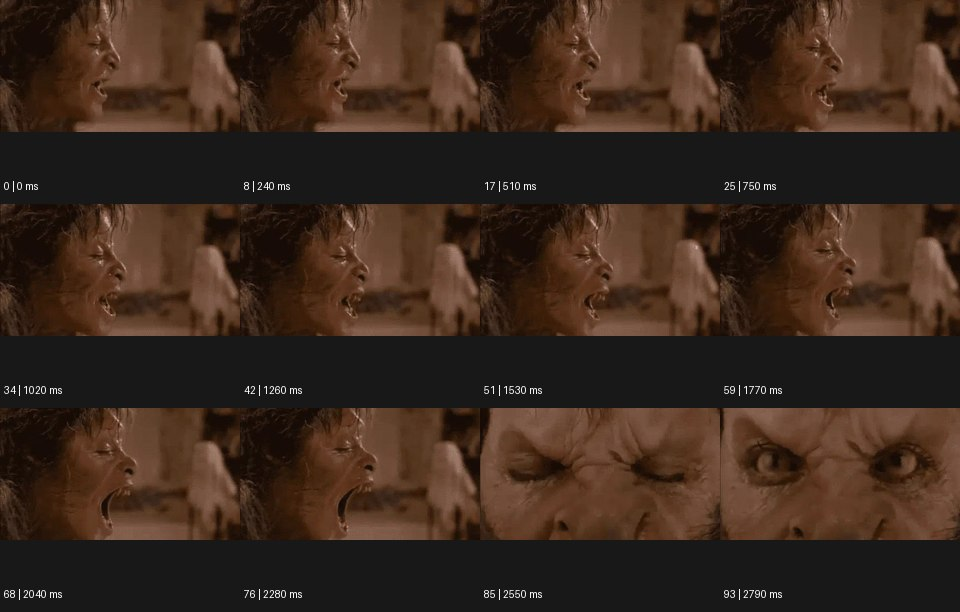

# Transformation 트랜스포메이션


출처: Eyecandy · 원본 등록 카드명: **Transformation 트랜스포메이션** · slug: transformation

분류: I · VFX & Style / VFX & 스타일

[원본 기법 페이지](https://eyecannndy.com/technique/transformation) · [원본 미디어](https://asset.eyecannndy.com/media/clip/2024/03/18/261710752644.webp)

## 확인 근거

원본 94프레임, 메타데이터 길이 2820ms. 고유 12개 시점 프레임을 추출하여 이미지로 직접 관찰했다. 재생 감상·음향 청취·생성 재현 테스트를 했다는 뜻이 아니다.

표본 프레임(0부터): 0, 8, 17, 25, 34, 42, 51, 59, 68, 76, 85, 93



## 실제 시간순 관찰

0–750ms: 갈색 조명의 측면 얼굴이 입을 벌리고 피부와 얼굴 윤곽이 거칠게 보인다. 1020–2280ms: 입이 크게 열리고 이와 턱 주변의 형태가 더 두드러진다. 2550–2790ms: 정면 눈 주변의 극단적 클로즈업으로 화면이 바뀌며 눈꺼풀이 열려 변형된 눈을 드러낸다.

## 주체·카메라·합성·편집 구분

주체는 입과 눈을 움직인다. 분장·형태 변형 층이 신체의 비인간적 상태를 만든 것으로 보이나 공정은 미확인이다. 후반은 측면에서 정면 눈으로 편집·숏 변경이 확인된다.

## 장면에 재사용할 원리

대상의 정체성 일부를 유지하면서 신체나 재질의 상태가 다른 존재로 바뀌는 사건을 단계적으로 드러낸다. 모핑처럼 윤곽만 바꾸는 데 그치지 않고 동작과 소재 반응을 함께 설계한다.

## 확인 한계

생물 변형 장면을 모든 브랜드에 그대로 옮기지 않는다. 정면 눈 숏이 연속 카메라 이동이라는 근거는 없다. 표본 사이의 모든 프레임과 반복 경계의 연속성을 검사하지 않았다. 음향은 확인하지 않았다.

## 뮤직비디오 각색 · 완성형 프롬프트

아래는 장면 목적에 맞게 새로 설계한 창작 적용안이며 원본 길이를 상속하지 않는다.

```text
7초 뮤직비디오, 어두운 온실에서 성인 가수가 검은 장갑을 낀 손을 얼굴 앞에 든다. 카메라는 손과 얼굴이 함께 읽히는 정면 클로즈업이다. 2초에 가수가 주먹을 천천히 펴면 장갑 표면의 실밥이 은빛 잎맥으로 변하고 손가락 바깥을 따라 얇은 금속 잎이 펼쳐진다. 피부나 손가락 수는 바뀌지 않으며 장갑의 소재만 새로운 갑옷으로 변한다. 카메라는 15도 옆으로 이동해 잎 사이의 깊이를 보여주고 5초에 멈춘다. 가수가 변한 손을 내려 눈을 드러내며 변화한 자신을 받아들이는 표정으로 끝낸다. 자막 없이 잎이 마찰하는 금속 소리만 둔다.
```

## 브랜드필름 각색 · 완성형 프롬프트

```text
8초 소재 연구를 주제로 한 가방 브랜드필름, 따뜻한 회색 스튜디오의 작업대에 천으로 된 작은 파우치를 놓는다. 고정된 삼사분면 카메라 앞에서 장인의 손이 파우치 표면을 한 번 쓸어내린다. 손이 지난 영역부터 부드러운 직물이 촘촘한 가죽 결로 변하고 접힌 가장자리가 제품의 구조적인 모서리로 정돈된다. 4초 동안 변화가 위에서 아래로 진행되어 하나의 완성된 가죽 가방에 도달한다. 손잡이 수와 지퍼 위치를 중간부터 끝까지 일관되게 유지한다. 마지막 3초에는 장인이 손을 빼고 카메라가 조금 접근해 결·스티치·완성 형태를 읽힌다. 새 문자나 로고는 없다.
```

생성 테스트: 미실시. 단일 모델의 정확한 재현을 보장하지 않으며 필요한 촬영·합성·편집 층을 구분해 구현한다.
