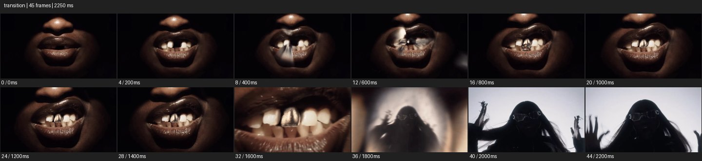
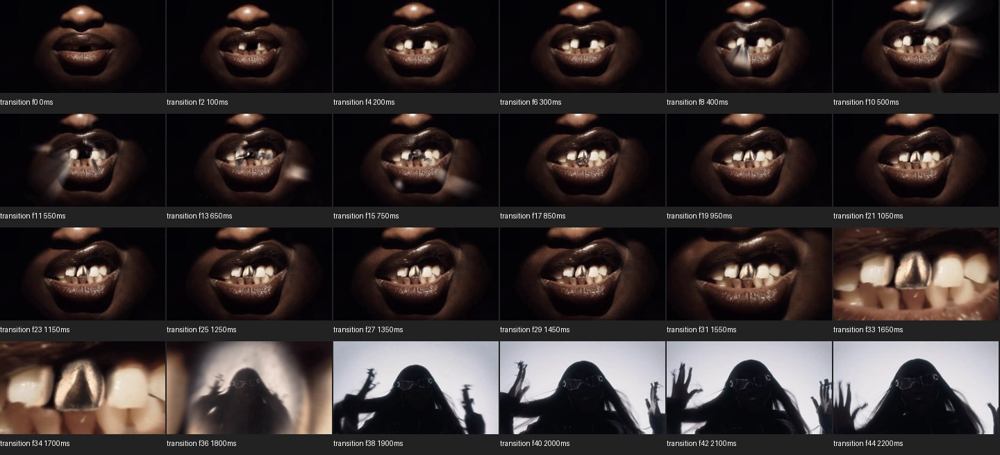

# Transitions


- 출처: Eyecandy · [Transitions](https://eyecannndy.com/technique/transition)
- 카탈로그 등록 표기: **Transitions 전환 일반**
- 카테고리: H · More Editing & Transition · 편집 & 전환 확장
- 원본 미디어: [애니메이션 WebP](https://asset.eyecannndy.com/media/clip/2024/07/05/261720163386.webp)
- 확인 방식: 원본 애니메이션을 디코딩해 시간순 프레임을 추출한 뒤 컨택트 시트를 직접 시각 확인했다. 전체 45프레임 / 2250ms, 기본 12시점, 추가 24시점 고밀도 확인. 재생·음향 청취·전 프레임 시각 검수·생성 테스트를 했다고 주장하지 않는다.
- 기본 확인 프레임: 0, 4, 8, 12, 16, 20, 24, 28, 32, 36, 40, 44. 해당 타임스탬프(ms): 0, 200, 400, 600, 800, 1000, 1200, 1400, 1600, 1800, 2000, 2200.
- 원본 길이는 관찰 정보다. 아래 새 장면의 길이를 원본에 자동 맞추지 않는다.

## 움직임 증거





## 원본에서 확인한 시작 → 변화 → 끝

검은 배경에서 코와 입술만 읽히는 얼굴 하부가 보인다. 입이 열려 금속 치아가 드러나고 반사 같은 밝은 흔적이 지나간다. 약 1.55–1.70초에 금속 치아 중심으로 급확대하고 1.80초에는 밝은 배경 앞 선글라스 인물이 나타나 2.20초까지 손을 움직인다.

- 카메라·시점: 입 하부에서 금속 치아 중심으로 급격히 확대한다.
- 주체: 입이 열리고 다음 인물이 손을 움직인다.
- 조명·합성·편집: 금속 디테일의 밝은 형상에서 밝은 배경 인물 장면으로 연결한다.

## 작동 원리와 확인 한계

입의 실제 동작, 금속 치아 디테일, 급격한 확대와 다음 장면의 밝은 형상을 연결한다. 등록명 Transitions를 유지한다. Spotlight나 마스킹 단독 효과로 재명명하지 않으며 반사 내부 연결의 세부 합성법은 미확인.

샘플 사이의 빠른 변화는 일부 빠질 수 있다. GIF의 반복 경계가 작품의 의도된 완전 루프라는 보장은 없다. 원본 음악·대사·촬영 장비·제작 소프트웨어는 확인하지 않았다. 아래 프롬프트는 관찰한 원리를 다른 장면에 각색한 창작안이며 원본 장면이나 검증된 생성 결과가 아니다.

## 뮤직비디오 각색 · 완전한 장면 프롬프트

```text
검은 의상의 성인 보컬이 비 내린 밤거리에서 은색 반지를 돌리는 뮤직비디오. 카메라는 손과 얼굴이 함께 보이는 가까운 구도로 시작하고 보컬이 반지를 빛 쪽으로 기울이면 반지 표면에 밝은 무대가 반사된다. 카메라가 그 반사 중심으로 빠르게 접근해 금속 곡면이 화면을 채우는 순간 밝은 무대 위 같은 보컬의 미디엄으로 연결한다. 다음 장면에서도 짧게 접근을 이어 감속하고 보컬이 손을 펼치면 정지한다. 두 장면의 보컬 얼굴과 의상을 일치시킨다.
```

## 브랜드필름 각색 · 완전한 장면 프롬프트

```text
향수의 맑고 차가운 인상을 전달하는 브랜드필름. 카메라는 유리 향수병 어깨에 맺힌 한 방울을 매크로로 담고 방울 안에 비친 푸른 하늘을 읽힌다. 빛이 방울 가장자리를 스치는 순간 카메라가 곡면 중심으로 빠르게 접근해 굴절된 푸른 형태가 화면 전체를 채우게 한다. 같은 색과 곡률의 새벽 호수 수면으로 한 번 연결하고 카메라는 낮게 전진하다 감속해 수평선 앞에서 멈춘다. 마지막에는 잔물결만 남는다. 병 라벨과 형태는 전환 전에 충분히 읽히게 한다.
```

적용 시 사용자가 지정한 길이·참조·컷·음향·제품 보존 조건을 우선한다. 효과의 시작 계기와 도착 구도를 유지하며 필요한 부분을 해당 장면에 맞춰 다시 연출한다.
