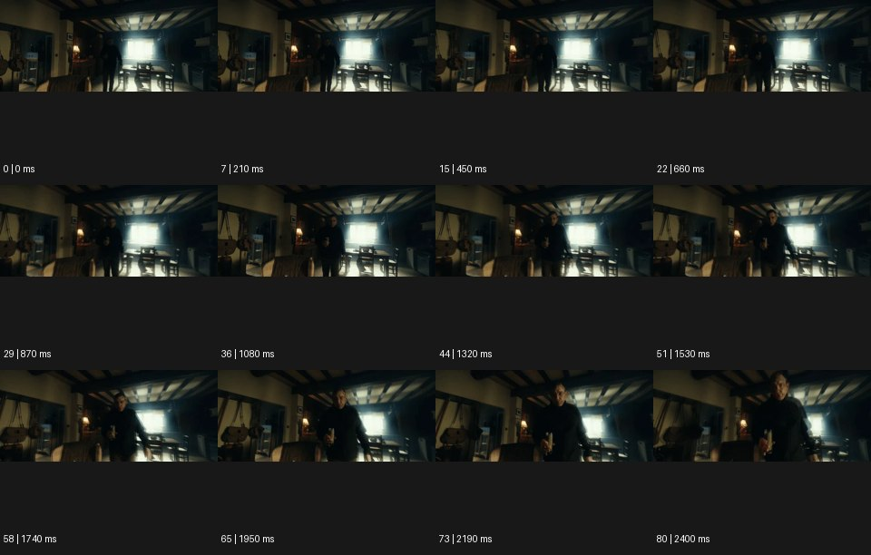

# Altered State 알터드 스테이트


출처: Eyecandy · 원본 등록 카드명: **Altered State 알터드 스테이트** · slug: trip

분류: J · People, POV & Mood / 인물·시점·무드

[원본 기법 페이지](https://eyecannndy.com/technique/trip) · [원본 미디어](https://asset.eyecannndy.com/media/clip/2024/03/10/261710032970.webp)

## 확인 근거

원본 81프레임, 메타데이터 길이 2430ms. 고유 12개 시점 프레임을 추출하여 이미지로 직접 관찰했다. 재생 감상·음향 청취·생성 재현 테스트를 했다는 뜻이 아니다.

표본 프레임(0부터): 0, 7, 15, 22, 29, 36, 44, 51, 58, 65, 73, 80



## 실제 시간순 관찰

0–660ms: 창빛이 강한 어두운 실내에서 한 인물이 멀리 서 있고 공간 가장자리가 기울거나 불안정하게 보인다. 870–1530ms: 인물이 카메라 쪽으로 접근하며 구도 흔들림과 흐림이 이어진다. 1740–2400ms: 인물이 더 커지고 전경으로 다가오지만 같은 실내 공간을 유지한다.

## 주체·카메라·합성·편집 구분

주체의 전진과 카메라의 기울기·흔들림이 결합한다. 광학 왜곡 또는 후처리의 정확한 비율은 미확인이다. 환각의 원인·약물 사용은 영상만으로 알 수 없다.

## 장면에 재사용할 원리

안정된 기준점과 불안정한 주변 원근·초점을 대비해 지각이 흔들리는 상태를 연출한다.

## 확인 한계

카탈로그에 있는 색 번짐이 이 원본에서 강하게 보인다고 확대 해석하지 않는다. 특정 정신 상태를 진단하지 않는다. 표본 사이의 모든 프레임과 반복 경계의 연속성을 검사하지 않았다. 음향은 확인하지 않았다.

## 뮤직비디오 각색 · 완성형 프롬프트

아래는 장면 목적에 맞게 새로 설계한 창작 적용안이며 원본 길이를 상속하지 않는다.

```text
7초 지각 변형 뮤직비디오, 성인 보컬이 오래된 빈 식당의 끝에서 카메라 쪽으로 천천히 걸어온다. 카메라는 앉은 사람 눈높이에서 시작하고 보컬의 얼굴만 중심에 유지한다. 2초부터 화면 가장자리의 의자와 벽선이 호흡처럼 조금 휘었다 펴지며 카메라가 좌우로 약하게 기운다. 보컬의 얼굴과 신체는 정상 형태를 유지하고 주변 왜곡이 몸을 통과하지 않게 한다. 5초에 보컬이 테이블에 손을 대고 멈추면 기울기와 왜곡이 차례로 가라앉는다. 마지막 2초는 안정된 얼굴과 손에 안착해 현실을 붙잡는 감정을 남긴다. 무자막, 발소리와 작은 호흡만 둔다.
```

## 브랜드필름 각색 · 완성형 프롬프트

```text
8초 감각적인 향수 브랜드필름, 성인 모델이 낮은 조명의 호텔 라운지에서 향수병을 손목 가까이 든다. 카메라는 모델 손과 얼굴을 함께 담는 정면 미디엄숏이다. 모델이 눈을 감는 순간 뒤의 램프와 커튼 가장자리만 부드럽게 이중으로 번지고 공간의 수직선이 약하게 휜다. 피부·병·라벨에는 왜곡을 적용하지 않는다. 카메라는 천천히 20cm 접근하고 모델이 눈을 뜨는 5초 지점에 배경의 중첩이 한 겹으로 정리된다. 마지막 3초는 손목과 병의 유리 재질에 안정적으로 안착한다. 의학적·효능 문구나 새 로고 없이 조용한 라운지 환경음만 둔다.
```

생성 테스트: 미실시. 단일 모델의 정확한 재현을 보장하지 않으며 필요한 촬영·합성·편집 층을 구분해 구현한다.
