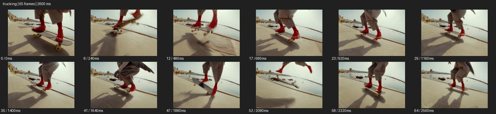

# Trucking


- 출처: Eyecandy · [Trucking](https://eyecannndy.com/technique/trucking)
- 카탈로그 등록 표기: **Trucking 트러킹**
- 카테고리: E · More Camera Moves · 카메라 무브 확장
- 원본 미디어: [애니메이션 WebP](https://asset.eyecannndy.com/media/clip/2024/03/04/261709537697.webp)
- 확인 방식: 원본 애니메이션을 디코딩해 시간순 프레임을 추출한 뒤 컨택트 시트를 직접 시각 확인했다. 전체 65프레임 / 2600ms, 기본 12시점. 재생·음향 청취·전 프레임 시각 검수·생성 테스트를 했다고 주장하지 않는다.
- 기본 확인 프레임: 0, 6, 12, 17, 23, 29, 35, 41, 47, 52, 58, 64. 해당 타임스탬프(ms): 0, 240, 480, 680, 920, 1160, 1400, 1640, 1880, 2080, 2320, 2560.
- 원본 길이는 관찰 정보다. 아래 새 장면의 길이를 원본에 자동 맞추지 않는다.

## 움직임 증거



## 원본에서 확인한 시작 → 변화 → 끝

빨간 부츠를 신은 스케이트보더의 다리와 보드를 낮은 측면에서 따라간다. 인물이 보드를 띄우고 착지하는 동안 바닥과 그림자가 옆으로 흐르며 피사체는 가까운 구도에 남는다.

- 카메라·시점: 낮은 측면에서 보드와 나란히 이동한다.
- 주체: 라이더가 점프·착지하며 발 위치를 바꾼다.
- 조명·합성·편집: 광각 왜곡·흔들림이 함께 있고 속도 처리 미확인.

## 작동 원리와 확인 한계

주체와 나란한 측면 이동으로 동작의 실루엣과 지면 관계를 유지한다. 핸드헬드 흔들림과 광각 원근도 함께 보인다.

샘플 사이의 빠른 변화는 일부 빠질 수 있다. GIF의 반복 경계가 작품의 의도된 완전 루프라는 보장은 없다. 원본 음악·대사·촬영 장비·제작 소프트웨어는 확인하지 않았다. 아래 프롬프트는 관찰한 원리를 다른 장면에 각색한 창작안이며 원본 장면이나 검증된 생성 결과가 아니다.

## 뮤직비디오 각색 · 완전한 장면 프롬프트

```text
긴 벽을 따라 사이드 스텝을 밟는 성인 댄서의 뮤직비디오. 카메라는 골반 높이의 측면 전신에서 시작해 댄서와 평행하게 오른쪽으로 이동한다. 발을 교차하고 다시 벌리는 동작을 끊지 않고 보여주며 가까운 벽 기둥이 반대 방향으로 흐르게 한다. 댄서가 벽 끝의 빛 안에서 낮게 점프하면 카메라는 수평 경로를 유지해 공중의 실루엣을 읽힌다. 착지 후 함께 감속하고 전신과 긴 그림자가 들어오는 구도로 멈춘다. 바닥 접촉과 다리 수를 보존한다.
```

## 브랜드필름 각색 · 완전한 장면 프롬프트

```text
붉은 가죽 부츠의 유연성을 보여주는 패션필름. 밝은 석재 보도에서 성인 모델이 일정한 걸음으로 걷는다. 카메라는 발목보다 조금 높은 측면에서 부츠와 평행하게 이동해 굽이 닿고 앞코가 접히는 순서를 가까이 보여준다. 먼 건축물은 천천히, 가까운 타일은 빠르게 뒤로 흐른다. 마지막에 모델이 한 발을 앞으로 두고 멈추면 카메라도 부드럽게 멈춰 두 부츠의 온전한 측면과 가죽 주름을 읽힌다. 제품 색과 굽 형태를 유지하고 불필요한 회전이나 점프컷은 넣지 않는다.
```

적용 시 사용자가 지정한 길이·참조·컷·음향·제품 보존 조건을 우선한다. 효과의 시작 계기와 도착 구도를 유지하며 필요한 부분을 해당 장면에 맞춰 다시 연출한다.
