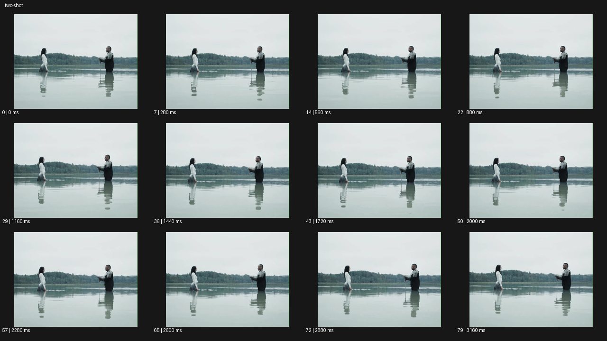

# Two Shot 투 샷


- 원본 등록명: **Two Shot 투 샷**
- 분류: B · 앵글 & 구도 / Angle & Framing
- 공식 기법 페이지: [Two Shot 투 샷](https://eyecannndy.com/technique/two-shot)
- 지정 원본 미디어: [애니메이션 WebP](https://asset.eyecannndy.com/media/clip/2024/03/26/261711436397.webp)
- 확인 방식: 80프레임 중 12시점의 시간순 이미지 배열을 직접 시각 확인. 메타데이터 길이 3.2초. 전체 프레임 재생·청음 확인 또는 생성 재현 테스트로 보고하지 않는다.



## 실제 관찰

회색 하늘 아래 얕은 물에 두 인물이 마주 서 있다. 왼쪽 인물은 흰 상의, 오른쪽은 어두운 상의를 입고 두 사람 사이에 넓은 간격이 남는다. 0–3.16초 손과 몸이 조금 움직이며 물결이 늘어나지만 두 사람과 반영을 함께 담는 구도는 유지된다.

## 작동 원리와 역할

두 피사체의 위치·거리·서로 향한 시선이 하나의 고정 구도에서 동시에 읽힌다. 물결은 주체의 작은 동작에 반응하고 역숏 컷은 보이지 않는다.

## 해석의 한계

대화나 갈등의 구체적인 내용은 확인하지 않았다. 투 샷은 전경·후경 배치만으로 제한되지 않는다. 샘플 사이의 모든 움직임과 반복 경계의 무봉합 여부는 별도 검증하지 않았다. 아래 프롬프트는 새로운 장면 각색이며 생성 테스트는 하지 않았다.

## 뮤직비디오 적용 · 완성형 프롬프트

아래 설정과 길이는 독립 창작 예시다. 실제 요청의 길이·참조·음향 조건을 우선한다.

```text
8초 듀엣 뮤직비디오. 새벽의 빈 야외 수영장 양 끝에 성인 보컬 두 명이 서로 마주 서 있다. 카메라는 옆에서 두 전신과 사이의 빈 공간을 한 프레임에 담고 고정한다. 첫 보컬이 한 걸음 다가서면 다른 보컬은 잠깐 시선을 내렸다가 같은 거리만큼 움직인다. 두 사람은 끝내 만나지 않고 중앙에 팔 하나만큼 간격을 남긴다. 카메라는 클로즈업으로 자르지 않아 접근과 멈춤을 동시에 읽히게 한다. 마지막 2초 두 사람이 서로를 보는 상태로 머물며 옷자락만 바람에 움직인다. 인물의 위치와 이동 방향을 바꾸지 않는다.
```

## 브랜드필름 적용 · 완성형 프롬프트

제품의 재질과 기능이 읽히는 순간에 효과를 배치하고 안정된 제품 상태로 끝낸다. 실제 브랜드 톤과 구조에 맞춰 각색한다.

```text
8초 고급 가구 필름. 긴 참나무 식탁 양쪽에 성인 두 사람이 앉은 넓은 투 샷이다. 낮은 오후빛이 식탁 위를 가로지르고 카메라는 두 사람과 테이블 전체를 함께 담는다. 왼쪽 인물이 작은 도자기 그릇을 중앙으로 밀고 오른쪽 인물이 손을 내밀어 받는다. 두 동작이 한 프레임 안에서 이어져 식탁의 넓이와 두 사람의 관계가 동시에 읽힌다. 카메라는 아주 느리게 뒤로 이동해 의자의 곡선까지 드러낸다. 마지막에는 두 사람이 손을 거두고 완성된 식탁 배치를 2초간 유지한다. 목재 결, 다리 구조, 제품 비례는 변형하지 않는다.
```

음향은 원본에서 확인하지 않았다. 실제 음원과 무음·NO BGM 등 사용자 조건을 유지한다. 특정 모델의 자동 재현을 보장하는 프리셋이 아니다.
