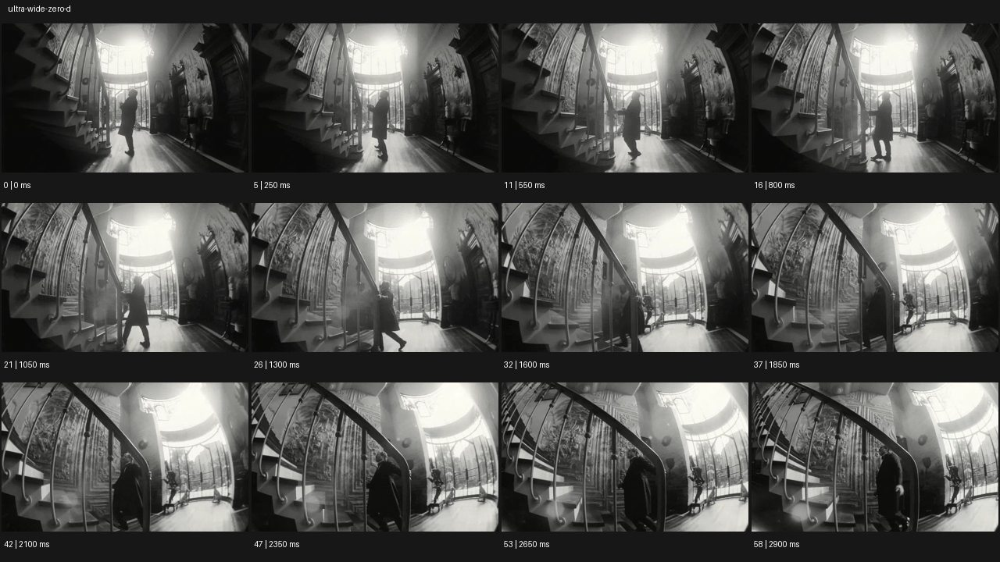

# Ultra Wide


- 원본 등록명: **Ultra Wide**
- 분류: D · 편집 & 전환 / Editing & Transition
- 공식 기법 페이지: [Ultra Wide](https://eyecannndy.com/technique/ultra-wide-zero-d)
- 지정 원본 미디어: [애니메이션 WebP](https://asset.eyecannndy.com/media/clip/2024/03/06/261709715882.webp)
- 확인 방식: 59프레임 중 12시점의 시간순 이미지 배열을 직접 시각 확인. 메타데이터 길이 2.95초. 전체 프레임 재생·청음 확인 또는 생성 재현 테스트로 보고하지 않는다.



## 실제 관찰

흑백의 높은 실내에서 왼쪽 나선형 계단, 오른쪽 벽, 뒤쪽 밝은 출입구가 한 화면에 들어온다. 인물이 입구에서 안쪽으로 걸어오고 1.05–1.85초 계단 가까이 이동한다. 2.1–2.9초 카메라 시점도 계단 쪽을 더 담으며 높은 천장과 깊은 바닥이 강조된다.

## 작동 원리와 역할

넓은 화각과 가까운 계단 전경이 공간 깊이와 인물 크기 차이를 만든다. 주체 걷기와 완만한 카메라 재프레이밍이 함께 있다.

## 해석의 한계

Zero-D라는 slug만으로 실제 무왜곡 렌즈 사용을 확정할 수 없다. 주변부 곡률이 보이므로 직선이 완벽하게 유지된다고 주장하지 않는다. 샘플 사이의 모든 움직임과 반복 경계의 무봉합 여부는 별도 검증하지 않았다. 아래 프롬프트는 새로운 장면 각색이며 생성 테스트는 하지 않았다.

## 뮤직비디오 적용 · 완성형 프롬프트

아래 설정과 길이는 독립 창작 예시다. 실제 요청의 길이·참조·음향 조건을 우선한다.

```text
8초 뮤직비디오. 높은 천장과 두 층 난간이 있는 빈 도서관에서 성인 보컬이 먼 문을 열고 들어온다. 카메라는 낮은 눈높이의 초광각 구도로 가까운 책상 모서리, 양쪽 서가, 멀리 있는 문을 한 번에 담는다. 보컬이 중앙 통로를 따라 걸어오면 카메라는 천천히 뒤로 이동해 주변 공간이 벌어지는 느낌을 유지한다. 가까운 책상은 크게 지나가지만 얼굴이 가장자리에서 늘어나지 않도록 보컬은 중앙 근처에 둔다. 마지막 보컬이 책상에 손을 얹고 멈추면 카메라도 정지한다. 넓은 공간과 인물의 작은 존재를 함께 남긴다.
```

## 브랜드필름 적용 · 완성형 프롬프트

제품의 재질과 기능이 읽히는 순간에 효과를 배치하고 안정된 제품 상태로 끝낸다. 실제 브랜드 톤과 구조에 맞춰 각색한다.

```text
8초 고급 건축 가구 필름. 넓은 석재 거실의 낮은 원목 의자를 전경에 놓고 뒤쪽에는 큰 창과 성인 사용자가 보인다. 카메라는 초광각의 낮은 사선 구도로 의자 다리와 전체 공간을 함께 담는다. 사용자가 창가에서 걸어와 의자에 앉는 동안 카메라는 짧게 오른쪽으로 이동해 전경 구조와 후경의 깊이 차이를 보여준다. 의자는 화면 중심 가까이에 두어 비정상적인 늘어짐을 줄인다. 착석 후 카메라가 멈추고 자연광이 나뭇결을 드러낸다. 마지막 2초 사람과 의자의 비례, 다리 연결 구조, 실내 여백을 선명하게 유지한다.
```

음향은 원본에서 확인하지 않았다. 실제 음원과 무음·NO BGM 등 사용자 조건을 유지한다. 특정 모델의 자동 재현을 보장하는 프리셋이 아니다.
