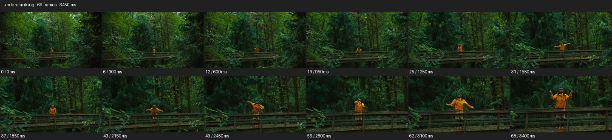

# Fast Motion


- 출처: Eyecandy · [Fast Motion](https://eyecannndy.com/technique/undercranking)
- 카탈로그 등록 표기: **Fast Motion 패스트모션**
- 카테고리: G · Speed & Time · 속도 & 시간
- 원본 미디어: [애니메이션 WebP](https://asset.eyecannndy.com/media/clip/2024/03/22/261711139246.webp)
- 확인 방식: 원본 애니메이션을 디코딩해 시간순 프레임을 추출한 뒤 컨택트 시트를 직접 시각 확인했다. 전체 69프레임 / 3450ms, 기본 12시점. 재생·음향 청취·전 프레임 시각 검수·생성 테스트를 했다고 주장하지 않는다.
- 기본 확인 프레임: 0, 6, 12, 19, 25, 31, 37, 43, 49, 56, 62, 68. 해당 타임스탬프(ms): 0, 300, 600, 950, 1250, 1550, 1850, 2150, 2450, 2800, 3100, 3400.
- 원본 길이는 관찰 정보다. 아래 새 장면의 길이를 원본에 자동 맞추지 않는다.

## 움직임 증거



## 원본에서 확인한 시작 → 변화 → 끝

숲의 목조 다리 위 노란 옷 인물이 멀리 보인다. 카메라가 앞으로 이동하며 인물이 커지고 팔을 빠르게 바꾸며 퍼포먼스한다. 끝에는 다리 난간 뒤 상체와 팔이 더 크게 보인다.

- 카메라·시점: 다리 위 인물 쪽으로 전진한다.
- 주체: 인물 팔 동작이 빠르게 바뀐다.
- 조명·합성·편집: 가속된 시간감과 접근이 결합하며 배율 미확인.

## 작동 원리와 확인 한계

시간을 압축해 몸짓과 이동에 경쾌함을 준다. 카메라 전진도 함께 보여 정확한 재생 배율은 확인되지 않는다.

샘플 사이의 빠른 변화는 일부 빠질 수 있다. GIF의 반복 경계가 작품의 의도된 완전 루프라는 보장은 없다. 원본 음악·대사·촬영 장비·제작 소프트웨어는 확인하지 않았다. 아래 프롬프트는 관찰한 원리를 다른 장면에 각색한 창작안이며 원본 장면이나 검증된 생성 결과가 아니다.

## 뮤직비디오 각색 · 완전한 장면 프롬프트

```text
늦은 준비를 서두르는 성인 보컬의 뮤직비디오. 고정 카메라로 작은 분장실 전체를 담고 보컬이 재킷을 입고 머리를 정리하고 마이크를 집는 과정을 빠른 재생으로 압축한다. 같은 공간과 사물 배치는 유지하고 동작 사이를 순간이동으로 건너뛰지 않는다. 문 앞에 도착하면 재생이 정상 속도로 돌아오고 보컬이 한 번 깊이 숨을 쉰다. 마지막에는 문을 열기 직전의 정지된 전신 구도를 남긴다. 빠른 구간과 정상 구간의 행동 연결을 분명히 한다.
```

## 브랜드필름 각색 · 완전한 장면 프롬프트

```text
도자기 테이블 세팅의 준비 과정을 보여주는 브랜드필름. 고정된 높은 사선 카메라 아래 장인의 손이 접시, 컵, 냅킨을 차례로 배치한다. 준비 구간은 빠른 재생으로 압축하되 손이 각 물건을 실제로 옮기는 경로가 남게 한다. 마지막 컵을 내려놓을 때 정상 속도로 돌아와 손가락이 손잡이에서 떨어지는 동작을 읽힌다. 이후 손이 프레임 밖으로 빠지고 완성된 테이블을 안정되게 유지한다. 그릇 개수와 색, 배치가 임의로 바뀌지 않게 한다.
```

적용 시 사용자가 지정한 길이·참조·컷·음향·제품 보존 조건을 우선한다. 효과의 시작 계기와 도착 구도를 유지하며 필요한 부분을 해당 장면에 맞춰 다시 연출한다.
