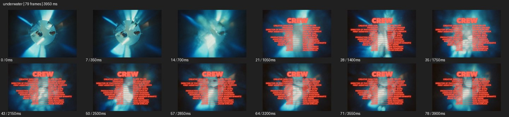

# Underwater


- 출처: Eyecandy · [Underwater](https://eyecannndy.com/technique/underwater)
- 카탈로그 등록 표기: **Underwater 수중 촬영**
- 카테고리: F · Lens & Optics · 렌즈 & 옵틱
- 원본 미디어: [애니메이션 WebP](https://asset.eyecannndy.com/media/clip/2024/03/19/261710827122.webp)
- 확인 방식: 원본 애니메이션을 디코딩해 시간순 프레임을 추출한 뒤 컨택트 시트를 직접 시각 확인했다. 전체 79프레임 / 3950ms, 기본 12시점. 재생·음향 청취·전 프레임 시각 검수·생성 테스트를 했다고 주장하지 않는다.
- 기본 확인 프레임: 0, 7, 14, 21, 28, 35, 43, 50, 57, 64, 71, 78. 해당 타임스탬프(ms): 0, 350, 700, 1050, 1400, 1750, 2150, 2500, 2850, 3200, 3550, 3900.
- 원본 길이는 관찰 정보다. 아래 새 장면의 길이를 원본에 자동 맞추지 않는다.

## 움직임 증거



## 원본에서 확인한 시작 → 변화 → 끝

청록색 물속에서 위의 밝은 원형 영역과 주변 인물·물체가 왜곡되어 보인다. 시점과 수면 굴절이 흔들리고 후반 붉은 제작진 글자가 화면 위에 겹쳐진다.

- 카메라·시점: 수면 아래에서 밝은 위쪽을 향한 시점이 흔들린다.
- 주체: 주변 인물·물체와 수면 형태가 변한다.
- 조명·합성·편집: 청록 굴절 영상 위 붉은 제작진 글자가 겹친다.

## 작동 원리와 확인 한계

물의 굴절, 부유하는 움직임과 수면을 통과한 빛이 공간 감각을 바꾼다. 깊이와 수중 촬영 장비, 원본 음향은 미확인.

샘플 사이의 빠른 변화는 일부 빠질 수 있다. GIF의 반복 경계가 작품의 의도된 완전 루프라는 보장은 없다. 원본 음악·대사·촬영 장비·제작 소프트웨어는 확인하지 않았다. 아래 프롬프트는 관찰한 원리를 다른 장면에 각색한 창작안이며 원본 장면이나 검증된 생성 결과가 아니다.

## 뮤직비디오 각색 · 완전한 장면 프롬프트

```text
성인 무용수가 얕은 수중 세트에서 천천히 팔을 펼치는 뮤직비디오. 카메라는 인물의 측면 전신을 물속에서 담고 아주 느리게 나란히 이동한다. 얇은 흰 천과 머리카락은 물의 저항에 따라 늦게 따라오고 위의 수면빛은 몸과 바닥에 움직이는 무늬를 만든다. 무용수가 팔을 모으면 카메라도 감속해 얼굴과 손이 함께 보이는 미디엄으로 끝낸다. 수면과 기포의 움직임을 일관되게 유지하고 인물의 관절과 얼굴을 굴절 때문에 과도하게 변형하지 않는다.
```

## 브랜드필름 각색 · 완전한 장면 프롬프트

```text
방수 기능을 주장하지 않는 조형적 주얼리 필름. 투명한 수조 안의 금속 반지를 얇은 실로 고정하고 카메라는 수평 측면의 근접 구도에서 시작한다. 위 수면에 작은 물결이 생기면 굴절된 빛무늬가 반지와 뒤의 밝은 벽을 천천히 지나간다. 카메라는 반지 주위를 짧게 원호 이동해 금속 곡면의 반사를 읽힌다. 마지막에는 반지 정면이 보이는 각도에서 멈추고 물결만 잔잔하게 남긴다. 제품 구조와 보석 수를 유지하고 물속에서 새 부품이 생기지 않게 한다.
```

적용 시 사용자가 지정한 길이·참조·컷·음향·제품 보존 조건을 우선한다. 효과의 시작 계기와 도착 구도를 유지하며 필요한 부분을 해당 장면에 맞춰 다시 연출한다.
