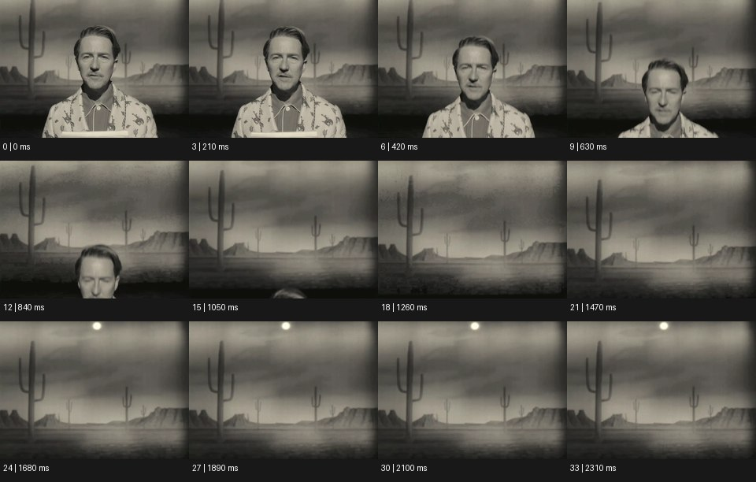

# Vintage / VHS 빈티지


출처: Eyecandy · 원본 등록 카드명: **Vintage / VHS 빈티지** · slug: vhs

분류: J · People, POV & Mood / 인물·시점·무드

[원본 기법 페이지](https://eyecannndy.com/technique/vhs) · [원본 미디어](https://asset.eyecannndy.com/media/clip/2024/01/04/261704383512.webp)

## 확인 근거

원본 34프레임, 메타데이터 길이 2380ms. 고유 12개 시점 프레임을 추출하여 이미지로 직접 관찰했다. 재생 감상·음향 청취·생성 재현 테스트를 했다는 뜻이 아니다.

표본 프레임(0부터): 0, 3, 6, 9, 12, 15, 18, 21, 24, 27, 30, 33



## 실제 시간순 관찰

0–420ms: 흑백 인물이 선인장과 사막 그림 같은 배경 앞에 정면으로 서 있다. 630–1050ms: 인물이 아래로 몸을 낮추어 머리가 프레임 아래로 빠진다. 1260–2310ms: 인물이 사라지고 사막 배경과 위쪽 밝은 점이 남는다. 부드러운 입자·가장자리 어두움이 지속된다.

## 주체·카메라·합성·편집 구분

인물의 하강이 주된 동작이고 카메라는 정면 고정이다. 배경은 회화적·무대 같은 질감이다. 빈티지 흑백 화면 표현은 보이지만 VHS 트래킹 노이즈는 뚜렷하지 않다.

## 장면에 재사용할 원리

시대감 있는 대비·해상도·입자·무대 표현으로 기억된 영상 매체의 감각을 만든다. 테이프 아티팩트는 별도 창작 선택이다.

## 확인 한계

Vintage / VHS 카드의 원본을 컬러 VHS 트래킹 오류 사례라고 서술하지 않는다. 정확한 매체와 연대는 미확인이다. 표본 사이의 모든 프레임과 반복 경계의 연속성을 검사하지 않았다. 음향은 확인하지 않았다.

## 뮤직비디오 각색 · 완성형 프롬프트

아래는 장면 목적에 맞게 새로 설계한 창작 적용안이며 원본 길이를 상속하지 않는다.

```text
7초 빈티지 뮤직비디오, 성인 보컬을 손으로 그린 밤바다 무대 배경 앞에 세우고 정면 고정 미디엄숏으로 담는다. 흑백의 부드러운 대비와 작은 필름 입자를 유지하고 과도한 테이프 줄무늬는 넣지 않는다. 첫 3초 동안 보컬이 렌즈를 바라보다가 천천히 시선을 내린다. 이어 낮은 의자에 앉으며 얼굴이 프레임 아래로 사라지고 무대의 그려진 달과 파도만 남는다. 카메라는 인물을 따라 틸트하지 않는다. 마지막 2초는 사람이 떠난 빈 무대의 질감과 위쪽 조명을 그대로 읽힌다. 화면 문자·새 로고·대사 없이 방의 작은 잔향만 둔다.
```

## 브랜드필름 각색 · 완성형 프롬프트

```text
8초 헤리티지 시계 브랜드필름, 회화적인 회색 도시 배경 앞에 성인 모델의 손목을 가까이 담는다. 고정 카메라, 부드러운 흑백 대비와 미세한 입자로 오래된 스튜디오 초상 감각을 만든다. 모델이 2초에 손목을 천천히 돌리면 시계 유리의 하이라이트가 문자판을 한 번 지나간다. 시계 인덱스와 바늘은 흐려지거나 재생성되지 않게 보존하고 입자는 제품 디테일을 삼키지 않을 만큼 작게 둔다. 5초에 손목이 정면으로 멈추면 마지막 3초는 케이스 두께와 스트랩의 질감을 읽힌다. 색 복귀 전환·가짜 연도·새 로고·자막 없이 옷감 소리만 둔다.
```

생성 테스트: 미실시. 단일 모델의 정확한 재현을 보장하지 않으며 필요한 촬영·합성·편집 층을 구분해 구현한다.
