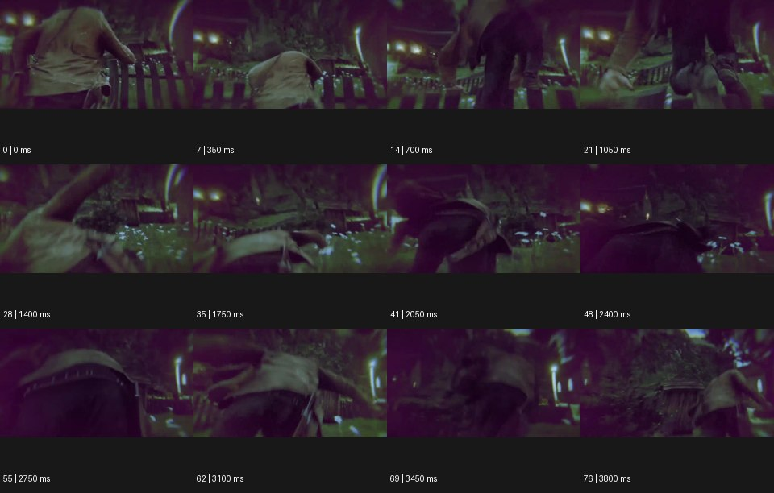

# Video Game 비디오 게임 룩


출처: Eyecandy · 원본 등록 카드명: **Video Game 비디오 게임 룩** · slug: video-game

분류: I · VFX & Style / VFX & 스타일

[원본 기법 페이지](https://eyecannndy.com/technique/video-game) · [원본 미디어](https://asset.eyecannndy.com/media/clip/2024/02/20/261708401438.webp)

## 확인 근거

원본 77프레임, 메타데이터 길이 3850ms. 고유 12개 시점 프레임을 추출하여 이미지로 직접 관찰했다. 재생 감상·음향 청취·생성 재현 테스트를 했다는 뜻이 아니다.

표본 프레임(0부터): 0, 7, 14, 21, 28, 35, 41, 48, 55, 62, 69, 76



## 실제 시간순 관찰

0–700ms: 어둡고 녹색빛인 장소에서 인물의 뒤쪽을 가까이 따라간다. 1050–2050ms: 인물이 몸을 굽히거나 넘어지듯 낮아지고 카메라도 기울고 내려간다. 2400–3800ms: 인물의 허리·등 가까운 낮은 구도에서 다시 움직이며 울타리와 불빛이 배경으로 흔들린다.

## 주체·카메라·합성·편집 구분

인물 동작과 그 뒤를 따르는 시점의 흔들림이 함께 있다. 녹색·보라색 테두리와 흐림 같은 화면 처리가 보인다. UI·점수나 게임 엔진은 샘플에서 확인되지 않는다.

## 장면에 재사용할 원리

플레이 가능한 인물을 가까이 따라가는 제삼자 시점, 동작에 반응하는 카메라, 일관된 렌더링 톤으로 게임 감각을 만든다.

## 확인 한계

원본이 실제 게임 영상인지 게임을 모사한 실사인지 확정하지 않는다. 표본 사이의 모든 프레임과 반복 경계의 연속성을 검사하지 않았다. 음향은 확인하지 않았다.

## 뮤직비디오 각색 · 완성형 프롬프트

아래는 장면 목적에 맞게 새로 설계한 창작 적용안이며 원본 길이를 상속하지 않는다.

```text
7초 게임 시점 뮤직비디오, 검은 후드의 성인 보컬을 청록색 조명이 켜진 빈 지하 주차장에 둔다. 카메라는 보컬 등 뒤 1.5m, 어깨 높이에서 따라간다. 보컬이 세 걸음 전진한 뒤 왼쪽 기둥을 돌아서면 카메라는 반 박자 늦게 같은 곡선을 따라 돌며 행동에 반응하는 게임 시점을 만든다. 화면 가장자리에는 약한 색수차를 두되 중앙 인물은 선명하게 유지한다. 5초에 보컬이 걸음을 멈추고 고개만 관객 쪽으로 돌리면 카메라도 감속해 뒤쪽 삼사분면에서 안착한다. 다른 인물 생성·HUD·무기 없이 발소리와 환풍기 소리만 둔다.
```

## 브랜드필름 각색 · 완성형 프롬프트

```text
8초 아웃도어 재킷 브랜드필름, 안개 낀 돌길을 걷는 성인 모델을 등 뒤의 제삼자 추적 시점으로 담는다. 첫 2초는 재킷 등판과 배낭 없이 드러난 어깨 봉제선을 읽힌다. 모델이 낮은 돌턱을 올라가면 카메라도 일정 거리에서 높아져 길 너머의 계곡을 보여주고 움직임에 약한 관성을 남긴다. 게임처럼 명료한 공간 깊이를 갖되 실제 직물과 지퍼는 사실적으로 유지한다. 5초에 모델이 전망대에서 멈추면 카메라는 30도 옆으로 돌아 재킷 측면과 얼굴을 함께 담는다. 마지막 2초는 바람에 흔들리는 옷자락과 안정된 제품 형태, UI·점수·새 로고는 없다.
```

생성 테스트: 미실시. 단일 모델의 정확한 재현을 보장하지 않으며 필요한 촬영·합성·편집 층을 구분해 구현한다.
