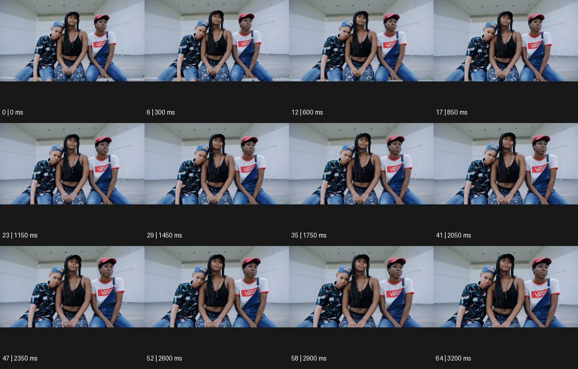

# Video Portraits 비디오 포트레이트


출처: Eyecandy · 원본 등록 카드명: **Video Portraits 비디오 포트레이트** · slug: video-portraits

분류: J · People, POV & Mood / 인물·시점·무드

[원본 기법 페이지](https://eyecannndy.com/technique/video-portraits) · [원본 미디어](https://asset.eyecannndy.com/media/clip/2024/03/13/261710334571.webp)

## 확인 근거

원본 65프레임, 메타데이터 길이 3250ms. 고유 12개 시점 프레임을 추출하여 이미지로 직접 관찰했다. 재생 감상·음향 청취·생성 재현 테스트를 했다는 뜻이 아니다.

표본 프레임(0부터): 0, 6, 12, 17, 23, 29, 35, 41, 47, 52, 58, 64



## 실제 시간순 관찰

0–850ms: 세 사람이 밝은 빈 실내에서 나란히 앉고 왼쪽 인물은 가운데 인물 어깨에 머리를 기댄다. 1150–2050ms: 자세는 거의 유지되고 시선·눈·호흡 정도의 작은 변화가 보인다. 2350–3200ms: 동일한 세 인물 구도를 지속한다.

## 주체·카메라·합성·편집 구분

주체의 작고 자연스러운 변화가 중심이며 카메라는 정면에서 거의 고정한다. 장소 전환·큰 VFX는 관찰되지 않는다.

## 장면에 재사용할 원리

사진 같은 구도를 유지한 채 호흡·눈·관계의 작은 움직임으로 초상을 살아 있게 만든다.

## 확인 한계

거의 정지한 초상을 완전한 정지 이미지라고 표현하지 않는다. 인물의 관계나 신원은 추정하지 않는다. 표본 사이의 모든 프레임과 반복 경계의 연속성을 검사하지 않았다. 음향은 확인하지 않았다.

## 뮤직비디오 각색 · 완성형 프롬프트

아래는 장면 목적에 맞게 새로 설계한 창작 적용안이며 원본 길이를 상속하지 않는다.

```text
7초 비디오 포트레이트 뮤직비디오, 성인 밴드 멤버 세 명을 텅 빈 연습실의 낮은 벤치에 나란히 앉힌다. 카메라는 눈높이 정면에서 고정하고 무릎 위 손까지 보이는 넓은 초상 구도로 시작한다. 가운데 보컬은 렌즈를 바라보고 양옆 멤버는 서로 다른 먼 지점을 본다. 큰 퍼포먼스 없이 한 명이 천천히 숨을 내쉬고 다른 한 명이 어깨의 긴장을 푸는 작은 변화만 허용한다. 4초에 가운데 보컬이 눈을 한 번 감았다 뜨면 왼쪽 멤버가 잠깐 그를 바라본다. 마지막에는 처음과 비슷한 정돈된 구도로 여운을 남긴다. 컷·줌·자막 없이 공간 소리만 둔다.
```

## 브랜드필름 각색 · 완성형 프롬프트

```text
8초 니트웨어 브랜드필름, 성인 모델 둘을 따뜻한 회색 벽 앞의 긴 벤치에 앉힌다. 눈높이 고정 카메라로 얼굴·어깨·무릎 위 손과 니트의 늘어짐을 함께 담는다. 처음 3초는 두 모델이 조용히 다른 방향을 보며 자연스럽게 호흡한다. 한 모델이 손끝으로 소매를 한 번 정리하면 직물이 부드럽게 접히고 다른 모델은 그 동작을 보고 작게 웃는다. 카메라는 끝까지 움직이지 않고 창빛도 일정하게 유지해 사람과 재료의 편안함을 읽힌다. 마지막 2초에는 손이 멈추고 니트의 짜임과 두 사람의 눈빛을 충분히 보여준다. 과장된 포즈·새 문자·음악은 없다.
```

생성 테스트: 미실시. 단일 모델의 정확한 재현을 보장하지 않으며 필요한 촬영·합성·편집 층을 구분해 구현한다.
