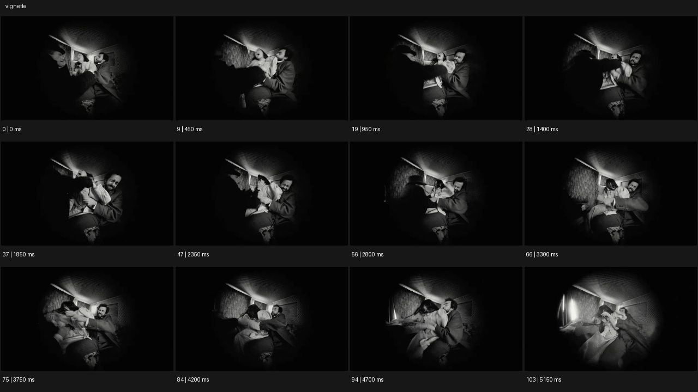

# Vignette 비네트


- 원본 등록명: **Vignette 비네트**
- 분류: B · 앵글 & 구도 / Angle & Framing
- 공식 기법 페이지: [Vignette 비네트](https://eyecannndy.com/technique/vignette)
- 지정 원본 미디어: [애니메이션 WebP](https://asset.eyecannndy.com/media/clip/2024/03/06/261709716787.webp)
- 확인 방식: 104프레임 중 12시점의 시간순 이미지 배열을 직접 시각 확인. 메타데이터 길이 5.2초. 전체 프레임 재생·청음 확인 또는 생성 재현 테스트로 보고하지 않는다.



## 실제 관찰

흑백 실내에서 한 남성이 다른 인물을 붙잡고 있고 프레임 둘레가 매우 어둡다. 0–2.8초 인물들의 팔과 몸이 움직이며 가운데 밝은 영역 안에 남는다. 3.3–5.15초 자세와 카메라 방향이 조금 달라져도 주변 암부는 원형에 가까운 창처럼 중앙 장면을 감싼다.

## 작동 원리와 역할

행동이 벌어지는 장면 위에 주변부 암화를 유지해 시야를 좁힌다. 카메라의 작은 흔들림, 주체 움직임, 암부의 프레이밍 기능을 구별한다.

## 해석의 한계

암부가 광학적 비네팅인지 후반 마스크인지 식별할 수 없다. 원형 아이리스가 열리거나 닫히는 과정은 이 표본에서 뚜렷하지 않다. 샘플 사이의 모든 움직임과 반복 경계의 무봉합 여부는 별도 검증하지 않았다. 아래 프롬프트는 새로운 장면 각색이며 생성 테스트는 하지 않았다.

## 뮤직비디오 적용 · 완성형 프롬프트

아래 설정과 길이는 독립 창작 예시다. 실제 요청의 길이·참조·음향 조건을 우선한다.

```text
6초 뮤직비디오. 흑백의 오래된 호텔방에서 성인 보컬이 창가 의자에 앉아 빈 전화기를 들고 있다. 카메라는 조금 떨어진 가슴 위 구도에 고정하고 화면 가장자리를 부드러운 타원형 암부로 감싸 중앙의 얼굴과 전화기만 읽히게 한다. 보컬이 수화기를 내려놓으며 시선이 바닥으로 떨어지면 가장자리 암부가 아주 조금 깊어진다. 얼굴과 손은 밝은 중앙 영역 안에 남고 윤곽이 잘리지 않는다. 마지막에는 보컬이 고개를 들어도 주변 시야가 열리지 않고 좁은 공간감이 유지된다. 완전한 검정으로 닫거나 다른 장소로 전환하지 않는다.
```

## 브랜드필름 적용 · 완성형 프롬프트

제품의 재질과 기능이 읽히는 순간에 효과를 배치하고 안정된 제품 상태로 끝낸다. 실제 브랜드 톤과 구조에 맞춰 각색한다.

```text
6초 고급 기계식 시계 필름. 짙은 갈색 테이블 위 시계가 놓이고 성인 손이 옆의 돋보기를 천천히 들어 올린다. 카메라는 정면 사선 매크로에서 시계 다이얼과 크라운을 함께 잡는다. 부드럽게 어두운 가장자리로 중앙의 금속과 숫자에 시선을 모으되 제품 외곽이 암부에 잘리지 않게 한다. 손이 빠지면 측면 빛이 다이얼의 요철을 드러내고 카메라는 짧게 접근한다. 마지막 2초 초침이 움직이는 선명한 다이얼에 고정한다. 비네트는 장면 끝까지 일정하고 과한 검정 원이나 터널 모양을 만들지 않는다.
```

음향은 원본에서 확인하지 않았다. 실제 음원과 무음·NO BGM 등 사용자 조건을 유지한다. 특정 모델의 자동 재현을 보장하는 프리셋이 아니다.
