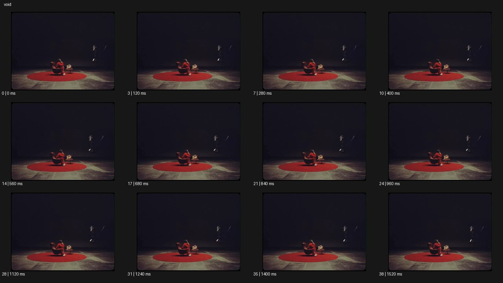

# Void 보이드


- 원본 등록명: **Void 보이드**
- 분류: B · 앵글 & 구도 / Angle & Framing
- 공식 기법 페이지: [Void 보이드](https://eyecannndy.com/technique/void)
- 지정 원본 미디어: [애니메이션 WebP](https://asset.eyecannndy.com/media/clip/2024/03/24/261711256303.webp)
- 확인 방식: 39프레임 중 12시점의 시간순 이미지 배열을 직접 시각 확인. 메타데이터 길이 1.56초. 전체 프레임 재생·청음 확인 또는 생성 재현 테스트로 보고하지 않는다.



## 실제 관찰

어두운 큰 공간의 아래쪽에 붉은 원형 러그와 의자, 앉은 인물, 작은 탁자가 있다. 오른쪽 위에는 희미하게 밝은 또 다른 형체가 보인다. 0–1.52초 앉은 인물의 손과 몸이 조금 움직이지만 공간 대부분은 상세가 드러나지 않는 어둠으로 남는다.

## 작동 원리와 역할

주체와 작은 섬처럼 밝힌 바닥을 넓은 암부 안에 배치한다. 암부는 주체를 둘러싼 공간이며 화면 가장자리만 어둡게 하는 비네트와 구별된다.

## 해석의 한계

피사체 외 모든 것이 완전한 검정은 아니다. 바닥과 주변 형체가 일부 읽히므로 무한공간이나 특정 VFX 공정을 단정하지 않는다. 샘플 사이의 모든 움직임과 반복 경계의 무봉합 여부는 별도 검증하지 않았다. 아래 프롬프트는 새로운 장면 각색이며 생성 테스트는 하지 않았다.

## 뮤직비디오 적용 · 완성형 프롬프트

아래 설정과 길이는 독립 창작 예시다. 실제 요청의 길이·참조·음향 조건을 우선한다.

```text
7초 뮤직비디오. 끝이 보이지 않는 검은 스튜디오 가운데 작은 흰 의자와 성인 보컬 한 명만 낮은 따뜻한 빛에 놓인다. 멀리 고정한 카메라로 인물이 화면 하단 중앙을 작게 차지하게 한다. 보컬은 의자에 앉아 빈 손바닥을 바라보다가 천천히 몸을 일으킨다. 일어선 뒤에도 빛의 범위는 넓어지지 않아 발과 의자 주변만 보인다. 카메라는 가까이 가지 않고 위쪽의 넓은 어둠을 유지한다. 마지막 보컬이 의자 뒤로 한 걸음 물러서며 얼굴이 어둠에 잠기고 손끝만 남는다. 검정 배경이 새로운 장소로 열리지 않는다.
```

## 브랜드필름 적용 · 완성형 프롬프트

제품의 재질과 기능이 읽히는 순간에 효과를 배치하고 안정된 제품 상태로 끝낸다. 실제 브랜드 톤과 구조에 맞춰 각색한다.

```text
7초 고급 오디오 필름. 검은 무한 배경의 작은 돌 받침 위에 월넛 스피커 한 대를 놓는다. 카메라는 넓은 정면 구도로 시작해 스피커가 화면 중앙 아래에 작게 보이게 한다. 좁고 부드러운 측광이 앞판과 나뭇결을 드러내고 주변 공간은 깊은 검정에 남는다. 카메라가 아주 천천히 전진하여 제품의 존재감만 키우며 배경 구조는 드러내지 않는다. 마지막에는 스피커 전체가 읽히는 중간 제품 구도에서 멈추고 빛도 고정한다. 2초간 그릴 패턴과 모서리를 선명하게 유지하며 소리를 시각화하는 파동이나 입자를 추가하지 않는다.
```

음향은 원본에서 확인하지 않았다. 실제 음원과 무음·NO BGM 등 사용자 조건을 유지한다. 특정 모델의 자동 재현을 보장하는 프리셋이 아니다.
