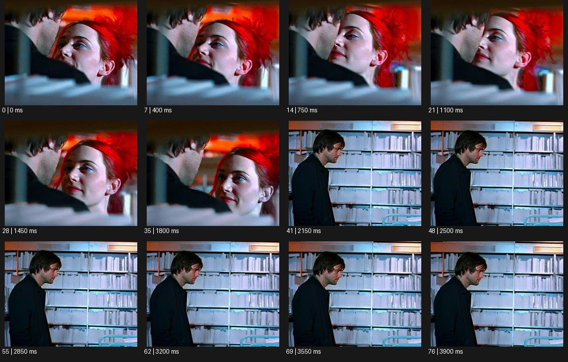

# Voyeur 보이어


출처: Eyecandy · 원본 등록 카드명: **Voyeur 보이어** · slug: voyeur

분류: J · People, POV & Mood / 인물·시점·무드

[원본 기법 페이지](https://eyecannndy.com/technique/voyeur) · [원본 미디어](https://asset.eyecannndy.com/media/clip/2024/02/11/261707687620.webp)

## 확인 근거

원본 77프레임, 메타데이터 길이 3950ms. 고유 12개 시점 프레임을 추출하여 이미지로 직접 관찰했다. 재생 감상·음향 청취·생성 재현 테스트를 했다는 뜻이 아니다.

표본 프레임(0부터): 0, 7, 14, 21, 28, 35, 41, 48, 55, 62, 69, 76



## 실제 시간순 관찰

0–1800ms: 선반 같은 전경 틈 너머로 두 사람이 가까이 마주 보는 얼굴 구도가 보인다. 2150ms: 책이나 자료가 가득한 실내의 남성 측면 중간숏으로 바뀐다. 2500–3900ms: 인물이 옆으로 서 있는 구도를 유지하며 미세하게 움직인다.

## 주체·카메라·합성·편집 구분

초반 전경 가림이 외부 관찰자의 시야를 만든다. 주체들은 서로를 보고 카메라에 직접 반응하지 않는다. 후반에는 명확한 숏 변경이 있다.

## 장면에 재사용할 원리

전경 경계와 관찰 거리를 활용해 관객이 사건 바깥에서 조심스럽게 지켜보는 느낌을 만든다.

## 확인 한계

실제 몰래 촬영됐다는 의미가 아니다. 출연자의 동의 여부나 서사를 영상만으로 추정하지 않는다. 표본 사이의 모든 프레임과 반복 경계의 연속성을 검사하지 않았다. 음향은 확인하지 않았다.

## 뮤직비디오 각색 · 완성형 프롬프트

아래는 장면 목적에 맞게 새로 설계한 창작 적용안이며 원본 길이를 상속하지 않는다.

```text
7초 뮤직비디오, 성인 보컬이 늦은 밤 음반 가게에서 한 장의 레코드를 꺼내 바라본다. 카메라는 맞은편 선반 사이 좁은 틈 뒤에 고정하고 화면 양끝에 흐린 음반 등선을 남긴다. 첫 2초는 보컬 손과 얼굴 일부만 보인다. 보컬이 레코드를 가슴 높이로 올리면 카메라는 옆으로 20cm 이동해 눈과 입을 드러내되 선반 가림은 유지한다. 보컬은 관객을 보지 않고 커버에 집중한다. 5초에 레코드를 조심히 되돌려 놓고 빈 손을 잠시 바라본다. 마지막에는 가려진 구도로 감정을 남기며 장면을 전환하지 않는다. 대사·문구 없이 종이와 실내 소리만 둔다.
```

## 브랜드필름 각색 · 완성형 프롬프트

```text
8초 공예 향수 브랜드필름, 아침 조향실에서 성인 조향사가 작은 유리병을 정리한다. 카메라는 문밖의 반쯤 열린 문틀 뒤에서 시작해 인물과 작업대 일부만 보여준다. 조향사가 시향지를 집어 코 가까이 가져가는 동안 카메라는 문틀을 따라 아주 조금 이동해 손과 병을 더 드러낸다. 인물은 카메라를 의식하지 않는 연기를 유지한다. 5초에 시향지를 내려놓으면 선택한 병 하나만 빛 안에 남고 카메라는 그 병이 보이는 틈에서 멈춘다. 마지막 3초는 유리 재질·액체 색·장인의 손을 함께 읽힌다. 전경은 부드럽게 흐리고 대사·새 문자·로고는 없다.
```

생성 테스트: 미실시. 단일 모델의 정확한 재현을 보장하지 않으며 필요한 촬영·합성·편집 층을 구분해 구현한다.
