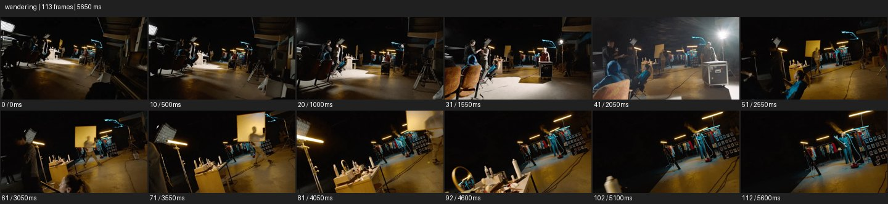

# Wandering


- 출처: Eyecandy · [Wandering](https://eyecannndy.com/technique/wandering)
- 카탈로그 등록 표기: **Wandering 원더링**
- 카테고리: E · More Camera Moves · 카메라 무브 확장
- 원본 미디어: [애니메이션 WebP](https://asset.eyecannndy.com/media/clip/2024/03/13/261710362976.webp)
- 확인 방식: 원본 애니메이션을 디코딩해 시간순 프레임을 추출한 뒤 컨택트 시트를 직접 시각 확인했다. 전체 113프레임 / 5650ms, 기본 12시점. 재생·음향 청취·전 프레임 시각 검수·생성 테스트를 했다고 주장하지 않는다.
- 기본 확인 프레임: 0, 10, 20, 31, 41, 51, 61, 71, 81, 92, 102, 112. 해당 타임스탬프(ms): 0, 500, 1000, 1550, 2050, 2550, 3050, 3550, 4050, 4600, 5100, 5600.
- 원본 길이는 관찰 정보다. 아래 새 장면의 길이를 원본에 자동 맞추지 않는다.

## 움직임 증거



## 원본에서 확인한 시작 → 변화 → 끝

어두운 촬영 스튜디오 안에서 낮고 기울어진 시점이 앞으로 움직인다. 의자에 앉은 사람과 조명·케이블·테이블을 지나며 시선이 오른쪽의 서 있는 사람들에게 넘어간다. 끝에 장비와 세트가 더 가까워진다.

- 카메라·시점: 공간 안을 전진하며 여러 대상에게 시선을 넘긴다.
- 주체: 앉거나 서 있는 사람들이 현장에 보인다.
- 조명·합성·편집: 원테이크처럼 이어지지만 숨은 컷은 단정 불가.

## 작동 원리와 확인 한계

특정 주체를 계속 고정하기보다 경로 중 시선 대상을 넘기며 공간을 탐색한다. 기울기와 전진이 함께 있으나 실제 장비는 미확인.

샘플 사이의 빠른 변화는 일부 빠질 수 있다. GIF의 반복 경계가 작품의 의도된 완전 루프라는 보장은 없다. 원본 음악·대사·촬영 장비·제작 소프트웨어는 확인하지 않았다. 아래 프롬프트는 관찰한 원리를 다른 장면에 각색한 창작안이며 원본 장면이나 검증된 생성 결과가 아니다.

## 뮤직비디오 각색 · 완전한 장면 프롬프트

```text
공연 직전의 분주함을 보여주는 뮤직비디오. 카메라는 무대 뒤 복도 입구에서 사람 눈높이로 천천히 전진한다. 기타를 조율하는 연주자에게 잠깐 시선을 두고 다시 오른쪽으로 돌아 의상 랙 사이를 지난다. 그 끝에서 숨을 고르는 성인 보컬이 보이면 이동을 낮추고 보컬을 향해 작은 곡선으로 다가간다. 보컬이 커튼을 젖히면 빛이 들어오고 카메라는 어깨 뒤에서 멈춰 밝은 무대를 함께 바라본다. 장면은 연속되고 경로마다 다음 시선 대상이 자연스럽게 나타난다.
```

## 브랜드필름 각색 · 완전한 장면 프롬프트

```text
수공예 가죽 브랜드의 아틀리에를 탐색하는 필름. 카메라는 문 입구에서 출발해 낮은 재료 선반을 지나 작업자의 손 쪽으로 천천히 향한다. 재단칼이 멈추면 시선을 옆 작업대로 옮겨 바느질 중인 손을 스치고, 완성된 가방이 놓인 창가로 완만하게 방향을 바꾼다. 마지막에는 가방 앞에서 움직임을 멈추고 손잡이와 봉제선을 읽히는 삼분의 사 구도를 남긴다. 이동 중 공방의 통로와 사물 위치를 일관되게 유지하며 빠른 훑기 대신 각 공정의 한 행동을 보여준다.
```

적용 시 사용자가 지정한 길이·참조·컷·음향·제품 보존 조건을 우선한다. 효과의 시작 계기와 도착 구도를 유지하며 필요한 부분을 해당 장면에 맞춰 다시 연출한다.
