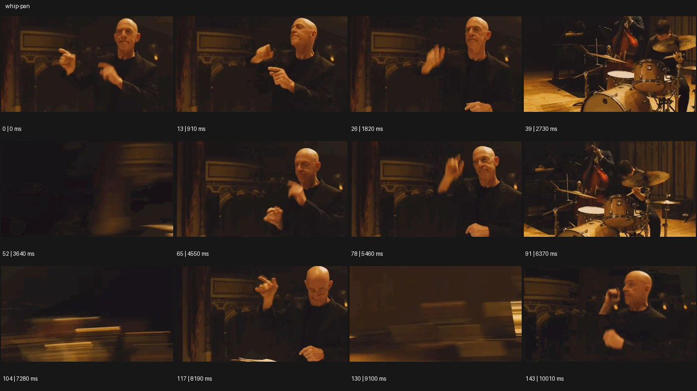
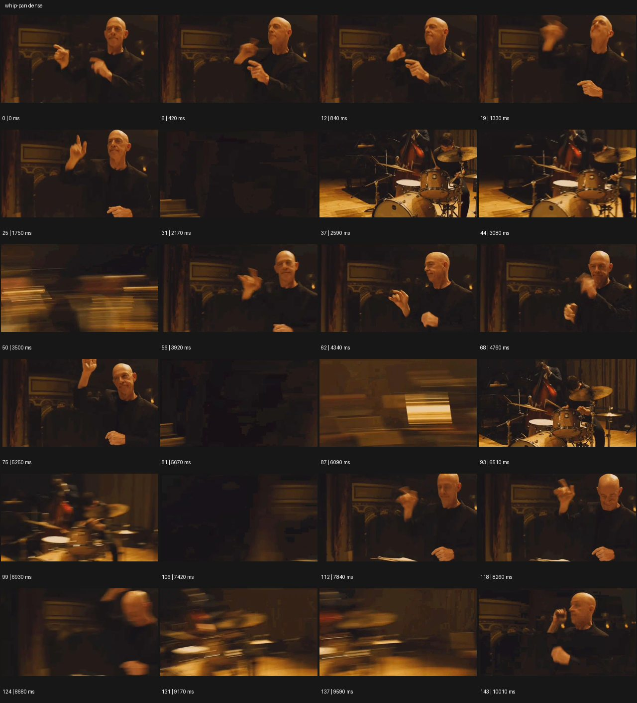

# Whip Pan


- 원본 등록명: **Whip Pan**
- 분류: A · 카메라 무브 / Camera Moves
- 공식 기법 페이지: [Whip Pan](https://eyecannndy.com/technique/whip-pan)
- 지정 원본 미디어: [애니메이션 WebP](https://asset.eyecannndy.com/media/clip/2023/12/19/261702949462.webp)
- 확인 방식: 144프레임 중 12시점의 시간순 이미지 배열을 직접 시각 확인. 메타데이터 길이 10.08초. 추가 24시점 배열도 직접 확인. 전체 프레임 재생·청음 확인 또는 생성 재현 테스트로 보고하지 않는다.





## 실제 관찰

0–1.82초 손으로 지휘하는 인물이 보인다. 2.17초 무렵 화면이 가로로 번지고 2.59초 드럼 연주자에 도착한다. 3.5초 가로 블러 후 지휘자로 돌아오며, 이후에도 지휘자와 드럼 구도 사이의 빠른 왕복이 반복된다. 마지막 표본은 지휘자다.

## 작동 원리와 역할

주체들은 각 자리에서 손·악기를 움직인다. 카메라의 빠른 수평 팬이 두 시선 대상을 연결하고 중간 구간의 형태는 가로 스트릭으로 사라진다.

## 해석의 한계

소리를 듣지 않았으므로 실제 박자 일치나 연주 내용을 확인한 것은 아니다. 블러 안에 숨은 컷이 있는지는 표본으로 확정할 수 없다. 샘플 사이의 모든 움직임과 반복 경계의 무봉합 여부는 별도 검증하지 않았다. 아래 프롬프트는 새로운 장면 각색이며 생성 테스트는 하지 않았다.

## 뮤직비디오 적용 · 완성형 프롬프트

아래 설정과 길이는 독립 창작 예시다. 실제 요청의 길이·참조·음향 조건을 우선한다.

```text
7초 뮤직비디오. 작은 지하 연습실 왼쪽에 성인 보컬, 오른쪽 3미터에 드러머가 있다. 보컬이 마이크를 쥐고 드러머 쪽으로 손을 내미는 근접 구도로 시작한다. 손이 오른쪽 끝에 닿을 때 카메라가 오른쪽으로 빠르게 팬해 방을 가로 방향 블러로 만들고 드러머의 스틱이 내려오는 순간 중간 구도에 멈춘다. 드러머가 시선을 돌리면 같은 경로로 왼쪽 휩팬하여 보컬에게 돌아온다. 공간 구조와 이동 방향을 유지하고 인물을 순간 이동시키지 않는다. 마지막 2초는 보컬 얼굴에 안정적으로 머문다. 음악 동기화는 실제 사용할 음원의 지정 타격점에 맞춘다.
```

## 브랜드필름 적용 · 완성형 프롬프트

제품의 재질과 기능이 읽히는 순간에 효과를 배치하고 안정된 제품 상태로 끝낸다. 실제 브랜드 톤과 구조에 맞춰 각색한다.

```text
7초 고급 주방 도구 필름. 오픈 키친의 왼쪽 작업대에서 성인 셰프가 스테인리스 칼로 허브를 자르고, 오른쪽에는 완성 접시가 있다. 칼날이 도마에서 멈추는 선명한 근접 구도로 시작한다. 셰프의 손이 잘린 허브를 오른쪽으로 보내면 카메라가 그 방향으로 짧고 빠르게 팬한다. 이동 중 배경만 수평 스트릭이 되고 도착 즉시 접시에 떨어지는 허브에 초점이 잡힌다. 이어 천천히 아래로 틸트해 접시 옆 칼의 손잡이와 날을 같은 화면에 담는다. 끝 2초는 제품의 마감과 요리의 질감을 읽히며 과도한 흔들림 없이 고정한다.
```

음향은 원본에서 확인하지 않았다. 실제 음원과 무음·NO BGM 등 사용자 조건을 유지한다. 특정 모델의 자동 재현을 보장하는 프리셋이 아니다.
