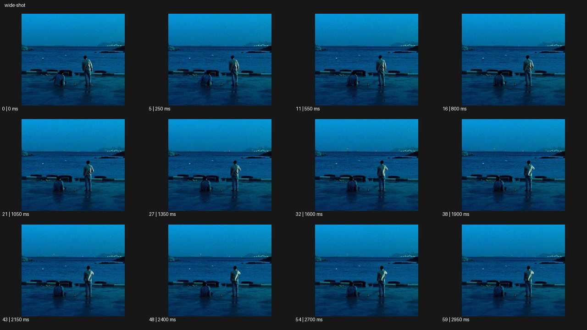

# Wide Shot 와이드 샷


- 원본 등록명: **Wide Shot 와이드 샷**
- 분류: B · 앵글 & 구도 / Angle & Framing
- 공식 기법 페이지: [Wide Shot 와이드 샷](https://eyecannndy.com/technique/wide-shot)
- 지정 원본 미디어: [애니메이션 WebP](https://asset.eyecannndy.com/media/clip/2023/12/20/261703056769.webp)
- 확인 방식: 60프레임 중 12시점의 시간순 이미지 배열을 직접 시각 확인. 메타데이터 길이 3.0초. 전체 프레임 재생·청음 확인 또는 생성 재현 테스트로 보고하지 않는다.



## 실제 관찰

푸른 저녁 바다 앞 넓은 부두에 두 인물이 작게 놓여 있다. 왼쪽은 앉아 있고 오른쪽은 서 있으며 0–1.35초 서 있는 인물의 팔이 조금 움직인다. 1.6–2.95초에도 바다와 젖은 바닥이 화면 대부분을 차지하고 두 사람의 위치는 유지된다.

## 작동 원리와 역할

환경의 크기와 두 사람의 간격을 읽히는 넓은 고정 구도다. 바다의 작은 변화와 신체 동작을 함께 관찰하며 감정을 클로즈업에 의존하지 않는다.

## 해석의 한계

정확한 감정이나 관계는 미확인이다. 넓은 숏이 항상 고독을 뜻하는 것은 아니다. 샘플 사이의 모든 움직임과 반복 경계의 무봉합 여부는 별도 검증하지 않았다. 아래 프롬프트는 새로운 장면 각색이며 생성 테스트는 하지 않았다.

## 뮤직비디오 적용 · 완성형 프롬프트

아래 설정과 길이는 독립 창작 예시다. 실제 요청의 길이·참조·음향 조건을 우선한다.

```text
8초 뮤직비디오. 겨울 새벽의 빈 해변에 긴 검은 코트를 입은 성인 보컬이 수평선 아래 작게 서 있다. 카메라는 멀리 떨어진 고정 와이드로 바다와 모래, 흐린 하늘을 넓게 담는다. 보컬이 천천히 해안을 따라 세 걸음 걷다가 멈추고 파도 쪽으로 몸을 돌린다. 동작은 작지만 검은 코트가 밝은 모래와 분리되어 읽혀야 한다. 카메라는 줌하거나 쫓아가지 않고 지나간 발자국과 넓은 빈 공간을 남긴다. 마지막 2초 보컬이 그대로 서 있는 동안 파도만 들어온다. 얼굴 디테일보다 사람과 풍경의 거리로 이별의 여운을 표현한다.
```

## 브랜드필름 적용 · 완성형 프롬프트

제품의 재질과 기능이 읽히는 순간에 효과를 배치하고 안정된 제품 상태로 끝낸다. 실제 브랜드 톤과 구조에 맞춰 각색한다.

```text
8초 고급 아웃도어 의류 필름. 넓은 산악 초원에 작은 황토색 재킷을 입은 성인 하이커가 왼쪽 아래 서 있다. 카메라는 고정 와이드로 능선과 바람에 누운 풀을 함께 담는다. 하이커는 배낭 끈을 조절한 뒤 오른쪽의 낮은 길을 따라 천천히 걷는다. 재킷 색만 풍경에서 또렷하게 분리하고 인물이 너무 작아 사라지지 않도록 전신 윤곽을 유지한다. 마지막에는 하이커가 능선 앞에서 멈춰 옆모습을 보인다. 카메라 이동 없이 넓은 환경 안에서 옷의 보호감과 활동성을 전달하며 마지막 2초 안정된 구도를 유지한다.
```

음향은 원본에서 확인하지 않았다. 실제 음원과 무음·NO BGM 등 사용자 조건을 유지한다. 특정 모델의 자동 재현을 보장하는 프리셋이 아니다.
