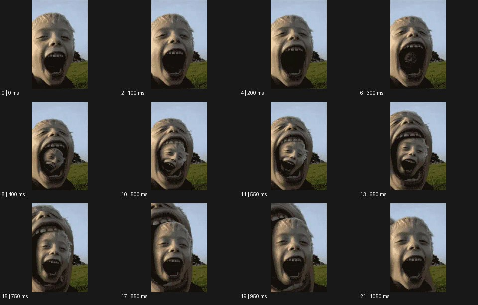

# Weirdcore 위어드코어


출처: Eyecandy · 원본 등록 카드명: **Weirdcore 위어드코어** · slug: wierdcore

분류: I · VFX & Style / VFX & 스타일

[원본 기법 페이지](https://eyecannndy.com/technique/wierdcore) · [원본 미디어](https://asset.eyecannndy.com/media/clip/2024/02/04/261707007398.webp)

## 확인 근거

원본 22프레임, 메타데이터 길이 1100ms. 고유 12개 시점 프레임을 추출하여 이미지로 직접 관찰했다. 재생 감상·음향 청취·생성 재현 테스트를 했다는 뜻이 아니다.

표본 프레임(0부터): 0, 2, 4, 6, 8, 10, 11, 13, 15, 17, 19, 21



## 실제 시간순 관찰

0–200ms: 야외 인물 얼굴 클로즈업에서 입이 점점 크게 열린다. 300–650ms: 입 안의 어두운 영역에 작은 같은 얼굴이 나타나 커진다. 750–1050ms: 안쪽 얼굴이 프레임을 크게 차지하며 다시 입을 여는 얼굴로 이어진다.

## 주체·카메라·합성·편집 구분

주체의 입 벌림과 얼굴 확대가 결합한다. 입 안에 같은 얼굴을 합성하는 중첩 구조가 핵심이며 물리적으로 안구나 입 내부를 촬영한 경로로 보지 않는다.

## 장면에 재사용할 원리

익숙한 얼굴의 일부에 동일한 전체를 재귀적으로 넣어 크기와 공간의 기대를 어긋나게 만든다.

## 확인 한계

공식 Weirdcore 이름과 원본 slug wierdcore를 유지한다. H Transitions 사용자 예시와 동일 미디어라고 단정하지 않는다. 루프 이음새의 정확한 무결성은 평가하지 않았다. 표본 사이의 모든 프레임과 반복 경계의 연속성을 검사하지 않았다. 음향은 확인하지 않았다.

## 뮤직비디오 각색 · 완성형 프롬프트

아래는 장면 목적에 맞게 새로 설계한 창작 적용안이며 원본 길이를 상속하지 않는다.

```text
6초 기묘한 뮤직비디오, 성인 보컬이 노란 방에서 작은 정사각 사진 액자를 들고 정면을 본다. 카메라는 상반신에서 천천히 액자로 접근한다. 보컬이 액자를 기울이면 사진 속에 같은 방과 같은 보컬이 같은 액자를 들고 있는 모습이 움직이기 시작한다. 안쪽 보컬이 한 번 눈을 깜빡일 때 바깥 보컬은 정지해 시간의 어긋남을 만든다. 카메라는 액자 경계가 화면 가장자리에 닿기 직전에 멈추고 중첩된 세 단계가 함께 보이게 한다. 얼굴이나 입의 해부학적 변형 없이 익숙한 공간의 재귀로 불안을 만든다. 무음·무자막.
```

## 브랜드필름 각색 · 완성형 프롬프트

```text
7초 실험적 안경 브랜드필름, 성인 모델이 흰 갤러리에서 둥근 안경을 손끝으로 들어 올린다. 카메라는 모델 얼굴과 안경이 함께 보이는 가까운 정면 구도다. 안경의 한쪽 렌즈 안에 같은 갤러리와 같은 안경을 든 모델이 작게 나타나고, 그 안쪽 모델이 실제 모델보다 먼저 안경을 착용한다. 실제 안경의 프레임·힌지·렌즈 외곽은 끝까지 정확히 유지한다. 카메라는 렌즈에 20cm 접근했다가 멈추고 5초에 실제 모델도 안경을 착용한다. 중첩 영상은 깨끗한 반사로 정리되며 마지막 2초는 착용 핏을 읽힌다. 문자·음성은 없다.
```

생성 테스트: 미실시. 단일 모델의 정확한 재현을 보장하지 않으며 필요한 촬영·합성·편집 층을 구분해 구현한다.
