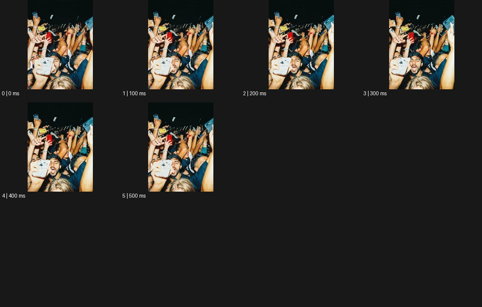

# Wigglegram 위글그램


출처: Eyecandy · 원본 등록 카드명: **Wigglegram 위글그램** · slug: wigglegram

분류: I · VFX & Style / VFX & 스타일

[원본 기법 페이지](https://eyecannndy.com/technique/wigglegram) · [원본 미디어](https://asset.eyecannndy.com/media/clip/2024/03/14/261710401391.webp)

## 확인 근거

원본 6프레임, 메타데이터 길이 600ms. 고유 6개 시점 프레임을 추출하여 이미지로 직접 관찰했다. 재생 감상·음향 청취·생성 재현 테스트를 했다는 뜻이 아니다.

표본 프레임(0부터): 0, 1, 2, 3, 4, 5



## 실제 시간순 관찰

0–200ms: 공연 관객 같은 사람들 사이에서 앞쪽 휴대전화·손과 뒤쪽 얼굴의 상대 위치가 조금 바뀐다. 300–500ms: 비슷한 순간의 구도가 옆 방향으로 달라지며 깊이에 따른 시차가 보인다. 전체 파일은 6프레임이다.

## 주체·카메라·합성·편집 구분

주체의 표정·손 자세는 거의 같은 순간을 유지한다. 인물의 큰 동작보다 시점 사이 전환이 주요 변화다. 다중 카메라 촬영인지 후처리 깊이 추정인지는 미확인이다.

## 장면에 재사용할 원리

초점 대상 위치를 정렬한 가까운 여러 시점을 왕복하여 순간을 유지한 채 깊이감을 드러낸다.

## 확인 한계

6개 고유 프레임을 모두 이미지로 확인했으나 재생을 통한 반복 경계의 체감 속도 평가는 하지 않았다. 표본 사이의 모든 프레임과 반복 경계의 연속성을 검사하지 않았다. 음향은 확인하지 않았다.

## 뮤직비디오 각색 · 완성형 프롬프트

아래는 장면 목적에 맞게 새로 설계한 창작 적용안이며 원본 길이를 상속하지 않는다.

```text
5초 뮤직비디오, 성인 보컬이 검은 무대에서 손을 관객 쪽으로 뻗은 순간을 고정한다. 얼굴은 중앙에 두고 가까운 손, 얼굴, 멀리 있는 무대 조명이 세 깊이층으로 읽히게 한다. 1초 후 같은 순간을 왼쪽·정면·오른쪽의 세 가까운 시점으로 차례로 교체하고 다시 정면으로 돌아오는 왕복을 세 번 반복한다. 얼굴 위치는 매 시점 정렬하되 손과 배경의 시차는 남긴다. 인물이 추가 동작을 하거나 몸이 찌그러지지 않게 한다. 마지막 1초는 정면 시점에 안착해 보컬의 응시와 손의 간격을 읽힌다. 무음·무자막이며 실제 카메라가 빠르게 흔들린 듯한 모션블러는 넣지 않는다.
```

## 브랜드필름 각색 · 완성형 프롬프트

```text
6초 향수 브랜드필름, 투명 병 앞에 얇은 꽃잎 한 장, 뒤에는 넓은 그림자를 두어 세 겹의 깊이를 만든다. 1초 동안 병 라벨이 보이는 정면을 유지한다. 이어 병을 중심에 정렬한 좌측·중앙·우측의 가까운 세 시점을 왕복해 유리 측면의 두께와 꽃잎의 거리 차이를 보여준다. 병 자체는 회전하거나 변형되지 않고 액체 높이도 동일하다. 시점 교체는 짧고 명료하며 화면 전체에 흔들림 블러를 넣지 않는다. 마지막 2초에는 중앙 시점에서 멈춰 기존 라벨과 유리 모서리를 충분히 읽힌다. 새로운 글자·로고·대사는 없다.
```

생성 테스트: 미실시. 단일 모델의 정확한 재현을 보장하지 않으며 필요한 촬영·합성·편집 층을 구분해 구현한다.
