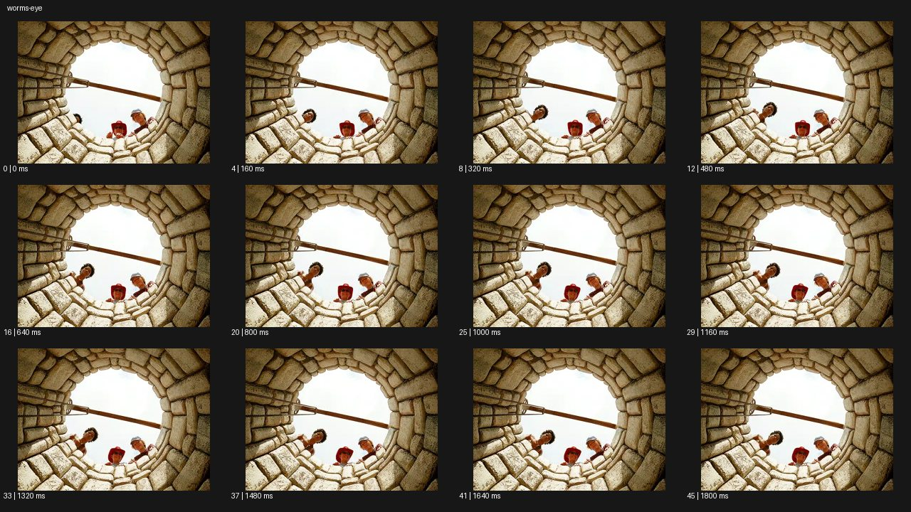

# Worm's-Eye


- 원본 등록명: **Worm's-Eye**
- 분류: B · 앵글 & 구도 / Angle & Framing
- 공식 기법 페이지: [Worm's-Eye](https://eyecannndy.com/technique/worms-eye)
- 지정 원본 미디어: [애니메이션 WebP](https://asset.eyecannndy.com/media/clip/2023/12/20/261703054801.webp)
- 확인 방식: 46프레임 중 12시점의 시간순 이미지 배열을 직접 시각 확인. 메타데이터 길이 1.84초. 전체 프레임 재생·청음 확인 또는 생성 재현 테스트로 보고하지 않는다.



## 실제 관찰

우물 안의 원형 돌벽이 하늘을 둘러싸고 위 가장자리에 두 사람이 보인다. 0.16–0.48초 왼쪽에서 한 사람이 추가로 고개를 내밀어 세 얼굴이 된다. 이후 세 사람은 아래를 내려다보며 고개를 조금 움직이고 우물 벽과 가로 막대는 같은 위치에 머문다.

## 작동 원리와 역할

카메라는 우물 아래에서 위를 향하는 고정 시점이다. 사람은 위쪽 가장자리로 몸을 내밀며 등장하고 원형 벽의 강한 원근이 깊이를 만든다.

## 해석의 한계

정확한 렌즈와 우물 크기는 알 수 없다. 위쪽 구도만으로 위협적 감정이나 특정 대사를 단정하지 않는다. 샘플 사이의 모든 움직임과 반복 경계의 무봉합 여부는 별도 검증하지 않았다. 아래 프롬프트는 새로운 장면 각색이며 생성 테스트는 하지 않았다.

## 뮤직비디오 적용 · 완성형 프롬프트

아래 설정과 길이는 독립 창작 예시다. 실제 요청의 길이·참조·음향 조건을 우선한다.

```text
6초 뮤직비디오. 폐극장의 둥근 천창 바로 아래 바닥에 카메라를 고정하고 수직으로 올려다본다. 어두운 난간과 밝은 새벽 하늘이 원형 프레임을 만든다. 먼저 흰 셔츠의 성인 보컬 한 명이 위 난간에 고개를 내밀고, 이어 양옆에서 두 성인 댄서가 나타나 렌즈를 내려다본다. 세 사람은 몸을 내밀어 서로 다른 높이로 원을 채우며 보컬이 천천히 손을 뻗는다. 카메라는 상승하거나 줌하지 않는다. 마지막에는 손을 거둬 하늘 중앙이 다시 열리고 세 얼굴의 시선만 남는다. 현실적인 신체 비율과 인물 수를 유지한다.
```

## 브랜드필름 적용 · 완성형 프롬프트

제품의 재질과 기능이 읽히는 순간에 효과를 배치하고 안정된 제품 상태로 끝낸다. 실제 브랜드 톤과 구조에 맞춰 각색한다.

```text
6초 건축 조명 브랜드 필름. 원형 계단실 바닥 중앙에 고정한 카메라가 천장을 수직으로 올려다본다. 동심원 난간 사이로 천장에 설치된 황동 펜던트 조명이 작게 보인다. 성인 관리자가 위층 난간에 잠깐 나타나 조명을 켜면 빛이 황동 내부를 채우고 원형 벽에 따뜻한 반사가 생긴다. 카메라는 지면에 머물며 건물의 수직 깊이와 조명의 위치를 함께 읽힌다. 관리자가 프레임에서 물러난 뒤 빛의 번짐을 정리해 펜던트 외곽선이 선명해진다. 마지막 2초 대칭 구도를 유지하고 조명 제품 형태를 바꾸지 않는다.
```

음향은 원본에서 확인하지 않았다. 실제 음원과 무음·NO BGM 등 사용자 조건을 유지한다. 특정 모델의 자동 재현을 보장하는 프리셋이 아니다.
