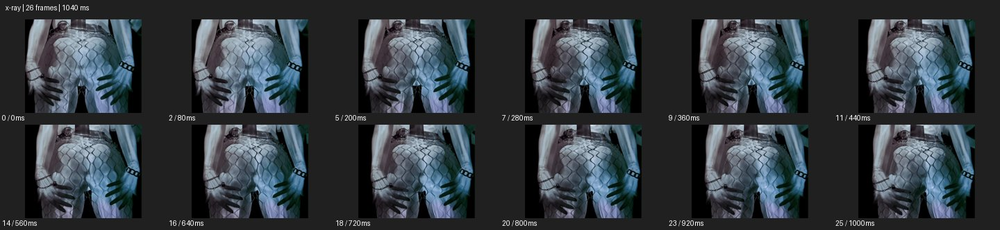

# X-Ray


- 출처: Eyecandy · [X-Ray](https://eyecannndy.com/technique/x-ray)
- 카탈로그 등록 표기: **X-Ray 엑스레이**
- 카테고리: F · Lens & Optics · 렌즈 & 옵틱
- 원본 미디어: [애니메이션 WebP](https://asset.eyecannndy.com/media/clip/2024/03/17/261710662060.webp)
- 확인 방식: 원본 애니메이션을 디코딩해 시간순 프레임을 추출한 뒤 컨택트 시트를 직접 시각 확인했다. 전체 26프레임 / 1040ms, 기본 12시점. 재생·음향 청취·전 프레임 시각 검수·생성 테스트를 했다고 주장하지 않는다.
- 기본 확인 프레임: 0, 2, 5, 7, 9, 11, 14, 16, 18, 20, 23, 25. 해당 타임스탬프(ms): 0, 80, 200, 280, 360, 440, 560, 640, 720, 800, 920, 1000.
- 원본 길이는 관찰 정보다. 아래 새 장면의 길이를 원본에 자동 맞추지 않는다.

## 움직임 증거



## 원본에서 확인한 시작 → 변화 → 끝

망사 무늬 옷의 허리와 골반, 양옆에 놓인 손을 가까이 본다. 몸과 손 위에 차갑고 반투명한 내부 구조 같은 형태가 겹쳐 있고 인물의 작은 움직임에 맞춰 위치가 변한다.

- 카메라·시점: 허리·골반 가까운 구도를 유지한다.
- 주체: 몸과 손이 작게 움직인다.
- 조명·합성·편집: 반투명 내부 구조 같은 층이 신체 위에 겹친다.

## 작동 원리와 확인 한계

표면 아래 구조를 투시처럼 겹쳐 외피와 내부를 동시에 보여준다. 실제 X선 촬영이나 해부학적 정확성은 확인되지 않는다.

샘플 사이의 빠른 변화는 일부 빠질 수 있다. GIF의 반복 경계가 작품의 의도된 완전 루프라는 보장은 없다. 원본 음악·대사·촬영 장비·제작 소프트웨어는 확인하지 않았다. 아래 프롬프트는 관찰한 원리를 다른 장면에 각색한 창작안이며 원본 장면이나 검증된 생성 결과가 아니다.

## 뮤직비디오 각색 · 완전한 장면 프롬프트

```text
성인 드러머가 어두운 연습실에서 스틱을 쥐는 뮤직비디오. 카메라는 손과 팔의 미디엄 클로즈업에서 천천히 접근한다. 손가락에 힘이 들어가는 순간 팔 외피가 잠깐 반투명해지고 뼈처럼 단순화한 밝은 선 구조가 같은 움직임으로 겹쳐진다. 드러머가 손을 펴면 내부 선이 사라지고 정상 피부로 돌아온다. 마지막에는 스틱을 잡은 온전한 두 손에서 정지한다. 내부 구조는 예술적 투시로 표현하며 상처나 신체 파괴는 없고 손가락 수와 관절 움직임은 유지한다.
```

## 브랜드필름 각색 · 완전한 장면 프롬프트

```text
기계식 시계의 내외부 관계를 보여주는 브랜드필름. 카메라는 시계 정면에서 시작해 아주 천천히 삼분의 사 각도로 이동한다. 외부 케이스의 윤곽은 유지한 채 앞면이 잠깐 반투명해지고 참조로 확인된 기어와 브리지 구조가 보이게 한다. 기어의 맞물림을 짧게 읽힌 뒤 반투명도가 줄어 정상 문자판과 유리로 돌아온다. 마지막에는 제품 전체가 선명한 구도에 착지한다. 구조 참조가 없는 부품은 만들지 않고 투시를 실제 의료 영상처럼 표시하지 않는다.
```

적용 시 사용자가 지정한 길이·참조·컷·음향·제품 보존 조건을 우선한다. 효과의 시작 계기와 도착 구도를 유지하며 필요한 부분을 해당 장면에 맞춰 다시 연출한다.
