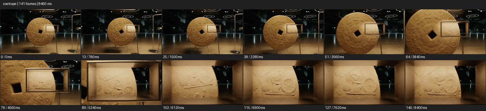
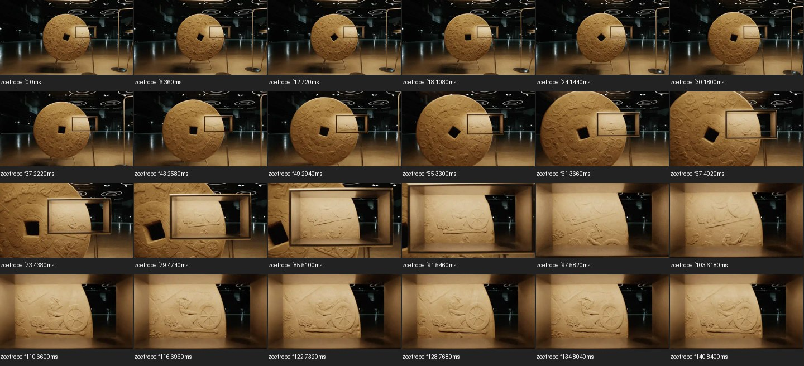

# Zoetrope


- 출처: Eyecandy · [Zoetrope](https://eyecannndy.com/technique/zoetrope)
- 카탈로그 등록 표기: **Zoetrope 조에트로프**
- 카테고리: G · Speed & Time · 속도 & 시간
- 원본 미디어: [애니메이션 WebP](https://asset.eyecannndy.com/media/clip/2023/12/18/261702859939.webp)
- 확인 방식: 원본 애니메이션을 디코딩해 시간순 프레임을 추출한 뒤 컨택트 시트를 직접 시각 확인했다. 전체 141프레임 / 8460ms, 기본 12시점, 추가 24시점 고밀도 확인. 재생·음향 청취·전 프레임 시각 검수·생성 테스트를 했다고 주장하지 않는다.
- 기본 확인 프레임: 0, 13, 25, 38, 51, 64, 76, 89, 102, 115, 127, 140. 해당 타임스탬프(ms): 0, 780, 1500, 2280, 3060, 3840, 4560, 5340, 6120, 6900, 7620, 8400.
- 원본 길이는 관찰 정보다. 아래 새 장면의 길이를 원본에 자동 맞추지 않는다.

## 움직임 증거





## 원본에서 확인한 시작 → 변화 → 끝

전시장 안 원형 부조판이 돌고 그 앞 작은 사각 틀이 있다. 카메라가 틀로 접근하면서 회전판의 연속 부조가 틀 안에서 인물과 바퀴의 움직임처럼 보인다. 끝에는 틀 안 장면이 크게 남는다.

- 카메라·시점: 원판 전체에서 사각 관찰 틀로 접근한다.
- 주체: 부조판이 회전한다.
- 조명·합성·편집: 순차 부조가 관찰 영역에서 운동 착시를 만든다.

## 작동 원리와 확인 한계

조금씩 다른 정지 형태를 순차적으로 제시해 운동 착시를 만드는 원리. 원본은 사각 관찰 틀과 회전 부조를 보여주며 전형적인 슬릿 원통으로 단정하지 않는다.

샘플 사이의 빠른 변화는 일부 빠질 수 있다. GIF의 반복 경계가 작품의 의도된 완전 루프라는 보장은 없다. 원본 음악·대사·촬영 장비·제작 소프트웨어는 확인하지 않았다. 아래 프롬프트는 관찰한 원리를 다른 장면에 각색한 창작안이며 원본 장면이나 검증된 생성 결과가 아니다.

## 뮤직비디오 각색 · 완전한 장면 프롬프트

```text
성인 댄서의 반복 연습을 조형적으로 보여주는 뮤직비디오. 어두운 전시장에 댄서의 도약 동작을 조금씩 다르게 만든 작은 흰 조각들이 원판 둘레에 배열되어 있다. 카메라는 원판 전체를 담은 뒤 천천히 가까이 이동하고 원판이 회전하면서 고정된 관찰 영역에서 조각들이 한 명의 연속 도약처럼 보이게 한다. 후반에는 회전이 감속해 조각들이 각각의 정지 포즈로 분리된다. 마지막에는 완전히 멈춘 한 도약 자세를 가까이 읽힌다. 실제 인물이 증식하는 장면으로 바꾸지 않는다.
```

## 브랜드필름 각색 · 완전한 장면 프롬프트

```text
운동화 제작의 손작업을 예술적으로 보여주는 브랜드필름. 원형 전시판 둘레에 끈을 묶는 손의 단계별 작은 부조를 배치하고 중앙에 실제 운동화 한 켤레를 둔다. 카메라는 정면 와이드에서 시작해 관찰 틀 쪽으로 천천히 접근한다. 전시판이 회전하면서 부조의 순서가 연속 손동작처럼 보이고 운동화는 중앙에 정지한다. 마지막에 회전이 잦아들면 카메라는 실제 제품 쪽으로 작게 팬해 온전한 측면을 남긴다. 부조의 동작과 제품 구조를 구분하고 최종 로고를 선명하게 읽힌다.
```

적용 시 사용자가 지정한 길이·참조·컷·음향·제품 보존 조건을 우선한다. 효과의 시작 계기와 도착 구도를 유지하며 필요한 부분을 해당 장면에 맞춰 다시 연출한다.
