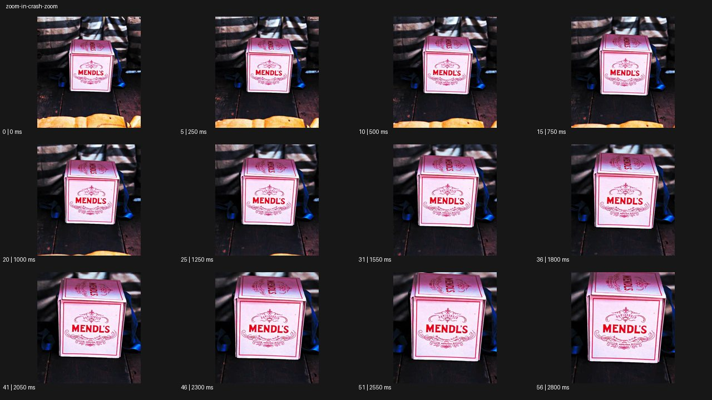

# Crash Zoom


- 원본 등록명: **Crash Zoom**
- 분류: C · 줌 & 임팩트 / Zoom & Impact
- 공식 기법 페이지: [Crash Zoom](https://eyecannndy.com/technique/zoom-in#crash-zoom)
- 지정 원본 미디어: [애니메이션 WebP](https://asset.eyecannndy.com/media/clip/2023/12/17/261702853421.webp)
- 확인 방식: 57프레임 중 12시점의 시간순 이미지 배열을 직접 시각 확인. 메타데이터 길이 2.85초. 전체 프레임 재생·청음 확인 또는 생성 재현 테스트로 보고하지 않는다.



## 실제 관찰

탁자 위 분홍색 상자가 중앙에 있다. 0–0.5초 초기 크기가 유지되고 0.75–1.8초 상자 앞면이 점차 커진다. 2.05–2.8초 더 가까운 크기로 끝나며 상자 정면의 글자와 장식이 중심에 남는다.

## 작동 원리와 역할

중앙 오브제에 화면 확대를 집중하여 중요도를 높인다. 대상은 놓여 있고 프레이밍의 확대가 주요 변화다.

## 해석의 한계

이 지정 예시는 긴 블러를 가진 폭발적 펀치인보다 단계적 확대가 뚜렷하다. 실제 광학 줌·디지털 크롭·컷 조합은 확정 불가하다. 샘플 사이의 모든 움직임과 반복 경계의 무봉합 여부는 별도 검증하지 않았다. 아래 프롬프트는 새로운 장면 각색이며 생성 테스트는 하지 않았다.

## 뮤직비디오 적용 · 완성형 프롬프트

아래 설정과 길이는 독립 창작 예시다. 실제 요청의 길이·참조·음향 조건을 우선한다.

```text
6초 뮤직비디오. 무대 뒤 어두운 복도에서 성인 보컬이 손바닥에 작은 붉은 열쇠를 펼친다. 첫 2초는 얼굴과 손이 함께 보이는 가슴 위 구도로, 보컬이 열쇠를 바라보다가 손을 조금 앞으로 내민다. 그 순간 카메라 화각을 빠르게 좁혀 열쇠가 화면 중앙을 채우는 근접 구도로 급히 확대한다. 확대는 한 번만 실행하고 마지막 위치에서 즉시 안정시키며 금속의 홈이 읽히도록 초점을 맞춘다. 이후 보컬의 손가락이 열쇠를 천천히 감싸고 1초 머문다. 열쇠가 문이나 다른 세계로 변하지 않으며 손 형태를 유지한다.
```

## 브랜드필름 적용 · 완성형 프롬프트

제품의 재질과 기능이 읽히는 순간에 효과를 배치하고 안정된 제품 상태로 끝낸다. 실제 브랜드 톤과 구조에 맞춰 각색한다.

```text
6초 프리미엄 커피 머신 필름. 검은 머신의 작은 황동 추출 레버를 포함한 정면 중간 구도로 시작한다. 성인 바리스타의 손이 레버를 누르는 순간 카메라 화각이 빠르게 좁아져 레버와 첫 커피 방울의 근접 구도에 도착한다. 제품 본체는 움직이지 않고 확대 중에만 짧은 방사형 블러를 허용한다. 곧바로 선명해져 호박색 커피가 잔에 흐르는 질감을 읽힌다. 마지막에는 같은 근접 구도를 2초 유지하며 레버의 표면과 안정된 추출 흐름을 보여준다. 제품 각인과 부품 수를 유지하고 확대를 반복하지 않는다.
```

음향은 원본에서 확인하지 않았다. 실제 음원과 무음·NO BGM 등 사용자 조건을 유지한다. 특정 모델의 자동 재현을 보장하는 프리셋이 아니다.
