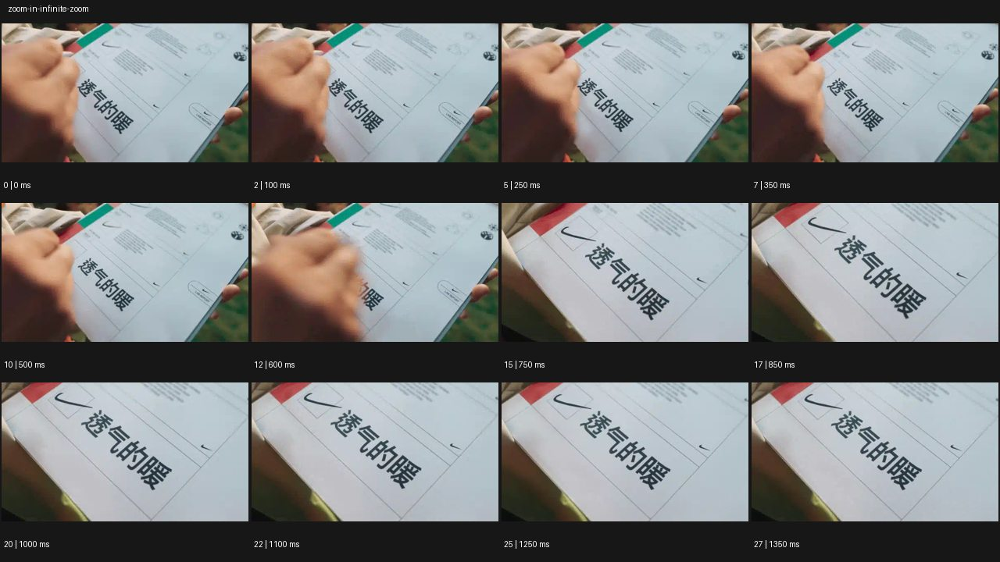

# Infinite Zoom


- 원본 등록명: **Infinite Zoom**
- 분류: C · 줌 & 임팩트 / Zoom & Impact
- 공식 기법 페이지: [Infinite Zoom](https://eyecannndy.com/technique/zoom-in#infinite-zoom)
- 지정 원본 미디어: [애니메이션 WebP](https://asset.eyecannndy.com/media/clip/2024/01/10/261704857000.webp)
- 확인 방식: 28프레임 중 12시점의 시간순 이미지 배열을 직접 시각 확인. 메타데이터 길이 1.4초. 전체 프레임 재생·청음 확인 또는 생성 재현 테스트로 보고하지 않는다.



## 실제 관찰

손이 체크리스트의 체크표시 옆을 가리킨다. 0–0.5초 종이와 손이 함께 보이고 0.6–0.85초 손이 빠지면서 체크표시와 큰 중국어 문구가 확대된다. 1.0–1.35초 확대된 같은 종이 구도가 유지된다.

## 작동 원리와 역할

관찰 가능한 것은 하나의 종이 디테일로 접근하는 확대다. 등록된 Infinite Zoom의 응용은 연속 확대의 목표를 여러 깊이 단계로 설계하는 별도 창작이다.

## 해석의 한계

지정 미디어에서는 다른 세계로의 통과나 무한 확대를 확인하지 못했다. 원본의 완성형 Infinite Zoom 구현이라고 주장하지 않으며 제목은 등록명을 보존한다. 샘플 사이의 모든 움직임과 반복 경계의 무봉합 여부는 별도 검증하지 않았다. 아래 프롬프트는 새로운 장면 각색이며 생성 테스트는 하지 않았다.

## 뮤직비디오 적용 · 완성형 프롬프트

아래 설정과 길이는 독립 창작 예시다. 실제 요청의 길이·참조·음향 조건을 우선한다.

```text
8초 뮤직비디오. 성인 보컬이 어두운 방에서 들고 있는 사진의 중앙에 작은 공연장이 보인다. 카메라는 사진을 향해 일정하게 접근하고 종이 표면이 화면을 채우는 순간 사진 속 공연장 무대로 확대 경로를 이어간다. 무대의 같은 보컬이 든 두 번째 사진을 다음 목표로 삼아 다시 접근한다. 두 번의 연결에서 사각 사진 모서리와 조명 방향을 맞추고 종이 질감에서 실제 공간으로 바뀌는 합성을 매끄럽게 한다. 마지막에는 두 번째 사진 속 조용한 빈 무대에 도착해 카메라가 감속하고 멈춘다. 무한 반복의 인상을 두 단계로 압축하되 끝 구도를 명확히 남긴다.
```

## 브랜드필름 적용 · 완성형 프롬프트

제품의 재질과 기능이 읽히는 순간에 효과를 배치하고 안정된 제품 상태로 끝낸다. 실제 브랜드 톤과 구조에 맞춰 각색한다.

```text
8초 고급 직물 필름. 어두운 작업실에 놓인 크림색 캐시미어 코트의 어깨에서 시작한다. 카메라가 직물의 한 교차점으로 천천히 접근하면 섬유가 부드러운 언덕처럼 커지고, 같은 곡선을 가진 실타래 사이 공간으로 확대 경로가 이어진다. 이어 실 한 가닥의 결로 다시 접근하여 밝은 섬유의 층을 통과한 듯한 매크로 세계를 보여준다. 두 깊이 단계의 색과 방향을 맞추고 코트가 찢어지는 모습은 만들지 않는다. 마지막에는 카메라가 감속해 섬유 결이 선명한 추상 근접 구도에 머문다. 제품 전체 모습은 첫 구간에서 충분히 읽히게 한다.
```

음향은 원본에서 확인하지 않았다. 실제 음원과 무음·NO BGM 등 사용자 조건을 유지한다. 특정 모델의 자동 재현을 보장하는 프리셋이 아니다.
