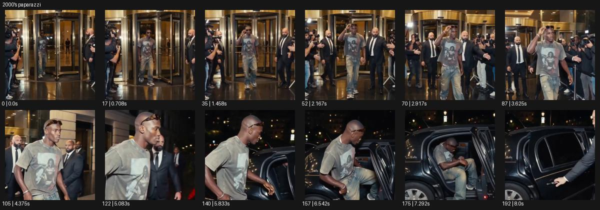

# 2000's paparazzi

- 원본 효과명: **2000's paparazzi**
- 출처·분류: Higgsfield / scene
- 원본 ID: 731211fd-ee97-463d-b279-4ca3259a5d29
- [공식 원본 미리보기](https://cdn.higgsfield.ai/viral_hub/5ec2d059-facf-45a5-968c-7fa45b090a8a.mp4)
- 확인 방식: 공식 미리보기의 12개 표본 프레임을 확인한 관찰 기록을 바탕으로 작성. 193프레임, 메타데이터 길이 8.042초. 표본 시점: [0.0, 0.708, 1.458, 2.167, 2.917, 3.625, 4.375, 5.083, 5.833, 6.542, 7.292, 8.0]초. 전체 재생·모든 프레임 검사·청음이나 생성 재현 테스트를 뜻하지 않는다.




## 실제 관찰

호텔 회전문에서 인물이 나와 촬영자와 경호원 사이를 지나 검은 차에 탄다. 가까워지는 구도와 순간 밝기 변화가 현장 취재 느낌을 만든다.

## 작동 원리와 역할

출입구에서 차량까지 이동하는 주체와 가까이 반응하는 카메라로 현장 취재의 긴장을 만든다. 순간 밝기 변화와 주변 촬영자 배치는 별개이며 실제 유명인 사건처럼 주장하지 않는다.

## 해석의 한계

특정 유명인의 실제 사건으로 보지 않는다. VHS 신호 결함 자체는 표본에서 강하지 않다. 샘플 사이의 연결과 루프 경계는 별도 검사하지 않았다. 아래는 원본 설정을 복사한 기록이 아닌 새로운 장면 각색이며 생성 테스트는 하지 않았다.

## 뮤직비디오 적용 · 완성형 프롬프트

아래 길이와 설정은 독립 창작 예시다. 실제 요청의 길이·참조·음향·컷 조건을 우선한다.

```text
8초 뮤직비디오. 가상의 성인 팝 보컬이 오래된 호텔 회전문에서 나와 밤거리의 검은 차량으로 걷는다. 카메라는 옆으로 이동하며 보컬의 얼굴과 주변 촬영자들의 손을 가까이 담고 가벼운 현장 흔들림을 남긴다. 순간적인 카메라 플래시가 두 번 얼굴과 은색 재킷을 밝히지만 눈과 피부 디테일이 계속 읽힌다. 보컬은 걸음을 멈추지 않고 렌즈를 한 번 바라본 뒤 차량 문을 연다. 마지막 카메라는 창 밖에서 멈춰 닫힌 유리 너머 보컬의 차분한 얼굴을 보여준다. 실제 유명인 이름이나 사건을 사용하지 않는다.
```

## 브랜드필름 적용 · 완성형 프롬프트

현재 제품과 브랜드 목적에 맞게 다시 설계하고 마지막 제품 가독성을 확보한다.

```text
8초 고급 선글라스 캠페인. 성인 모델이 저녁의 호텔 출입구에서 나와 기다리는 차량으로 향한다. 가까운 측면 카메라가 모델과 나란히 움직이며 주변의 촬영자 두 명이 프레임 가장자리에만 보인다. 모델이 선글라스 다리를 한 번 정리할 때 짧은 플래시가 프레임과 금속 힌지에 반사된다. 카메라는 얼굴을 흔들림 없이 읽힐 정도로만 현장감을 유지한다. 모델이 차량 옆에서 잠깐 멈춰 고개를 돌리면 카메라도 정지한다. 마지막 2초 선글라스의 형태와 렌즈 색을 선명하게 보여주고 플래시를 반복하지 않는다.
```

원본 음향은 확인하지 않았다. 실제 음원, 무음, NO BGM 등 사용자 조건을 유지한다. 명칭만으로 특정 생성 모델의 자동 재현을 보장하지 않는다.
