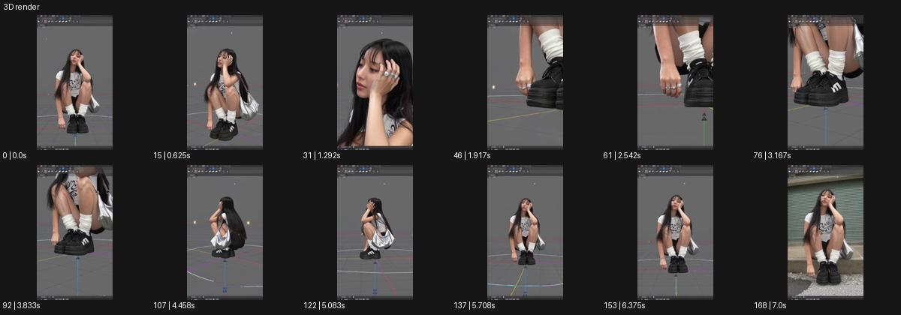

# 3D render

- 원본 효과명: **3D render**
- 출처·분류: Higgsfield / scene
- 원본 ID: c18f36af-b7cc-4b9e-b320-8b3b06f25683
- [공식 원본 미리보기](https://cdn.higgsfield.ai/viral_hub_preset/d215b031-c484-405e-bb3e-79ae0912f0f8.mp4)
- 확인 방식: 공식 미리보기의 12개 표본 프레임을 확인한 관찰 기록을 바탕으로 작성. 169프레임, 메타데이터 길이 7.042초. 표본 시점: [0.0, 0.625, 1.292, 1.917, 2.542, 3.167, 3.833, 4.458, 5.083, 5.708, 6.375, 7.0]초. 전체 재생·모든 프레임 검사·청음이나 생성 재현 테스트를 뜻하지 않는다.




## 실제 관찰

웅크린 인물이 회색 격자와 3D 편집기 같은 테두리 안에서 근경·신발·옆면으로 바뀐다. 마지막엔 실사 거리 배경이 다시 보인다.

## 작동 원리와 역할

실사 피사체를 3D 작업 공간 같은 격자·뷰포트·각도 변화 안에 배치하는 그래픽 표현이다. 실제 편집 가능한 모델 생성과는 구별하고 실사 복귀 지점을 정한다.

## 해석의 한계

실제 편집 가능한 3D 모델을 제공한다는 뜻은 아니다. UI 같은 화면 표현. 샘플 사이의 연결과 루프 경계는 별도 검사하지 않았다. 아래는 원본 설정을 복사한 기록이 아닌 새로운 장면 각색이며 생성 테스트는 하지 않았다.

## 뮤직비디오 적용 · 완성형 프롬프트

아래 길이와 설정은 독립 창작 예시다. 실제 요청의 길이·참조·음향·컷 조건을 우선한다.

```text
8초 뮤직비디오. 성인 보컬이 거리 벤치에 앉아 몸을 앞으로 숙인다. 카메라는 3/4 전신에서 시작하고 보컬이 고개를 들면 주변 거리가 회색 격자 공간으로 바뀐다. 피사체 외곽에 얇은 와이어프레임과 작업창 테두리가 나타나며 카메라는 보컬의 옆쪽으로 천천히 돌아 신발과 재킷의 다른 면을 보여준다. 보컬은 같은 자세를 유지하고 피부가 금속이나 플라스틱으로 변하지 않는다. 마지막 보컬이 몸을 펴면 작업창이 사라지고 실제 거리가 돌아온다. 카메라는 정면 중간 구도에 멈춰 원래 사람의 표정을 2초 남긴다.
```

## 브랜드필름 적용 · 완성형 프롬프트

현재 제품과 브랜드 목적에 맞게 다시 설계하고 마지막 제품 가독성을 확보한다.

```text
8초 고급 가방 디자인 필름. 회색 작업대 위 검은 가방을 선명한 사선 제품 구도로 시작한다. 카메라가 천천히 옆으로 이동하면 배경이 깨끗한 3D 뷰포트 같은 격자로 바뀌고 가방 위에 얇은 외곽선이 겹친다. 손잡이, 지퍼, 바닥 구조를 각각 잠깐 가까이 보여주되 제품의 실제 재질은 선명하게 유지한다. 마지막에는 격자와 선을 사라지게 하며 따뜻한 실사 작업실로 복귀하고 가방 전체가 정면에 남는다. 끝 2초 가죽 결과 제품명을 읽힌다. 편집 가능한 3D 파일이나 측정 수치가 생성되었다고 보이게 하지 않는다.
```

원본 음향은 확인하지 않았다. 실제 음원, 무음, NO BGM 등 사용자 조건을 유지한다. 명칭만으로 특정 생성 모델의 자동 재현을 보장하지 않는다.
