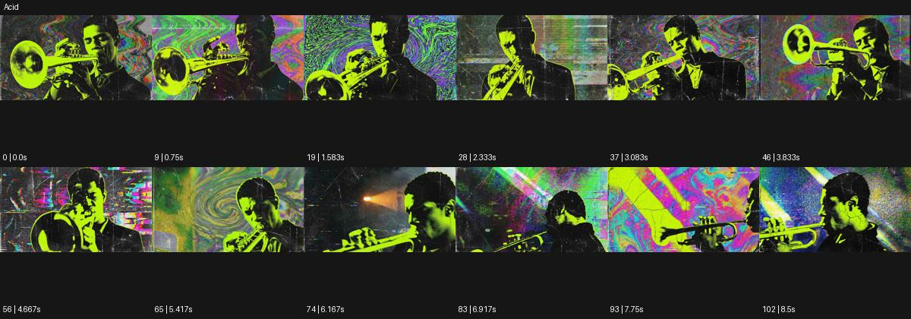

# Acid

출처: Higgsfield · 공식 원본명: **Acid** · 분류: look / 스타일 · ID: 92e39a66-01a4-4f17-9b86-2ffd8ceaac93

[원본 미리보기](https://cdn.higgsfield.ai/mixed_media_preset/d1cdb860-cff9-46de-b75f-4e821317bd30.mp4) · [원본 썸네일](https://cdn.higgsfield.ai/mixed_media_preset/bf57d2d1-1f10-4136-9199-ebfe44ff5f0f.webp)


## 확인 근거

공식 미리보기의 12개 표본 프레임을 확인한 관찰 기록을 바탕으로 작성했다. 원본 103프레임, 메타데이터 길이 8.583초. 전체 재생 감상·전 프레임 검사·음향 청취·생성 테스트를 했다는 뜻이 아니다.

표본 시점(초): 0, 0.75, 1.583, 2.333, 3.083, 3.833, 4.667, 5.417, 6.167, 6.917, 7.75, 8.5



## 원본에서 관찰한 변화

트럼펫 연주자가 형광 노랑과 검정 색면으로 분리된다. 배경 무지개 소용돌이·띠·거친 영상층이 바뀌며 악기 각도도 달라진다.

## 장면에 재사용할 원리와 층 구분

형광 노랑·검정의 주체 분리와 다색 소용돌이·거친 배경층을 결합한다. 화면 스타일 이름과 실제 약물 묘사를 구별하며 색의 혼란 속 기준 대상을 둔다.

## 확인 한계

원본 스타일명을 보존하되 약물 효과를 설명하지 않는다. 표본 사이의 미세한 변화·정확한 반복 경계·제작 공정은 확정하지 않는다. 음향은 확인하지 않았다.

## 뮤직비디오 각색 · 완성형 프롬프트

아래는 관찰한 시각 원리를 다른 장면 목적에 맞게 재설계한 창작안이다. 원본의 소재·길이·사건을 자동 상속하지 않는다.

```text
7초 그래픽 뮤직비디오, 성인 트럼펫 연주자를 형광 노랑과 검정의 두 면으로 분리해 표현한다. 카메라는 악기 벨의 근경에서 시작해 천천히 뒤로 이동한다. 연주자가 악기를 들어 올리면 뒤의 무지개 띠가 원형으로 느리게 흐르고 거친 인쇄 질감이 배경에만 붙는다. 악기의 관과 손가락 위치는 정확히 유지하며 얼굴과 악기가 하나로 녹지 않게 한다. 5초에 연주자가 벨을 조금 낮추면 배경 회전은 감속하고 마지막 2초는 노란 인물과 검은 여백의 안정된 삼사분면에 안착한다. 약물·가사·새 문자 없이 무음으로 만든다.
```

## 브랜드필름 각색 · 완성형 프롬프트

```text
8초 스포츠 안경 브랜드필름, 검정 스튜디오에 형광 노랑 안경 한 개를 정면으로 세운다. 카메라는 낮은 위치에서 25도 천천히 오빗한다. 첫 2초는 제품 구조를 읽히고 이어 뒤의 넓은 패널에 다색 소용돌이와 거친 인쇄 질감이 흐른다. 제품은 배경과 분리해 렌즈·힌지·코받침이 선명하게 유지되며 노랑은 브랜드 지정 색 그대로 둔다. 5초에 배경의 색 띠가 검정으로 가라앉으면 카메라가 멈춘다. 마지막 3초는 제품 실루엣과 투명 렌즈를 충분히 읽힌다. 화면 전체 번쩍임·새 로고·기능 수치·문구는 없다.
```

생성 테스트: 미실시. 스타일의 명칭만으로 자동 재현을 보장하지 않으며 촬영·그래픽·합성·편집 층을 구별해 구현한다.
