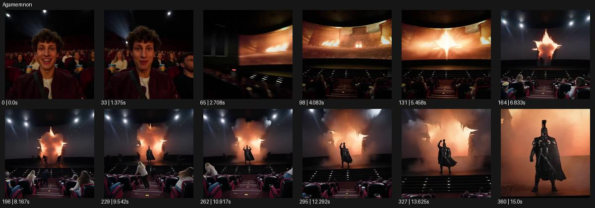

# Agamemnon

- 원본 효과명: **Agamemnon**
- 출처·분류: Higgsfield / scene
- 원본 ID: 81e45e83-caa5-4d06-a935-2ad776bf039f
- [공식 원본 미리보기](https://cdn.higgsfield.ai/viral_hub/99017935-54a8-4d3a-9fd6-445710265fac.mp4)
- 확인 방식: 공식 미리보기의 12개 표본 프레임을 확인한 관찰 기록을 바탕으로 작성. 361프레임, 메타데이터 길이 15.042초. 표본 시점: [0.0, 1.375, 2.708, 4.083, 5.458, 6.833, 8.167, 9.542, 10.917, 12.292, 13.625, 15.0]초. 전체 재생·모든 프레임 검사·청음이나 생성 재현 테스트를 뜻하지 않는다.




## 실제 관찰

극장 관객 얼굴에서 스크린으로 시점이 바뀐다. 화면 중앙이 불빛으로 찢어진 뒤 갑옷 인물이 극장 쪽으로 나와 전진한다.

## 작동 원리와 역할

평면 화면의 경계가 열리고 그 안의 인물이 실제 관객 공간으로 나오는 전환이다. 출구의 광원·크기·원근과 등장 주체의 방향을 맞춰 접촉 순간을 설계한다.

## 해석의 한계

실제 배우나 작품의 동일성을 판정하지 않는다. 평면 경계 통과 원리로 분석. 샘플 사이의 연결과 루프 경계는 별도 검사하지 않았다. 아래는 원본 설정을 복사한 기록이 아닌 새로운 장면 각색이며 생성 테스트는 하지 않았다.

## 뮤직비디오 적용 · 완성형 프롬프트

아래 길이와 설정은 독립 창작 예시다. 실제 요청의 길이·참조·음향·컷 조건을 우선한다.

```text
8초 뮤직비디오. 빈 소극장에 앉은 성인 보컬의 뒷모습 너머 흑백 공연 영상이 스크린에 나온다. 카메라는 보컬 어깨 뒤에서 천천히 접근한다. 영상 속 또 다른 같은 보컬이 화면 중앙에 손을 대면 종이 같은 스크린에 가는 빛의 틈이 생긴다. 틈이 몸이 통과할 만큼 벌어지고 화면 속 인물이 무대 바닥으로 한 걸음 나온다. 스크린 영상은 멈추지만 나온 인물은 고개를 들어 객석을 본다. 마지막 카메라가 멈춰 객석 보컬과 무대의 복제를 같은 구도에 남긴다. 두 사람의 얼굴과 의상은 일치시키고 인체가 찢어지지 않게 한다.
```

## 브랜드필름 적용 · 완성형 프롬프트

현재 제품과 브랜드 목적에 맞게 다시 설계하고 마지막 제품 가독성을 확보한다.

```text
8초 고급 코트 필름. 고요한 갤러리 벽에 코트를 입은 성인 모델의 큰 패션 영상이 상영된다. 카메라는 정면 와이드에서 영상과 바닥을 함께 보여준다. 영상 속 모델이 한 발을 앞으로 내밀면 화면 가장자리가 부드러운 빛으로 갈라지고 모델이 실제 갤러리 바닥으로 걸어 나온다. 종이 테두리는 뒤로 접히지만 코트와 신체는 정상 형태를 유지한다. 카메라는 천천히 뒤로 이동해 전신을 계속 담고 모델은 세 걸음 후 멈춘다. 마지막 2초 라펠과 밑단이 자연스럽게 내려앉아 제품 전체를 읽힌다. 벽이 폭발하거나 파편이 제품을 가리지 않는다.
```

원본 음향은 확인하지 않았다. 실제 음원, 무음, NO BGM 등 사용자 조건을 유지한다. 명칭만으로 특정 생성 모델의 자동 재현을 보장하지 않는다.
