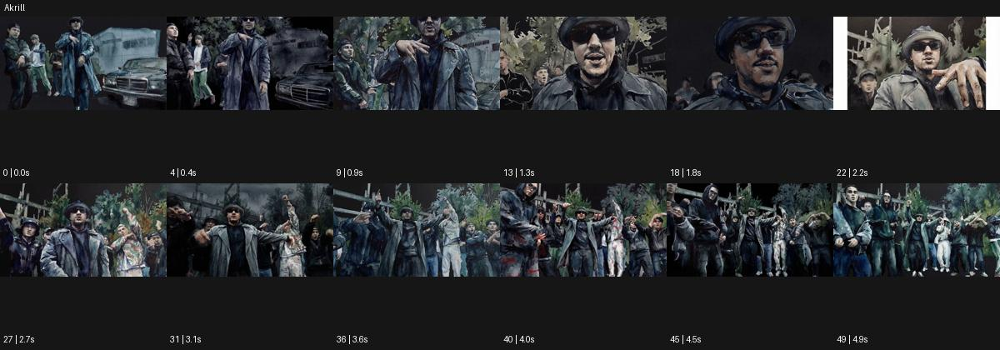

# Akrill

출처: Higgsfield · 공식 원본명: **Akrill** · 분류: look / 스타일 · ID: 9552b708-eaac-4fc0-ab3a-e9e5dacb4e9a

[원본 미리보기](https://cdn.higgsfield.ai/mixed_media_preset/59a6a0fb-834e-4e86-b41e-5f21ce8ee55a.mp4) · [원본 썸네일](https://cdn.higgsfield.ai/mixed_media_preset/d6648ba5-8188-4842-ac68-e4356dd5f483.webp)


## 확인 근거

공식 미리보기의 12개 표본 프레임을 확인한 관찰 기록을 바탕으로 작성했다. 원본 50프레임, 메타데이터 길이 5초. 전체 재생 감상·전 프레임 검사·음향 청취·생성 테스트를 했다는 뜻이 아니다.

표본 시점(초): 0, 0.4, 0.9, 1.3, 1.8, 2.2, 2.7, 3.1, 3.6, 4, 4.5, 4.9



## 원본에서 관찰한 변화

야외에서 공연하는 인물과 군중이 짙은 청회색 덩어리와 거친 붓칠 같은 경계로 표현된다. 근경과 넓은 군중 구도가 이어진다.

## 장면에 재사용할 원리와 층 구분

짙은 청회색 덩어리와 거친 붓칠 같은 경계를 움직임에 붙여 밀도와 집단 에너지를 만든다. 실제 아크릴 재료로 제작됐다는 주장과 외형의 각색을 분리한다.

## 확인 한계

회화 같은 표면은 관찰 가능하나 실제 아크릴 재료 사용은 단정 불가. 표본 사이의 미세한 변화·정확한 반복 경계·제작 공정은 확정하지 않는다. 음향은 확인하지 않았다.

## 뮤직비디오 각색 · 완성형 프롬프트

아래는 관찰한 시각 원리를 다른 장면 목적에 맞게 재설계한 창작안이다. 원본의 소재·길이·사건을 자동 상속하지 않는다.

```text
7초 회화 질감 뮤직비디오, 성인 보컬과 세 명의 댄서를 비어 있는 야외 무대에 세운다. 짙은 청회색 색면과 거친 붓칠 경계로 몸과 배경을 표현한다. 카메라는 보컬 얼굴 근경에서 시작해 뒤로 천천히 이동하며 뒤의 세 댄서를 드러낸다. 보컬이 한 팔을 펴면 댄서들이 다른 방향으로 몸을 돌리고 붓칠 경계가 의상 주름을 따라 새로 정리된다. 얼굴의 눈·입 위치는 유지해 인물이 익명 덩어리가 되지 않게 한다. 마지막 2초는 네 인물의 간격과 거친 배경 면이 정돈된 와이드숏에서 멈춘다. 문구·대사 없이 무음이다.
```

## 브랜드필름 각색 · 완성형 프롬프트

```text
8초 울 코트 브랜드필름, 성인 모델을 청회색 스튜디오에 세운다. 카메라는 코트 어깨 근경에서 천천히 뒤로 이동하고 표면에는 두꺼운 붓칠을 닮은 색면의 질감을 얹는다. 코트의 봉제선과 단추는 선명하게 남겨 실제 디자인을 보존한다. 모델이 3초에 몸을 30도 돌리면 거친 색면 경계가 옷의 입체적인 접힘을 따라 움직이고 배경은 넓은 단색 덩어리로 유지한다. 5초에 회전을 끝내고 카메라가 전신 삼사분면에서 멈춘다. 마지막 3초는 코트의 긴 실루엣과 질감에 안착한다. 새 문자·로고·색 전환 없이 옷감 마찰만 둔다.
```

생성 테스트: 미실시. 스타일의 명칭만으로 자동 재현을 보장하지 않으며 촬영·그래픽·합성·편집 층을 구별해 구현한다.
