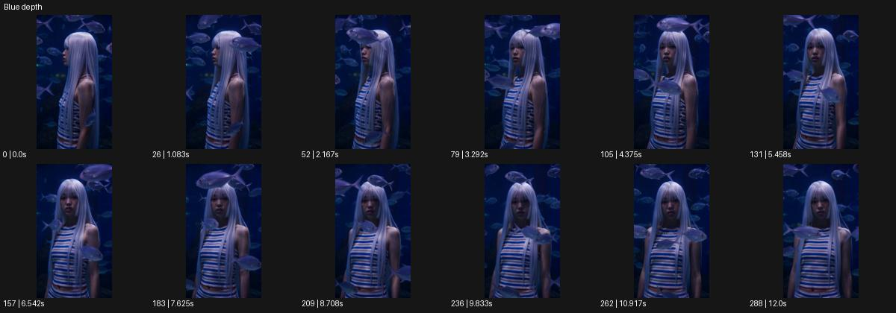

# Blue depth

- 원본 효과명: **Blue depth**
- 출처·분류: Higgsfield / scene
- 원본 ID: 16187c71-9db0-40ae-b1a4-4c2035933068
- [공식 원본 미리보기](https://cdn.higgsfield.ai/viral_hub_preset/429f29f6-8cfb-4a2d-8fde-3f3db4c8c658.mp4)
- 확인 방식: 공식 미리보기의 12개 표본 프레임을 확인한 관찰 기록을 바탕으로 작성. 289프레임, 메타데이터 길이 12.042초. 표본 시점: [0.0, 1.083, 2.167, 3.292, 4.375, 5.458, 6.542, 7.625, 8.708, 9.833, 10.917, 12.0]초. 전체 재생·모든 프레임 검사·청음이나 생성 재현 테스트를 뜻하지 않는다.




## 실제 관찰

푸른 수중 같은 공간에서 긴 머리 인물을 측면에서 정면으로 보여준다. 물고기들이 인물 앞뒤를 가로지른다.

## 작동 원리와 역할

푸른 수중 공간의 깊이, 머리와 옷의 완만한 움직임, 앞뒤를 지나는 물고기의 가림을 조합한다. 주체의 느림과 카메라 시점 변화는 별개로 설계한다.

## 해석의 한계

설명의 'everything still'과 달리 시점/머리 방향 변화가 보인다. 샘플 사이의 연결과 루프 경계는 별도 검사하지 않았다. 아래는 원본 설정을 복사한 기록이 아닌 새로운 장면 각색이며 생성 테스트는 하지 않았다.

## 뮤직비디오 적용 · 완성형 프롬프트

아래 길이와 설정은 독립 창작 예시다. 실제 요청의 길이·참조·음향·컷 조건을 우선한다.

```text
8초 뮤직비디오. 푸른 수중 같은 조용한 공간에서 긴 머리의 성인 보컬이 수직으로 떠 있다. 카메라는 옆얼굴 근접으로 시작하고 머리카락과 옷자락은 약한 흐름에 천천히 움직인다. 작은 은빛 물고기들이 전경과 후경을 서로 다른 속도로 지나가며 깊이를 만든다. 카메라는 보컬의 앞쪽으로 완만하게 돌아 정면 얼굴을 드러내고 보컬은 눈을 천천히 뜬다. 얼굴을 가로지르는 물고기는 짧게만 가리게 한다. 마지막 2초 카메라가 멈추고 정면 시선과 떠 있는 머리카락만 남긴다. 모든 것이 완전히 정지했다고 표현하지 않는다.
```

## 브랜드필름 적용 · 완성형 프롬프트

현재 제품과 브랜드 목적에 맞게 다시 설계하고 마지막 제품 가독성을 확보한다.

```text
8초 고급 향수 필름. 짙은 푸른 수중 같은 스튜디오에 투명한 향수병이 작은 석재 받침 위 고정되어 있다. 카메라는 병의 측면에서 시작해 천천히 정면으로 돌아오며 유리 두께와 액체의 빛을 읽힌다. 뒤쪽의 은빛 물고기 실루엣은 멀리 지나가고 전경에는 작은 빛 반사만 흐른다. 병과 라벨은 물에 흔들리거나 젖어 벗겨지지 않는 초현실적 제품 세계로 유지한다. 마지막에는 카메라가 정면 사선에 멈추고 물고기들이 프레임 밖으로 나간다. 끝 2초 제품명과 캡이 선명하고 푸른 깊이가 조용히 남는다.
```

원본 음향은 확인하지 않았다. 실제 음원, 무음, NO BGM 등 사용자 조건을 유지한다. 명칭만으로 특정 생성 모델의 자동 재현을 보장하지 않는다.
