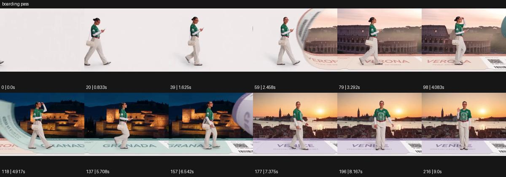

# boarding pass

- 원본 효과명: **boarding pass**
- 출처·분류: Higgsfield / scene
- 원본 ID: eee3cd37-1072-428d-a921-a37c3735423c
- [공식 원본 미리보기](https://cdn.higgsfield.ai/viral_hub/dcd67e05-0b1e-4475-9b6c-3f96e69c5384.mp4)
- 확인 방식: 공식 미리보기의 12개 표본 프레임을 확인한 관찰 기록을 바탕으로 작성. 217프레임, 메타데이터 길이 9.042초. 표본 시점: [0.0, 0.833, 1.625, 2.458, 3.292, 4.083, 4.917, 5.708, 6.542, 7.375, 8.167, 9.0]초. 전체 재생·모든 프레임 검사·청음이나 생성 재현 테스트를 뜻하지 않는다.




## 실제 관찰

밝은 배경의 보행 옆으로 커다란 여행 티켓 모양 경계가 굴러오며 서로 다른 도시 풍경으로 바뀐다. 보행 방향은 유지되고 마지막엔 노을 풍경에서 선다.

## 작동 원리와 역할

크게 회전하는 티켓 모양 경계를 화면의 연결 장치로 사용하고 주체의 보행 방향을 이어준다. 티켓 그래픽, 카메라 추적, 장소 교체를 독립적으로 조율한다.

## 해석의 한계

영상 내 지명 글자와 실제 랜드마크의 일치는 검증하지 않음. 의상 변화는 표본에서 뚜렷하지 않다. 샘플 사이의 연결과 루프 경계는 별도 검사하지 않았다. 아래는 원본 설정을 복사한 기록이 아닌 새로운 장면 각색이며 생성 테스트는 하지 않았다.

## 뮤직비디오 적용 · 완성형 프롬프트

아래 길이와 설정은 독립 창작 예시다. 실제 요청의 길이·참조·음향·컷 조건을 우선한다.

```text
8초 뮤직비디오. 성인 보컬이 밝은 빈 세트를 왼쪽에서 오른쪽으로 걷는다. 카메라는 측면에서 같은 속도로 따라가며 전신을 유지한다. 보컬이 주머니에서 접힌 표를 꺼내면 커다란 티켓 모양의 평면 경계가 뒤에서 굴러와 화면을 가로지른다. 그 경계가 지나간 부분만 세트에서 푸른 새벽의 부두로 바뀌고 보컬의 걸음과 의상은 이어진다. 보컬은 세 걸음을 더 걸은 뒤 바다 앞에서 멈춘다. 카메라도 감속하여 옆얼굴과 수평선을 함께 담는다. 마지막 2초 실제 지명이나 읽히는 티켓 문구 없이 출발의 여운을 남긴다.
```

## 브랜드필름 적용 · 완성형 프롬프트

현재 제품과 브랜드 목적에 맞게 다시 설계하고 마지막 제품 가독성을 확보한다.

```text
8초 고급 여행 가방 필름. 크림색 스튜디오에서 성인 모델이 검은 캐리어를 끌며 오른쪽으로 걷는다. 측면 추적 카메라는 가방 바퀴와 모델 전신을 함께 담는다. 거대한 무문자 탑승권 모양의 경계가 뒤에서 회전해 지나가면 배경이 스튜디오에서 조용한 호텔 테라스로 바뀐다. 경계가 가방을 통과할 때 제품 형태와 바퀴의 회전은 유지된다. 모델은 테라스 앞에서 캐리어를 세우고 손잡이를 놓는다. 카메라는 정면 사선으로 조금 이동해 가방의 표면과 잠금장치를 읽힌다. 끝 2초 안정된 제품 구도를 유지한다.
```

원본 음향은 확인하지 않았다. 실제 음원, 무음, NO BGM 등 사용자 조건을 유지한다. 명칭만으로 특정 생성 모델의 자동 재현을 보장하지 않는다.
