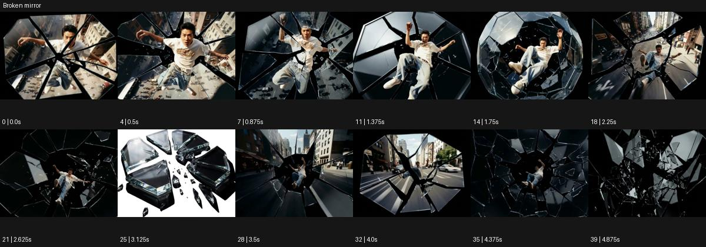

# Broken mirror

출처: Higgsfield · 공식 원본명: **Broken mirror** · 분류: look / 스타일 · ID: 536da8e0-dbbc-4990-9bfc-5da9df93ac49

[원본 미리보기](https://cdn.higgsfield.ai/mixed_media_preset/20397c83-0280-4dc2-950c-5b72a548bd5f.mp4) · [원본 썸네일](https://cdn.higgsfield.ai/mixed_media_preset/41f316db-8201-4432-b986-ead4fa4e3ea4.webp)


## 확인 근거

공식 미리보기의 12개 표본 프레임을 확인한 관찰 기록을 바탕으로 작성했다. 원본 40프레임, 메타데이터 길이 5초. 전체 재생 감상·전 프레임 검사·음향 청취·생성 테스트를 했다는 뜻이 아니다.

표본 시점(초): 0, 0.5, 0.875, 1.375, 1.75, 2.25, 2.625, 3.125, 3.5, 4, 4.375, 4.875



## 원본에서 관찰한 변화

인물과 도시가 검정 틈을 가진 여러 거울 같은 다각형 조각 안에 나뉜다. 조각이 벌어지고 작아지며 피사체와 배경의 분절 각도가 달라진다.

## 장면에 재사용할 원리와 층 구분

다각형 영상 조각의 각도·간격·크기를 바꿔 하나의 주체를 분절한다. 실제 파편의 충돌보다 각 조각에 무엇이 남을지와 최종 정렬을 설계한다.

## 확인 한계

실제 거울 파손 촬영인지 디지털 합성인지는 확정하지 않는다. 표본 사이의 미세한 변화·정확한 반복 경계·제작 공정은 확정하지 않는다. 음향은 확인하지 않았다.

## 뮤직비디오 각색 · 완성형 프롬프트

아래는 관찰한 시각 원리를 다른 장면 목적에 맞게 재설계한 창작안이다. 원본의 소재·길이·사건을 자동 상속하지 않는다.

```text
7초 뮤직비디오, 성인 보컬이 회색 옥상에서 정면을 본다. 카메라는 얼굴 가까운 미디엄숏에서 천천히 뒤로 이동한다. 2초에 화면이 검정 틈을 가진 다각형 거울 조각 여섯 개로 나뉘고 각 조각은 같은 보컬을 조금 다른 방향에서 보여준다. 중심 조각에는 눈을 계속 남겨 정체성을 유지한다. 보컬이 손을 뻗으면 조각 사이 간격이 조금 넓어지지만 파편이 몸을 찌르거나 날아오지 않는다. 5초에 손을 내리면 조각들이 한 평면으로 정렬되고 마지막 2초는 얇은 경계만 남은 정면 초상에 안착한다. 문자·대사 없이 무음이다.
```

## 브랜드필름 각색 · 완성형 프롬프트

```text
8초 향수 브랜드필름, 검정 배경에 투명 병 한 개를 놓고 그 뒤에 다각형 반사 패널 다섯 장을 띄운다. 카메라는 낮은 삼사분면에서 천천히 25도 오빗한다. 각 패널은 병의 다른 면을 반사하고 2초부터 서로 조금 벌어져 유리 모서리의 여러 하이라이트를 동시에 보여준다. 실제 병은 분할하거나 깨뜨리지 않고 제품 라벨과 액체 높이를 보존한다. 5초에 패널이 정돈된 부채꼴 배열로 멈추면 카메라도 멈춘다. 마지막 3초는 실물 제품과 분절된 반사 사이의 대비를 읽힌다. 날아오는 파편·새 로고·문구 없이 작은 공간 환경음만 둔다.
```

생성 테스트: 미실시. 스타일의 명칭만으로 자동 재현을 보장하지 않으며 촬영·그래픽·합성·편집 층을 구별해 구현한다.
