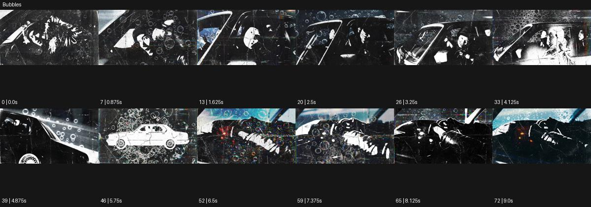

# Bubbles

출처: Higgsfield · 공식 원본명: **Bubbles** · 분류: look / 스타일 · ID: ab21d192-ae60-411f-ae52-ddf9cd9fedd5

[원본 미리보기](https://cdn.higgsfield.ai/mixed_media_preset/6eee81db-e7d6-4794-9190-39d0a8c1693c.mp4) · [원본 썸네일](https://cdn.higgsfield.ai/mixed_media_preset/c66d942e-c319-42fe-b25b-eff342516df4.webp)


## 확인 근거

공식 미리보기의 12개 표본 프레임을 확인한 관찰 기록을 바탕으로 작성했다. 원본 73프레임, 메타데이터 길이 9.125초. 전체 재생 감상·전 프레임 검사·음향 청취·생성 테스트를 했다는 뜻이 아니다.

표본 시점(초): 0, 0.875, 1.625, 2.5, 3.25, 4.125, 4.875, 5.75, 6.5, 7.375, 8.125, 9



## 원본에서 관찰한 변화

차량과 인물 장면이 강한 흑백 조각으로 바뀌며 크기가 다른 동그란 거품 선이 겹친다. 일부 파랑이 돌아오고 원형들이 밀집·분산한다.

## 장면에 재사용할 원리와 층 구분

여러 크기의 원형 선을 영상 위에 밀집·분산시켜 공기감과 리듬을 만든다. 실제 비눗방울의 굴절이나 물리 시뮬레이션으로 단정하지 않는다.

## 확인 한계

실제 비눗방울 촬영으로 단정하지 않는다. 화면 질감 오버레이로 관찰. 표본 사이의 미세한 변화·정확한 반복 경계·제작 공정은 확정하지 않는다. 음향은 확인하지 않았다.

## 뮤직비디오 각색 · 완성형 프롬프트

아래는 관찰한 시각 원리를 다른 장면 목적에 맞게 재설계한 창작안이다. 원본의 소재·길이·사건을 자동 상속하지 않는다.

```text
6초 뮤직비디오, 성인 보컬이 파란 자동차 옆에 기대어 서 있다. 낮은 정면 카메라는 천천히 20도 옆으로 이동한다. 첫 2초는 실사 형태를 보여주고 보컬이 손을 펴면 화면 가장자리에서 크기가 다른 흰 원형 선이 떠올라 흑백으로 단순화된 배경 위에 겹친다. 얼굴과 자동차 외곽은 정상으로 유지하고 원형 선이 눈과 입을 오래 가리지 않게 한다. 4초에 보컬이 한 걸음 나오면 원들은 바깥으로 분산되고 자동차의 파란색이 다시 읽힌다. 마지막 2초는 보컬과 드문 원 두 개만 남는 구도로 멈춘다. 문구·대사 없이 무음이다.
```

## 브랜드필름 각색 · 완성형 프롬프트

```text
7초 탄산수 브랜드필름, 투명 병 한 개를 흰 테이블 위에 세운다. 카메라는 병목 가까운 삼사분면에서 천천히 뒤로 이동해 제품 전체를 드러낸다. 2초에 병 뒤의 빈 공간에서 가는 파란 원형 선들이 작은 크기부터 생겨 위로 이동하고 큰 원은 옆으로 느리게 퍼진다. 원은 그래픽 장식이며 병 안 탄산의 실제 확대 영상으로 주장하지 않는다. 제품 라벨과 유리 외곽은 항상 읽히게 한다. 5초에 원들이 상단으로 빠져나가면 카메라가 멈추고 마지막 2초는 병 표면의 실제 물방울에 안착한다. 새 문구·로고·효능 수치 없이 작은 물소리만 둔다.
```

생성 테스트: 미실시. 스타일의 명칭만으로 자동 재현을 보장하지 않으며 촬영·그래픽·합성·편집 층을 구별해 구현한다.
