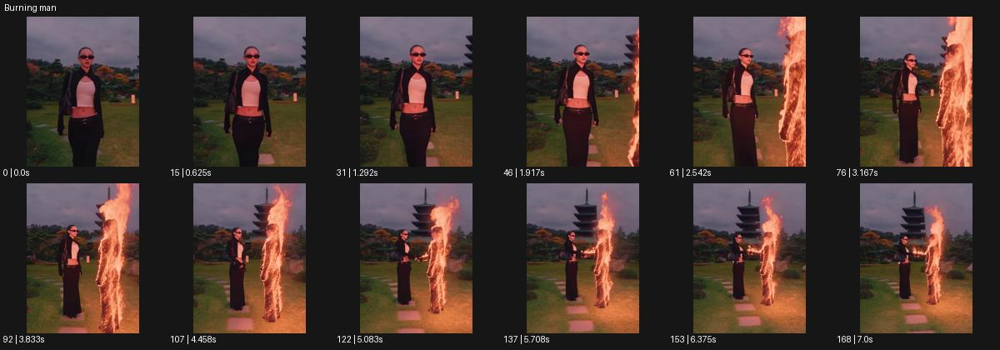

# Burning man

- 원본 효과명: **Burning man**
- 출처·분류: Higgsfield / scene
- 원본 ID: acc07eb5-2d40-4ace-9789-48d5bf19639c
- [공식 원본 미리보기](https://cdn.higgsfield.ai/viral_hub/c370022d-d99a-4cff-bb35-9d73b7a3a95d.mp4)
- 확인 방식: 공식 미리보기의 12개 표본 프레임을 확인한 관찰 기록을 바탕으로 작성. 169프레임, 메타데이터 길이 7.042초. 표본 시점: [0.0, 0.625, 1.292, 1.917, 2.542, 3.167, 3.833, 4.458, 5.083, 5.708, 6.375, 7.0]초. 전체 재생·모든 프레임 검사·청음이나 생성 재현 테스트를 뜻하지 않는다.




## 실제 관찰

정원을 걷는 선글라스 인물 옆에 불꽃으로 된 인간 윤곽이 나타난다. 카메라가 둘을 포함하도록 넓어지고 두 존재가 손을 맞댄다.

## 작동 원리와 역할

실제 인물과 별도의 불꽃 인간 윤곽을 구분해 조우와 접촉을 설계한다. 불꽃의 흐름은 별도 VFX이고 사람의 피부나 의상 연소와 혼동하지 않게 한다.

## 해석의 한계

불꽃 인물을 원래 인물이 직접 연소한 것으로 해석하지 않는다. 샘플 사이의 연결과 루프 경계는 별도 검사하지 않았다. 아래는 원본 설정을 복사한 기록이 아닌 새로운 장면 각색이며 생성 테스트는 하지 않았다.

## 뮤직비디오 적용 · 완성형 프롬프트

아래 길이와 설정은 독립 창작 예시다. 실제 요청의 길이·참조·음향·컷 조건을 우선한다.

```text
8초 뮤직비디오. 밤의 얕은 물가에서 검은 옷의 성인 보컬이 옆을 바라본다. 고정 중간 구도에서 물 위 반사가 먼저 흔들리고 그 반사 위로 주황빛 불꽃만으로 된 별도의 인간 윤곽이 천천히 일어난다. 카메라는 조금 뒤로 이동해 보컬과 불꽃 존재를 함께 담는다. 보컬이 손을 뻗으면 두 손끝 사이에 작은 빛이 맺히지만 실제 손이나 의상은 타지 않는다. 불꽃 존재가 바람처럼 흩어져 사라지면 보컬은 손을 내린다. 마지막 2초 물 위 빛의 잔영과 보컬의 얼굴을 함께 남긴다.
```

## 브랜드필름 적용 · 완성형 프롬프트

현재 제품과 브랜드 목적에 맞게 다시 설계하고 마지막 제품 가독성을 확보한다.

```text
8초 고급 향초 필름. 어두운 석재 방의 낮은 테이블에 향초 하나가 타고 있고 성인 모델이 옆에 앉아 있다. 카메라는 촛불에서 시작해 천천히 뒤로 이동한다. 촛불의 따뜻한 빛이 테이블 위에서 작은 인간형 불꽃 윤곽으로 일어나 모델의 손짓을 따라 한 번 고개를 숙인다. 실제 불은 제품 내부에 남고 형상은 빛으로 표현한다. 모델이 손을 내리면 빛의 존재는 다시 작은 불꽃으로 모인다. 카메라는 향초의 정면 라벨을 향해 짧게 접근하고 마지막 2초 제품과 안정된 불꽃에 머문다. 유리 용기와 주변 재질은 손상되지 않는다.
```

원본 음향은 확인하지 않았다. 실제 음원, 무음, NO BGM 등 사용자 조건을 유지한다. 명칭만으로 특정 생성 모델의 자동 재현을 보장하지 않는다.
