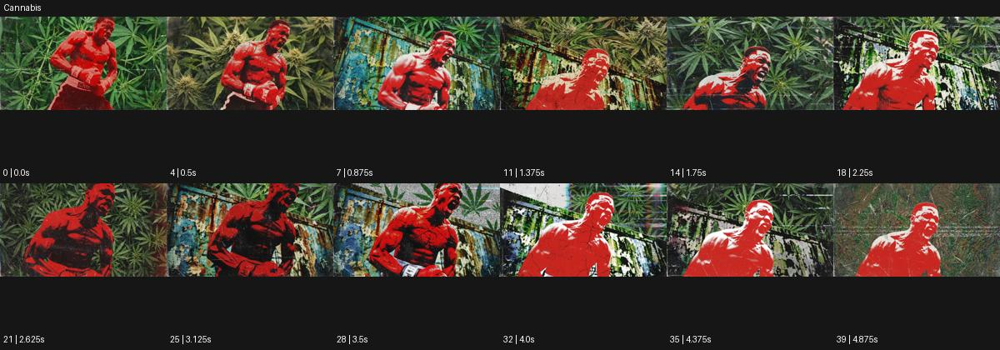

# Cannabis

출처: Higgsfield · 공식 원본명: **Cannabis** · 분류: look / 스타일 · ID: 7ffc5f58-47d0-46f8-b90c-8539f70c3d13

[원본 미리보기](https://cdn.higgsfield.ai/mixed_media_preset/ca8b9113-730d-4594-b916-6d530b16df8a.mp4) · [원본 썸네일](https://cdn.higgsfield.ai/mixed_media_preset/812e4d6b-cb10-47ff-8c6f-942232a3b60b.webp)


## 확인 근거

공식 미리보기의 12개 표본 프레임을 확인한 관찰 기록을 바탕으로 작성했다. 원본 40프레임, 메타데이터 길이 5초. 전체 재생 감상·전 프레임 검사·음향 청취·생성 테스트를 했다는 뜻이 아니다.

표본 시점(초): 0, 0.5, 0.875, 1.375, 1.75, 2.25, 2.625, 3.125, 3.5, 4, 4.375, 4.875



## 원본에서 관찰한 변화

붉은 단색 덩어리 인물과 초록 잎 무늬 배경이 겹친다. 몸 동작 중 검정·흰색 채움과 긁힌 표면이 번갈아 드러난다.

## 장면에 재사용할 원리와 층 구분

붉은 인물 덩어리와 녹색 잎 반복, 흑백 채움·긁힌 질감의 대비를 시각적 규칙으로 추출한다. 원본 스타일명은 보존하되 식물종·약물 경험을 주장하지 않는다.

## 확인 한계

원본 명칭 보존. 잎 종의 정확한 식물학적 판별이나 약물 경험 분석이 아님. 표본 사이의 미세한 변화·정확한 반복 경계·제작 공정은 확정하지 않는다. 음향은 확인하지 않았다.

## 뮤직비디오 각색 · 완성형 프롬프트

아래는 관찰한 시각 원리를 다른 장면 목적에 맞게 재설계한 창작안이다. 원본의 소재·길이·사건을 자동 상속하지 않는다.

```text
7초 그래픽 뮤직비디오, 성인 댄서를 붉은 단색 실루엣으로 표현하고 뒤에는 커다란 녹색 은행잎 패턴을 배치한다. 고정 정면 전신 카메라로 처음 2초 동안 팔의 준비 동작을 읽힌다. 댄서가 몸을 옆으로 꺾으면 실루엣 내부에 검정과 흰색의 긁힌 면이 순서대로 지나가고 잎 패턴은 반대 방향으로 느리게 미끄러진다. 손과 다리 외곽은 정상으로 유지하고 얼굴을 새로 바꾸지 않는다. 5초에 댄서가 두 발을 모으면 긁힌 면이 사라지고 붉은 형태로 돌아온다. 마지막 2초는 정돈된 잎과 몸의 대비에 안착한다. 글자·대사 없이 무음이다.
```

## 브랜드필름 각색 · 완성형 프롬프트

```text
8초 식물성 비누 브랜드필름, 크림색 비누 한 개를 붉은 받침 위에 두고 뒤에는 짙은 녹색 올리브잎 패턴을 넓게 배치한다. 카메라는 낮은 삼사분면에서 천천히 접근한다. 첫 2초는 비누의 실제 색과 각인을 읽히고 이어 배경 잎 패턴에만 검정·흰색 긁힌 질감이 지나가 자연 재료의 거친 감각을 만든다. 비누 표면과 제품 형상에는 색면 왜곡을 적용하지 않는다. 5초에 패턴 움직임이 멈추고 빛이 비누 가장자리로 옮겨간다. 마지막 3초는 제품의 매끈함과 잎 배경의 질감 대비를 유지한다. 식물학적·효능 문구나 새 로고는 없다.
```

생성 테스트: 미실시. 스타일의 명칭만으로 자동 재현을 보장하지 않으며 촬영·그래픽·합성·편집 층을 구별해 구현한다.
