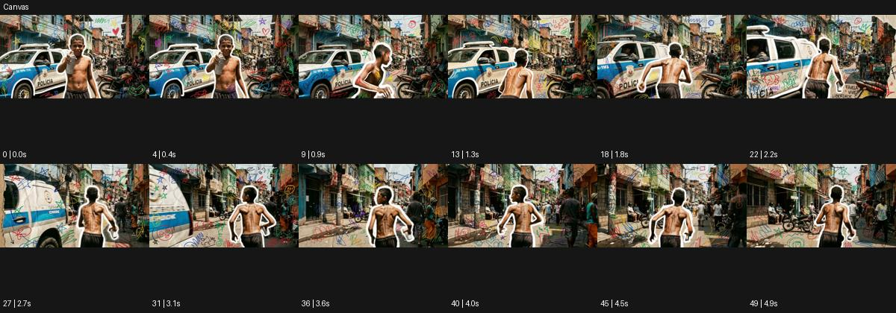

# Canvas

출처: Higgsfield · 공식 원본명: **Canvas** · 분류: look / 스타일 · ID: 51ce6a8b-3921-466b-b6d5-25816720af11

[원본 미리보기](https://cdn.higgsfield.ai/mixed_media_preset/ecdb540e-d1d6-4562-b29f-0bafe2961cdf.mp4) · [원본 썸네일](https://cdn.higgsfield.ai/mixed_media_preset/3792173a-6073-43ac-bffb-22cda9ffa9a0.webp)


## 확인 근거

공식 미리보기의 12개 표본 프레임을 확인한 관찰 기록을 바탕으로 작성했다. 원본 50프레임, 메타데이터 길이 5초. 전체 재생 감상·전 프레임 검사·음향 청취·생성 테스트를 했다는 뜻이 아니다.

표본 시점(초): 0, 0.4, 0.9, 1.3, 1.8, 2.2, 2.7, 3.1, 3.6, 4, 4.5, 4.9



## 원본에서 관찰한 변화

거리 인물 외곽에 흰 오린 선이 붙고 건물과 차량 위로 낙서가 놓인다. 인물이 돌아 달리며 카메라가 따라간다.

## 장면에 재사용할 원리와 층 구분

실사 구조를 남기고 윤곽선·낙서를 선택적으로 덧그린다. 주체 이동과 드로잉의 붙는 위치를 분리해 손그림이 행동을 설명하게 한다.

## 확인 한계

전체가 캔버스 그림으로 대체된 예시는 아니다. 실사와 드로잉 혼합이 보인다. 표본 사이의 미세한 변화·정확한 반복 경계·제작 공정은 확정하지 않는다. 음향은 확인하지 않았다.

## 뮤직비디오 각색 · 완성형 프롬프트

아래는 관찰한 시각 원리를 다른 장면 목적에 맞게 재설계한 창작안이다. 원본의 소재·길이·사건을 자동 상속하지 않는다.

```text
6초 믹스드 드로잉 뮤직비디오, 성인 댄서가 회색 골목 벽에 기대어 선다. 카메라는 정면에서 느리게 옆으로 이동한다. 댄서가 벽을 밀고 몸을 일으키면 몸 외곽에 얇은 흰 오린 선이 붙고 바닥에는 손으로 그린 짧은 화살표가 발의 방향을 따라 나타난다. 실사 얼굴과 의상 질감은 유지하고 그림은 배경과 외곽에만 쓴다. 댄서가 두 걸음 걷는 동안 카메라가 나란히 따라가며 선은 한 걸음 늦게 지워진다. 마지막에는 벽에 기대는 새 포즈와 그 주변의 흰 윤곽 하나만 남는다. 문자·새 로고 없이 발과 옷감 소리만 둔다.
```

## 브랜드필름 각색 · 완성형 프롬프트

```text
7초 캐주얼 의류 브랜드필름, 성인 모델이 밝은 도심의 벽 앞에서 가벼운 재킷을 입는다. 카메라는 허리 위 삼사분면에서 시작한다. 팔을 소매에 넣을 때 팔 경로를 따라 얇은 흰 연필선이 생기고 재킷이 몸에 안착하면 선은 외곽을 한 번 따라 정리된다. 실제 직물·지퍼·로고는 드로잉으로 덮지 않는다. 모델이 깃을 만지는 4초 지점에 카메라는 20cm 접근해 봉제와 손동작을 읽힌다. 마지막 2초에는 배경의 작은 추상 낙서만 남기고 외곽선은 옅어진다. 카메라 롤·장소 전환·글자 없이 옷감 마찰만 둔다.
```

생성 테스트: 미실시. 스타일의 명칭만으로 자동 재현을 보장하지 않으며 촬영·그래픽·합성·편집 층을 구별해 구현한다.
