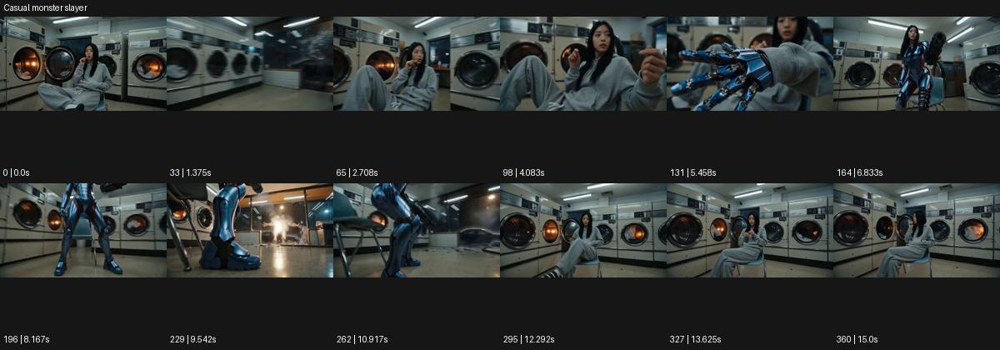

# Casual monster slayer

- 원본 효과명: **Casual monster slayer**
- 출처·분류: Higgsfield / scene
- 원본 ID: 57757dbc-7669-4495-b158-3f0104c6c1c1
- [공식 원본 미리보기](https://cdn.higgsfield.ai/viral_hub_preset/13be43ee-5c17-456f-a08c-1e2d1a13c718.mp4)
- 확인 방식: 공식 미리보기의 12개 표본 프레임을 확인한 관찰 기록을 바탕으로 작성. 361프레임, 메타데이터 길이 15.042초. 표본 시점: [0.0, 1.375, 2.708, 4.083, 5.458, 6.833, 8.167, 9.542, 10.917, 12.292, 13.625, 15.0]초. 전체 재생·모든 프레임 검사·청음이나 생성 재현 테스트를 뜻하지 않는다.




## 실제 관찰

세탁실에서 앉아 먹던 인물의 손에 파란 기계 장갑이 생기고 전신 갑옷 모습으로 이어진다. 문 쪽 섬광 뒤 다시 일상복의 앉은 구도로 돌아온다.

## 작동 원리와 역할

평범한 휴식 행동에서 손의 장비 변형, 전신 장비 공개, 다시 일상 복귀를 연결한다. 원본에서 확인되지 않은 적이나 공격의 세부를 억지로 더하지 않는다.

## 해석의 한계

괴물의 구체 형태와 공격 동작은 표본에서 명료하지 않다. 변신/일상 복귀가 확인 핵심. 샘플 사이의 연결과 루프 경계는 별도 검사하지 않았다. 아래는 원본 설정을 복사한 기록이 아닌 새로운 장면 각색이며 생성 테스트는 하지 않았다.

## 뮤직비디오 적용 · 완성형 프롬프트

아래 길이와 설정은 독립 창작 예시다. 실제 요청의 길이·참조·음향·컷 조건을 우선한다.

```text
8초 뮤직비디오. 늦은 밤 세탁실에서 성인 보컬이 의자에 앉아 작은 과자를 먹는다. 카메라는 무릎 위 중간 구도에 고정한다. 세탁기 불빛이 한 번 켜지는 계기에 보컬의 오른손 위로 푸른 기계 장갑이 조립되고 금속 판이 팔과 상체를 차례로 감싼다. 카메라는 조금 뒤로 이동해 완성된 가벼운 갑옷을 드러낸다. 보컬은 과자를 먹던 동작을 멈추지 않고 손바닥을 본 뒤 어깨를 으쓱한다. 장비가 빛으로 접혀 사라지면 원래 옷으로 돌아온다. 마지막 2초 평범한 휴식 자세를 남기며 신체가 금속으로 찢어지지 않게 한다.
```

## 브랜드필름 적용 · 완성형 프롬프트

현재 제품과 브랜드 목적에 맞게 다시 설계하고 마지막 제품 가독성을 확보한다.

```text
8초 고급 스마트워치 필름. 성인 사용자가 조용한 주방에서 커피를 마시고 있다. 카메라는 손목과 얼굴이 함께 보이는 가까운 사선 구도다. 사용자가 시계를 한 번 터치하면 시계 바깥으로 얇은 반투명 보호 장갑 형태가 손등을 감싸고 손목 주변에 잠깐 확장된다. 시계 본체와 디스플레이는 형태를 유지하고 장비는 실제 기능을 설명하는 UI가 아닌 상상적 빛의 형상이다. 사용자가 컵을 내려놓으면 보호 형상이 시계 쪽으로 접혀 사라진다. 마지막 2초 카메라가 제품에 접근해 금속 케이스와 스트랩을 선명하게 읽힌다.
```

원본 음향은 확인하지 않았다. 실제 음원, 무음, NO BGM 등 사용자 조건을 유지한다. 명칭만으로 특정 생성 모델의 자동 재현을 보장하지 않는다.
