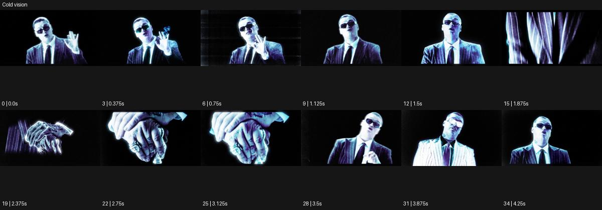

# Cold vision

출처: Higgsfield · 공식 원본명: **Cold vision** · 분류: look / 스타일 · ID: d5702ff7-e146-4369-bc84-8816929446ff

[원본 미리보기](https://cdn.higgsfield.ai/mixed_media_preset/a1a4d75a-b6e9-42fb-af01-be96d279b375.mp4) · [원본 썸네일](https://cdn.higgsfield.ai/mixed_media_preset/03511e0e-cf56-44fe-ad6c-bf0dd128573f.webp)


## 확인 근거

공식 미리보기의 12개 표본 프레임을 확인한 관찰 기록을 바탕으로 작성했다. 원본 35프레임, 메타데이터 길이 4.375초. 전체 재생 감상·전 프레임 검사·음향 청취·생성 테스트를 했다는 뜻이 아니다.

표본 시점(초): 0, 0.375, 0.75, 1.125, 1.5, 1.875, 2.375, 2.75, 3.125, 3.5, 3.875, 4.25



## 원본에서 관찰한 변화

검정 바탕의 정장 인물에 청백·보라 윤곽과 가느다란 세로 빛줄기가 붙는다. 얼굴에서 손 근경으로 바뀌었다 돌아온다.

## 장면에 재사용할 원리와 층 구분

검은 바탕 위 차가운 청백·보라 경계와 세로 광선을 사용해 신체의 선을 선택적으로 드러낸다. 열화상 같은 실제 측정으로 설명하지 않는다.

## 확인 한계

실제 조명 장비나 열화상 촬영이 아닌 화면색/윤곽 관찰. 표본 사이의 미세한 변화·정확한 반복 경계·제작 공정은 확정하지 않는다. 음향은 확인하지 않았다.

## 뮤직비디오 각색 · 완성형 프롬프트

아래는 관찰한 시각 원리를 다른 장면 목적에 맞게 재설계한 창작안이다. 원본의 소재·길이·사건을 자동 상속하지 않는다.

```text
6초 뮤직비디오, 검은 무대의 성인 보컬을 정면 상반신으로 담는다. 처음 2초는 청백색 가는 윤곽만 턱과 재킷 어깨를 드러내고 얼굴 내부는 어둡게 남긴다. 보컬이 손을 가슴 앞에 들어 올리면 보랏빛 세로 선이 손끝에서 위로 조금 늘어난다. 카메라는 손을 향해 짧게 접근하되 눈 한쪽을 프레임에 남겨 인물 관계를 유지한다. 손이 내려가는 4초 지점에 세로 빛은 얇아지고 얼굴의 청백 윤곽이 다시 중심이 된다. 마지막 2초는 움직임 없이 조용한 정면 응시에 안착한다. 빛으로 몸 형태를 새로 만들지 않고 무음·무자막으로 끝낸다.
```

## 브랜드필름 각색 · 완성형 프롬프트

```text
7초 메탈 안경 브랜드필름, 검은 배경 앞에 실버 프레임 안경 한 개를 둔다. 카메라는 낮은 삼사분면에서 천천히 20도 오빗한다. 차가운 청백색 빛이 안경다리에서 림으로 이동하며 금속의 얇은 두께를 읽히고 보랏빛 세로 선은 제품 뒤에만 두어 공간을 나눈다. 렌즈의 투명함과 힌지 형태를 유지하며 프레임을 발광 덩어리로 날리지 않는다. 4초에 빛이 코받침에 도착하면 카메라가 멈춘다. 마지막 3초는 제품 전체를 약한 중성 보조광으로 읽혀 실제 소재와 윤곽을 확인하게 한다. 수치·새 로고·문구·대사는 없다.
```

생성 테스트: 미실시. 스타일의 명칭만으로 자동 재현을 보장하지 않으며 촬영·그래픽·합성·편집 층을 구별해 구현한다.
