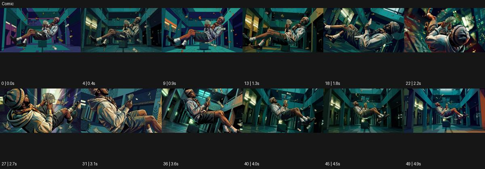

# Comic

출처: Higgsfield · 공식 원본명: **Comic** · 분류: look / 스타일 · ID: f6566fe4-418b-46bc-9d13-bd4b19de0ff6

[원본 미리보기](https://cdn.higgsfield.ai/mixed_media_preset/b2836797-7dc2-481c-8929-abc1ddbbb891.mp4) · [원본 썸네일](https://cdn.higgsfield.ai/mixed_media_preset/94ca24cf-0bc5-48da-9d70-461b0b83d93a.webp)


## 확인 근거

공식 미리보기의 12개 표본 프레임을 확인한 관찰 기록을 바탕으로 작성했다. 원본 50프레임, 메타데이터 길이 5초. 전체 재생 감상·전 프레임 검사·음향 청취·생성 테스트를 했다는 뜻이 아니다.

표본 시점(초): 0, 0.4, 0.9, 1.3, 1.8, 2.2, 2.7, 3.1, 3.6, 4, 4.5, 4.9



## 원본에서 관찰한 변화

골목에서 두 인물이 부유하는 자세가 짙은 외곽선·분절된 색면으로 표현된다. 시점과 인물 각도가 바뀌어 만화 그림의 공간감을 만든다.

## 장면에 재사용할 원리와 층 구분

윤곽선과 분절된 채색을 공간 깊이·동작에 일관되게 붙인다. 원본의 부유는 예시 장면이며 스타일의 필수 사건이 아니다.

## 확인 한계

움직임은 이 예시의 부유 장면이며 Comic 사용에 부유가 필수는 아니다. 표본 사이의 미세한 변화·정확한 반복 경계·제작 공정은 확정하지 않는다. 음향은 확인하지 않았다.

## 뮤직비디오 각색 · 완성형 프롬프트

아래는 관찰한 시각 원리를 다른 장면 목적에 맞게 재설계한 창작안이다. 원본의 소재·길이·사건을 자동 상속하지 않는다.

```text
7초 만화 스타일 뮤직비디오, 성인 보컬과 댄서가 코발트색 계단에 서로 다른 높이로 선다. 굵은 검정 윤곽선과 세 단계의 평면 명암을 전 구간 유지한다. 카메라는 낮은 삼사분면에서 시작해 보컬이 손을 펴는 동안 옆으로 천천히 이동한다. 댄서는 손동작을 이어 받아 한 계단 내려오고 옷 주름은 실제 몸 움직임을 따라 분절된 색면으로 바뀐다. 별도의 컷이나 만화 말풍선은 넣지 않는다. 마지막 2초에는 두 인물이 같은 높이에서 서로를 바라보고 카메라가 정면에 안착한다. 얼굴 정체성과 의상색을 보존하며 무음·무자막으로 끝낸다.
```

## 브랜드필름 각색 · 완성형 프롬프트

```text
8초 가방 브랜드필름, 성인 모델이 노란 벽 앞 벤치에서 남색 가방을 집어 든다. 정교한 검정 윤곽과 제한된 색면으로 만화처럼 표현하되 가방의 스티치·손잡이 수·실루엣은 정확히 유지한다. 카메라는 손잡이 클로즈업에서 시작해 모델이 일어나는 동안 천천히 뒤로 이동해 전신을 드러낸다. 가방이 몸 옆에서 한 번 흔들리면 평면 하이라이트가 곡면을 따라 자연스럽게 이동한다. 5초에 모델이 멈추고 가방을 정면으로 돌리면 카메라도 멈춘다. 마지막 3초는 제품의 구조와 착용 비율을 읽힌다. 속도선·문구·새 로고 없이 가죽 소리만 둔다.
```

생성 테스트: 미실시. 스타일의 명칭만으로 자동 재현을 보장하지 않으며 촬영·그래픽·합성·편집 층을 구별해 구현한다.
