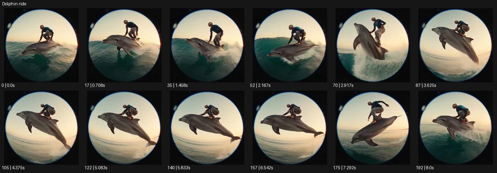

# Dolphin ride

- 원본 효과명: **Dolphin ride**
- 출처·분류: Higgsfield / scene
- 원본 ID: b7078c0c-2f92-49d4-a0ff-94aeb9e6f6fd
- [공식 원본 미리보기](https://cdn.higgsfield.ai/viral_hub/b9e49ad8-6009-44cc-84c4-06cd3ea71e24.mp4)
- 확인 방식: 공식 미리보기의 12개 표본 프레임을 확인한 관찰 기록을 바탕으로 작성. 193프레임, 메타데이터 길이 8.042초. 표본 시점: [0.0, 0.708, 1.458, 2.167, 2.917, 3.625, 4.375, 5.083, 5.833, 6.542, 7.292, 8.0]초. 전체 재생·모든 프레임 검사·청음이나 생성 재현 테스트를 뜻하지 않는다.




## 실제 관찰

어안 원 안에서 인물이 돌고래 위에 웅크려 있다. 파도를 지나 함께 뛰어오르고 공중에서 기울었다 물 가까이 내려온다.

## 작동 원리와 역할

곡면 위에 웅크린 주체가 파도와 함께 상승·하강하는 활주다. 탈것과 신체 접점, 수면 높이, 카메라의 낮은 추적을 연계하고 새 각색에서는 목적에 맞는 소재를 고른다.

## 해석의 한계

초현실 연출로서 동물 실사 행동의 검증 자료 아님. 샘플 사이의 연결과 루프 경계는 별도 검사하지 않았다. 아래는 원본 설정을 복사한 기록이 아닌 새로운 장면 각색이며 생성 테스트는 하지 않았다.

## 뮤직비디오 적용 · 완성형 프롬프트

아래 길이와 설정은 독립 창작 예시다. 실제 요청의 길이·참조·음향·컷 조건을 우선한다.

```text
8초 뮤직비디오. 푸른 새벽 바다에서 성인 보컬이 거대한 은색 돌고래 조형물 위에 웅크려 타고 있다. 카메라는 수면 가까운 넓은 구도로 옆을 따라가며 조형물과 파도가 같은 방향으로 움직이게 한다. 낮은 파도를 넘을 때 둘이 함께 부드럽게 떠올라 잠깐 기울고 보컬은 손으로 표면을 잡아 균형을 유지한다. 조형물이 다시 수면 가까이 내려오면 물보라가 뒤로만 흩어진다. 마지막에는 파도가 잦아들고 보컬이 천천히 상체를 세운다. 카메라도 감속해 전신과 수평선을 남기며 실제 동물 행동으로 표현하지 않는다.
```

## 브랜드필름 적용 · 완성형 프롬프트

현재 제품과 브랜드 목적에 맞게 다시 설계하고 마지막 제품 가독성을 확보한다.

```text
8초 고급 서핑웨어 필름. 성인 모델이 물결처럼 길고 매끈한 흰 부력 조형물 위에 낮게 앉아 해변을 따라 미끄러진다. 낮은 측면 카메라가 모델과 조형물의 접점을 읽히며 짙은 네이비 의상의 젖은 질감을 보여준다. 작은 파도를 넘는 순간 카메라도 함께 조금 상승하고 모델이 팔을 펼쳐 균형을 잡는다. 착수 뒤에는 속도가 줄고 물보라가 사라져 제품의 봉제선이 다시 선명해진다. 마지막 2초 모델이 편안히 앉은 사선 전신 구도에 안착한다. 실제 동물을 탈것으로 쓰지 않고 의상 형태를 유지한다.
```

원본 음향은 확인하지 않았다. 실제 음원, 무음, NO BGM 등 사용자 조건을 유지한다. 명칭만으로 특정 생성 모델의 자동 재현을 보장하지 않는다.
