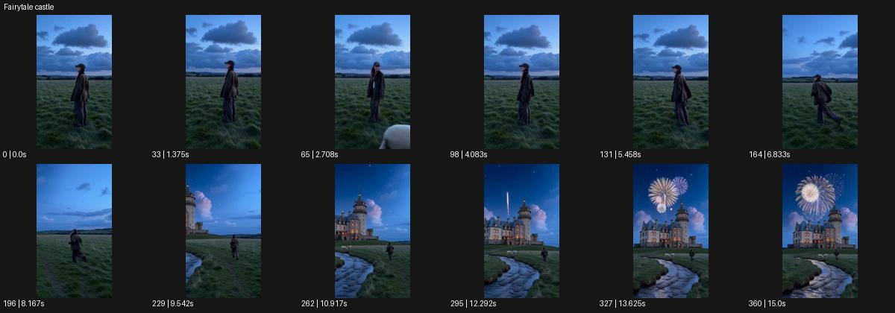

# Fairytale castle

- 원본 효과명: **Fairytale castle**
- 출처·분류: Higgsfield / scene
- 원본 ID: 6eab963f-5a31-4f3c-bb23-26ba1d86a49f
- [공식 원본 미리보기](https://cdn.higgsfield.ai/viral_hub/1afef4f9-70ec-44ab-b8b3-8ba5c2c286fa.mp4)
- 확인 방식: 공식 미리보기의 12개 표본 프레임을 확인한 관찰 기록을 바탕으로 작성. 361프레임, 메타데이터 길이 15.042초. 표본 시점: [0.0, 1.375, 2.708, 4.083, 5.458, 6.833, 8.167, 9.542, 10.917, 12.292, 13.625, 15.0]초. 전체 재생·모든 프레임 검사·청음이나 생성 재현 테스트를 뜻하지 않는다.




## 실제 관찰

황혼 들판 인물이 방향을 바꿔 달린다. 넓어지는 시점에 물길과 성이 드러나고 성 위로 불꽃이 피어난다.

## 작동 원리와 역할

인물의 이동을 따라가다 카메라가 넓어지며 새로운 풍경을 공개하는 장면이다. 성과 물길, 하늘의 이벤트는 공개 순서를 정하고 주체가 환경을 대체하지 않게 한다.

## 해석의 한계

빈 들판만의 스타일이 아니라 인물 행동에서 풍경 공개로 이어지는 장면. 샘플 사이의 연결과 루프 경계는 별도 검사하지 않았다. 아래는 원본 설정을 복사한 기록이 아닌 새로운 장면 각색이며 생성 테스트는 하지 않았다.

## 뮤직비디오 적용 · 완성형 프롬프트

아래 길이와 설정은 독립 창작 예시다. 실제 요청의 길이·참조·음향·컷 조건을 우선한다.

```text
8초 뮤직비디오. 보랏빛 황혼의 풀밭에서 성인 보컬이 렌즈를 돌아본 뒤 먼 언덕 쪽으로 달린다. 카메라는 처음 가슴 위에서 시작해 뒤로 부드럽게 상승하며 보컬을 전신으로 작게 만든다. 언덕 너머 얇은 물길과 빛나는 창을 가진 오래된 성이 차례로 드러난다. 보컬은 물길 앞에서 멈춰 성을 바라보고 하늘에는 작고 느린 불꽃 하나만 피어난다. 카메라는 더 이상 상승하지 않고 인물, 물길, 성을 균형 있게 담는다. 끝 2초 풍경의 여운을 유지하며 성이 갑자기 인물에서 자라나는 모습은 만들지 않는다.
```

## 브랜드필름 적용 · 완성형 프롬프트

현재 제품과 브랜드 목적에 맞게 다시 설계하고 마지막 제품 가독성을 확보한다.

```text
8초 고급 여행 브랜드 필름. 성인 여행자가 작은 가죽 가방을 들고 황혼 초원을 걷는다. 카메라는 뒤쪽 낮은 전신 구도로 시작해 여행자가 능선에 가까워질수록 천천히 올라간다. 능선 아래 물길과 오래된 성을 개조한 호텔이 드러나며 창의 따뜻한 빛이 풍경을 안내한다. 여행자는 멈춰 가방을 내려놓고 호텔을 바라본다. 카메라는 사선 와이드에 안착해 전경 가방과 먼 건축을 함께 보여준다. 마지막 2초 가죽의 색과 호텔의 실제적인 돌 재질이 읽히게 한다. 과한 불꽃 대신 저녁 창빛으로 도착의 감정을 마무리한다.
```

원본 음향은 확인하지 않았다. 실제 음원, 무음, NO BGM 등 사용자 조건을 유지한다. 명칭만으로 특정 생성 모델의 자동 재현을 보장하지 않는다.
