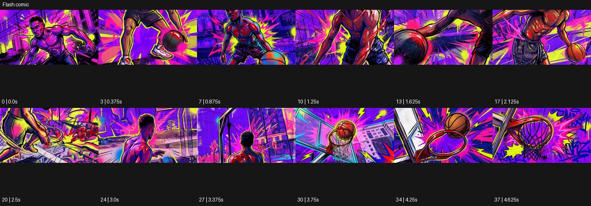

# Flash comic

출처: Higgsfield · 공식 원본명: **Flash comic** · 분류: look / 스타일 · ID: fec762be-6b12-4fb3-92dc-588522ac814f

[원본 미리보기](https://cdn.higgsfield.ai/mixed_media_preset/cd6524d8-d06f-4d6c-8883-9177b537840f.mp4) · [원본 썸네일](https://cdn.higgsfield.ai/mixed_media_preset/7ef545e5-b424-45cb-a812-990a2773602e.webp)


## 확인 근거

공식 미리보기의 12개 표본 프레임을 확인한 관찰 기록을 바탕으로 작성했다. 원본 38프레임, 메타데이터 길이 4.75초. 전체 재생 감상·전 프레임 검사·음향 청취·생성 테스트를 했다는 뜻이 아니다.

표본 시점(초): 0, 0.375, 0.875, 1.25, 1.625, 2.125, 2.5, 3, 3.375, 3.75, 4.25, 4.625



## 원본에서 관찰한 변화

농구하는 인물이 자홍·노랑·보라의 강한 만화 윤곽으로 표현된다. 공 근경에서 점프 뒤 골대까지 이어지고 방사형 선이 충격을 강조한다.

## 장면에 재사용할 원리와 층 구분

고채도 윤곽과 방사형 선을 특정 동작의 힘 방향에 맞춰 짧게 배치한다. 단순 만화 색면과 달리 절정 동작을 강조하되 지속적인 번쩍임으로 만들지 않는다.

## 확인 한계

기존 Comic보다 폭발형 배경선과 고채도 강조가 강하다. 표본 사이의 미세한 변화·정확한 반복 경계·제작 공정은 확정하지 않는다. 음향은 확인하지 않았다.

## 뮤직비디오 각색 · 완성형 프롬프트

아래는 관찰한 시각 원리를 다른 장면 목적에 맞게 재설계한 창작안이다. 원본의 소재·길이·사건을 자동 상속하지 않는다.

```text
6초 만화 액션 뮤직비디오, 성인 댄서가 보라색 빈 체육관에서 노란 공을 양손에 든다. 낮은 정면 카메라로 전신을 담고 자홍·노랑·보라의 굵은 윤곽을 유지한다. 2초에 댄서가 공을 위로 가볍게 던지면 공 뒤에만 방사형 선이 한 번 펼쳐진다. 카메라는 짧게 위로 틸트해 공을 따라가지만 댄서의 머리를 프레임 아래에 남긴다. 공을 받는 4초 지점에 선이 모였다 사라지고 카메라가 원래 수평으로 돌아온다. 마지막 2초는 공을 가슴에 안고 멈춘 포즈에 안착한다. 글자 효과음·반복 섬광·대사는 없다.
```

## 브랜드필름 각색 · 완성형 프롬프트

```text
7초 운동화 브랜드필름, 성인 모델이 노란 벽 앞에서 한 발을 낮은 받침 위에 올린다. 카메라는 발 높이의 삼사분면에서 시작하고 자홍·보라 윤곽으로 배경만 강하게 표현한다. 발이 받침에 닿는 2초 지점에 뒤쪽에 짧은 방사형 선이 한 번 퍼져 착지의 방향을 강조한다. 신발의 실제 색·로고·끈·갑피 조직은 만화 색면으로 지우지 않는다. 카메라는 20cm 접근해 밑창 측면을 읽힌다. 4초부터 방사형 선이 가라앉고 마지막 3초는 안정된 제품 구도에서 소재와 구조를 보여준다. 가짜 성능 수치·효과음 글자·새 로고 없이 발소리만 둔다.
```

생성 테스트: 미실시. 스타일의 명칭만으로 자동 재현을 보장하지 않으며 촬영·그래픽·합성·편집 층을 구별해 구현한다.
